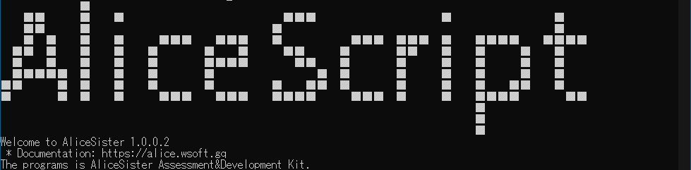

### はじめに
AliceScriptは、軽量な.NETエコシステム上で動作するインタプリンタ型のプログラミング言語です。AliceScriptはC#やPythonをルーツとしているため、C、C#、JavaScript、Pyhton、PHPのプログラマーであればすぐに使いこなすことができます。
AliceScriptについて詳しく知るには、[AliceScriptのツアー](../welcome)を参照してください。

この記事では、まず最初にAliceScriptで開発を始めるために必要な作業を確認します。(すでにAliceScriptを使用している場合はこのセクションを飛ばしても構いません)。
次に、AliceScriptを使って簡単なコンソールアプリケーションを例として作成し、AliceScriptの基本的な事項を解説します。

### 動作環境の構築
AliceScriptを使用したアプリケーションの開発についての説明の前に、まず、AliceScriptを実行できるコンピュータを用意する必要があります。.NETCore3.1がインストールされているコンピュータが必要です。そのようなコンピュータを用意できない場合は、.NET Framework上で動作するAliceSisterを使用する必要があります。AliceSisterはAliceScriptとほぼ同じ動作をするAliceScriptの別の実装です。
#### AliceScriptを使用する場合
自分のコンピュータでAliceScriptを実行する場合は、次のソフトウェアをインストールする必要があります。

* .NET Core v3.1以上
* AliceScript ADK

.NETCoreのインストールについては、Microsoftの公式ガイドを参照してください。

* [Windowsに.NETをインストールする](https://docs.microsoft.com/ja-jp/dotnet/core/install/windows?tabs=net50)
* [MacOSに.NETをインストールする](https://docs.microsoft.com/ja-jp/dotnet/core/install/macos)
* [Linuxに.NETをインストールする](https://docs.microsoft.com/ja-jp/dotnet/core/install/linux)

.NETCoreに加えて、AliceScriptADKもコンピュータにインストールする必要があります。が、実際のところAliceScriptADKはポータブル版として機能するため、ダウンロードしたファイルを解凍するだけで機能します。
AliceScriptADKをダウンロードするには、[AliceScriptのダウンロード](../download)を参照してください。
#### AliceSisterを使用する場合
自分のコンピュータでAliceSisterを実行する場合、.NETCoreは不要です。が、代わりにコンピュータに.NETFramework v4.5以降がインストールされている必要があります。このオプションはWindowsコンピュータでのみ選択可能です。
.NETFramework 4.5はWindows8以降またはWindowsServer2012以降であれば標準でインストールされています。それ以前のバージョンをお使いの方は、別途インストールが必要なことがあります。次のMicrosoftのガイドを参照してください。

* [.NETFramework インストールガイド](https://docs.microsoft.com/ja-jp/dotnet/framework/install/)

.NETFrameworkがインストールされている環境では、AliceSisterADKをコンピュータにインストールする必要があります。が、実際のところAliceSisterADKはポータブル版として機能するため、ダウンロードしたファイルを解凍するだけで機能します。
AliceSisterADKをダウンロードするには、[AliceSisterのダウンロード](../download)を参照してください。

## テストプログラムの実行と簡単なプログラムの作成

次にダウンロードし解凍したAliceScriptまたはAliceSisterのフォルダを開きます。
まず初めに、すでに備わっているテストプログラムを実行します。フォルダ内のalice.exeをクリックします。次に、表示された画面上に次のように入力します。

```js title="AliceScript"
iceimport("TestPkg.zip");
```
そうすると次のような出力結果となります。(実行環境や使用バージョンによっては異なる場合があります)（画像はAliceSisterRC2のものです)




期待通りの動作をしない場合パーミッションの設定が適切でない可能性があります。設定からTestPkg.zip、Alice.dll又はAlice.Runtime.dllのアクセス権の設定を見直してください。

次に簡易的なプログラムの作成を行います、alice.exeが存在するディレクトリ上にテキストファイルを作成し、次のようにコードを入力します。

```js title="main.alice"
print("Hello,World");
```

入力後保存します。保存後、作成したテキストファイルをRun.batと呼ばれるファイルにトラック＆ドロップします、そうすると作成したプログラムが実行されます。次のように出力されれば成功です。

```shell title="出力例"
Hello,World
```

以上で基礎的なチュートリアルは終了です。