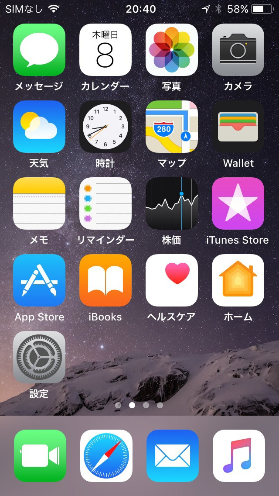
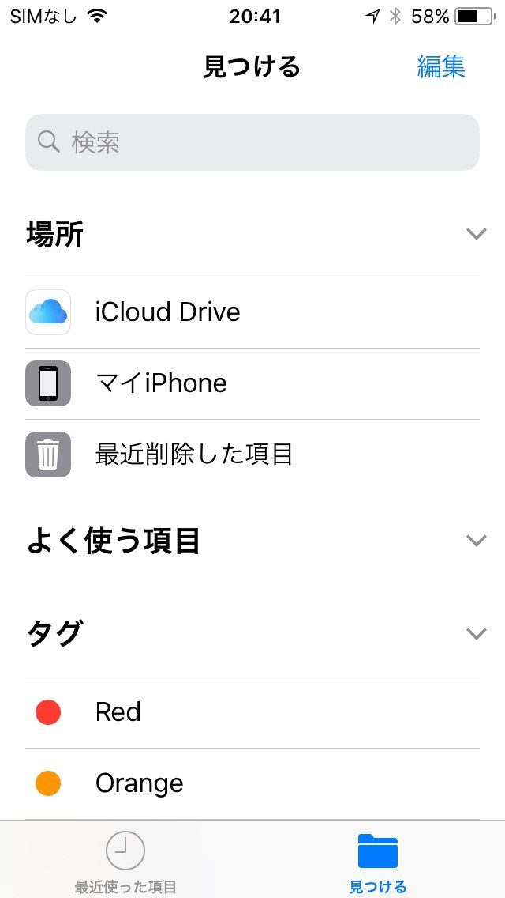
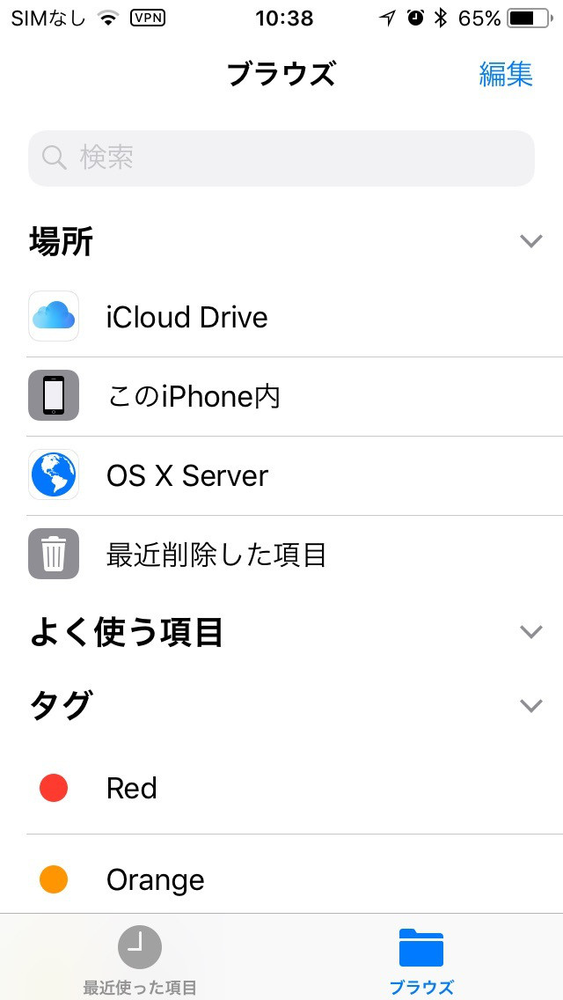
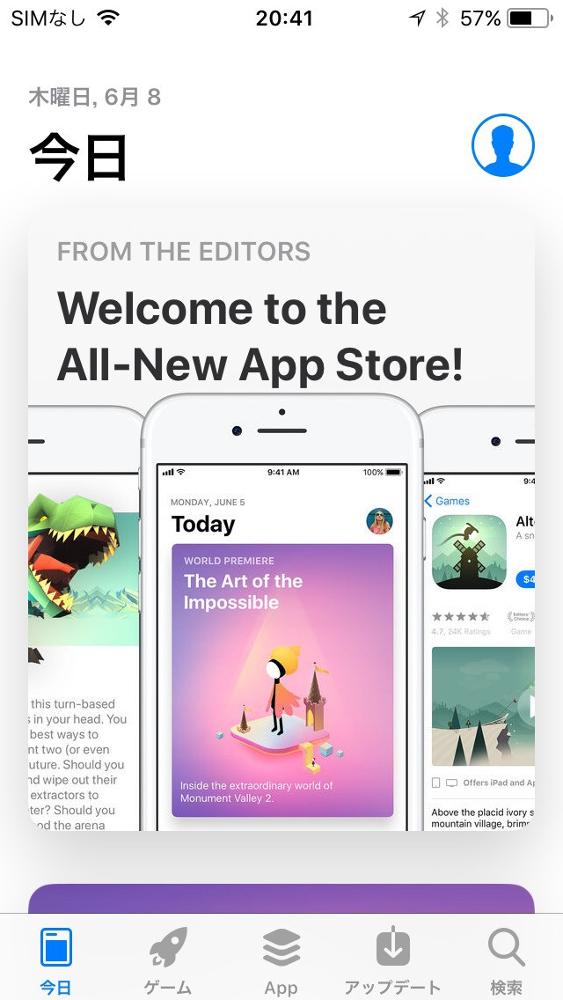
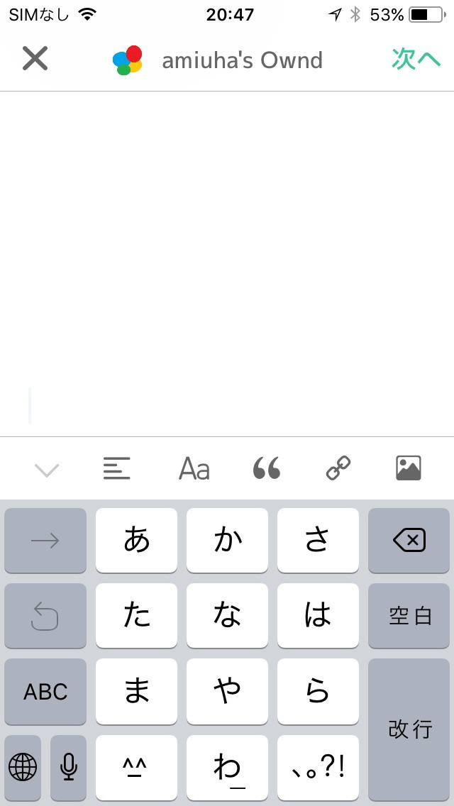
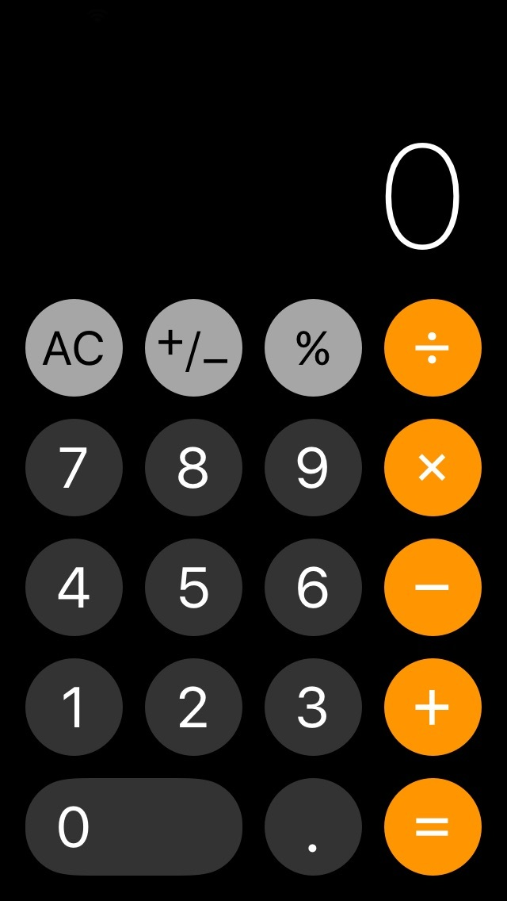
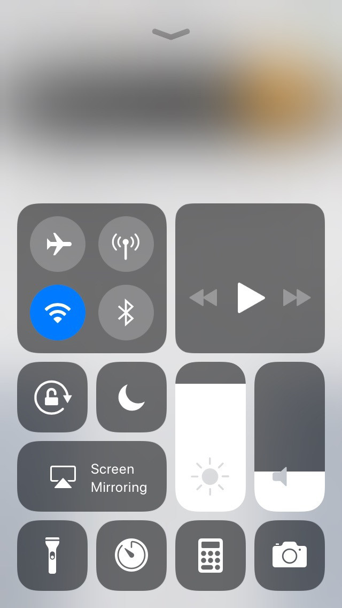
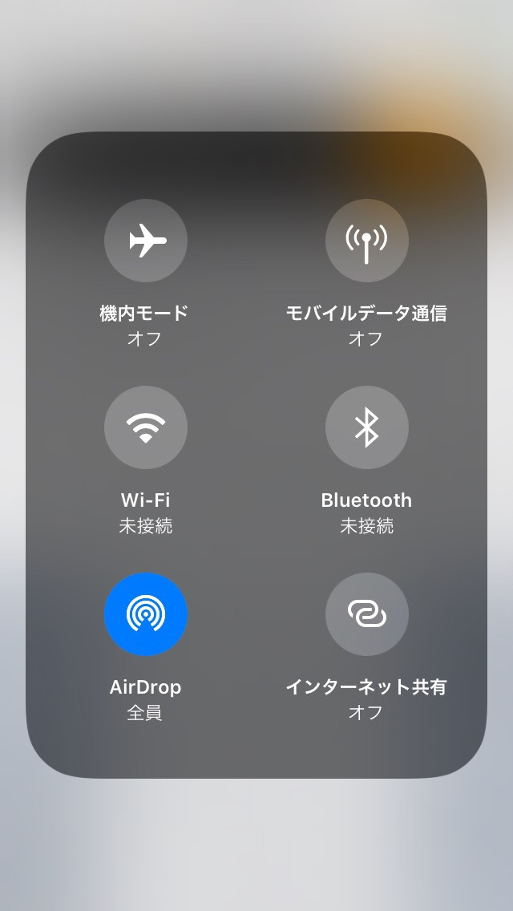
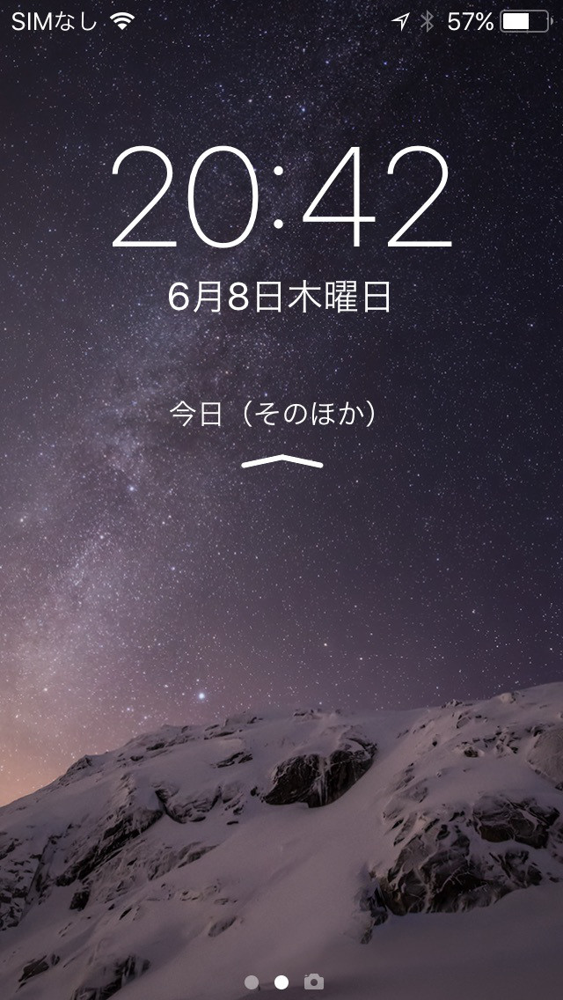
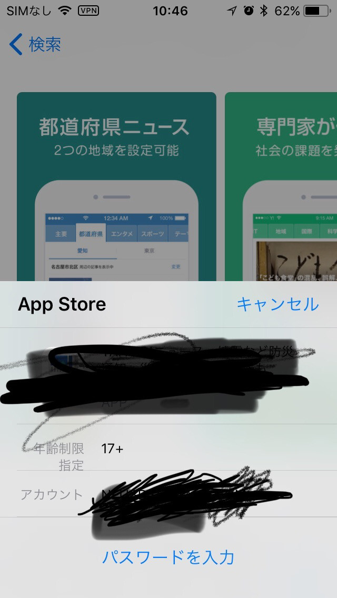

これがホーム画面
(ドックのアプリ名が消えている...)

そして期待していたファイルアプリだが、マイiPhoneは何も操作できず、iCloudアプリとあまり変わっていない。

> 追記 2017/7/16  ios11β2
> 

新しくなったApp Store。
(日本語で表記してくれ)

日本語かなキーボードだけ四隅が丸くなった。

これは電卓。
(そろそろアップルから統一性がなくなってきた気がする)

コントロールセンター。
カスタマイズできない。

> 追記 2017/6/17  コントロールセンターのカスタマイズの仕方が分かった

画面がずっと右寄り。
(バグ？)

App Storeでの購入確認画面がApple Pay 風になった。