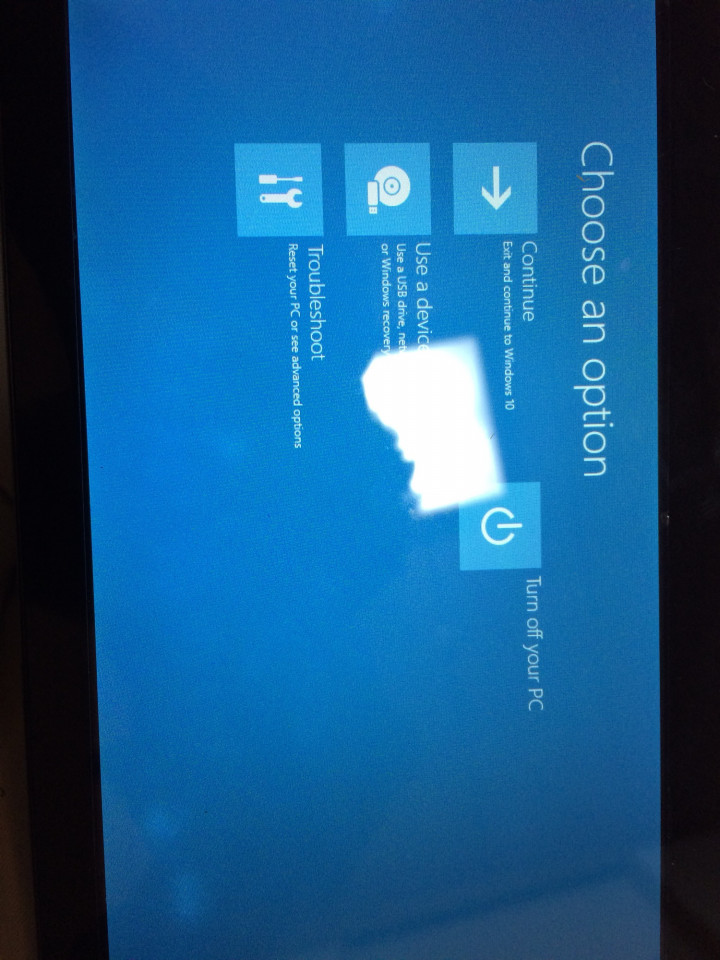
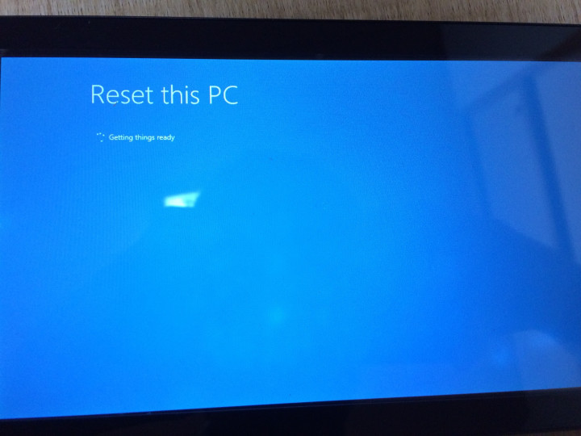
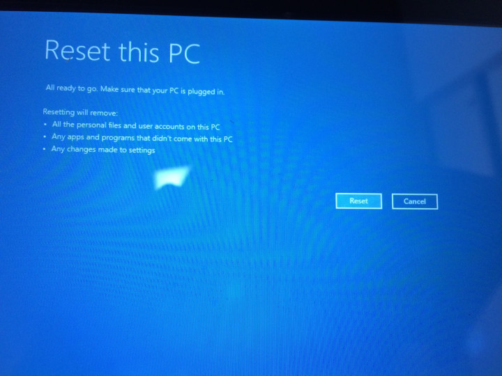
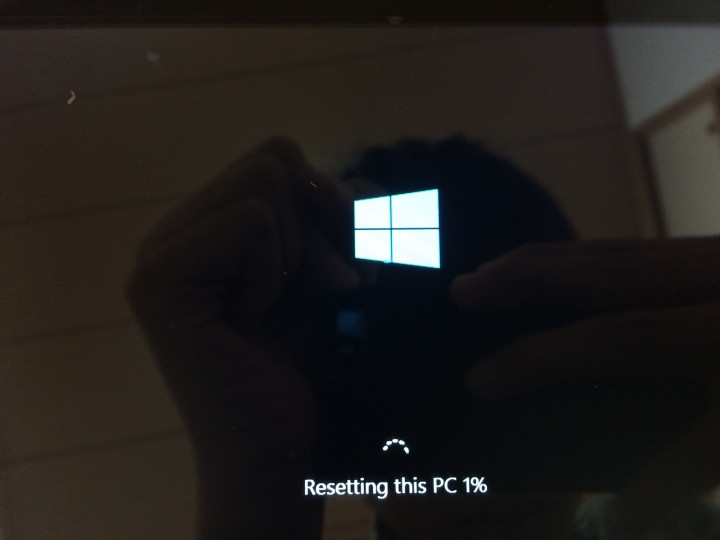
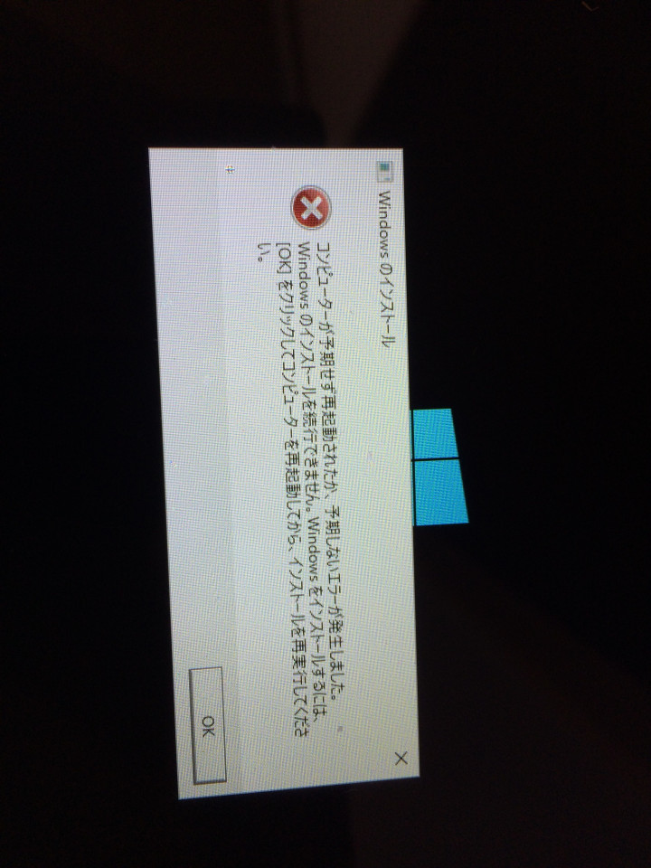

ご注意ください
このステップを踏むと、お使いのタブレット内のデータは全て削除されます。

1. Windows回復を実行する
1. 回復メニューを選択
1. 待つ
1. ちょっとタップ
1. Windowsを正しく実行する 

### Windows回復を実行する
まずタブレットPCを回復する為のはじめの問題がキーボードです。
キーボードがあればF2長押しで上手くいくのですが、今回はタブレットPCなのでそうは行きません。そこで、その手順をご説明します。

1. 電源オフにする
2. 電源ボタンとボリューム上げるボタンを15秒間長押し
3. 15秒だったら同時に手を離す
4. 10秒待つ
5. 4でロゴが表示されていなければ電源オフにする
6. もう一度電源オンにする
7. 待つ
8. 
この時ロゴの下にpleasewaitと表示されているはずです。
次に、少し待つとReset this PCと表示されるので、左側の長い方のボタンをタップします。

ここで一番下の左側のボタンをタップします。

そこで右側の一番上のボタンをタップします。

そして左側の一番上のボタンをタップします。

Fully clean the drive this if you'll recycle the PC This can take several hours.と書かれた方をタップします。

このように表示されたらしばらく待ちます。

しばらく待つと画面が変わります。

Resetをタップします。

するとまた画面が変わり、

回復が開始します。

続いてがめんが2回ほど切り替わります。

そこではコンティニューをタップしてください。

そこからまた画面が変わります。おなじみのロゴが表示され、しばらく待つと次の段階に入ります。

これは見たことあるような？

と思った皆さん、そうです。Windows7や8、8.1からWindows10にアップデートした時の画面ですね。

ここで途中、勝手に電源が切れる場合があります。しかし、この途中再起動を繰り返すので、ご安心を。

途中、コマンドプロンプトの画面が表示されることがありますが、気にしません。

もし、再起動中に電源ボタンを押してしまうと、このような画面になり、ループしてしまいます。

そうしたら、まず一度電源をオフにし、もう一度電源オンにし、さらにロゴが表示されたら電源をオフにし、電源をオンにし、電源をオフにしてから起動すると最初に戻れます。