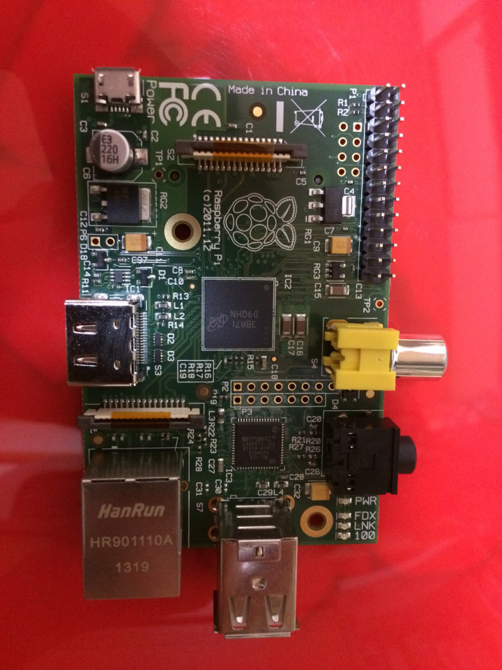
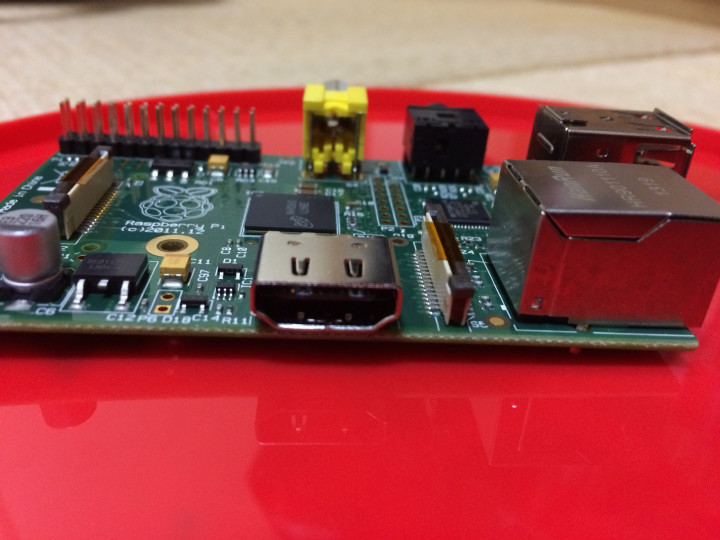
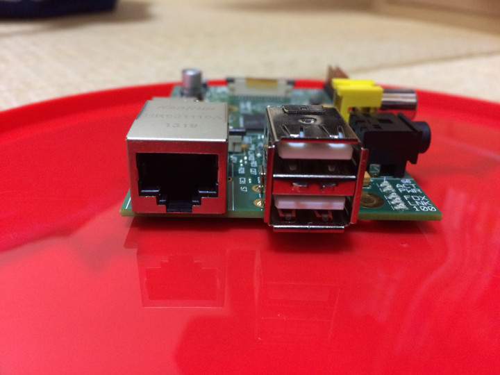
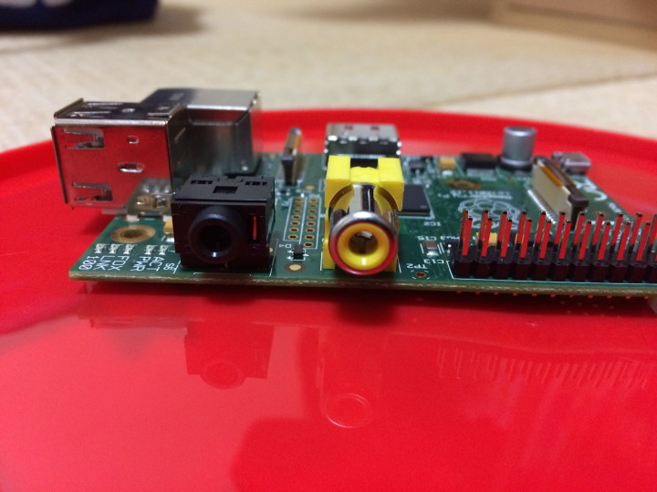
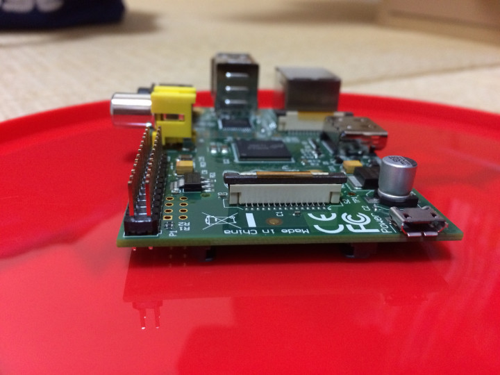
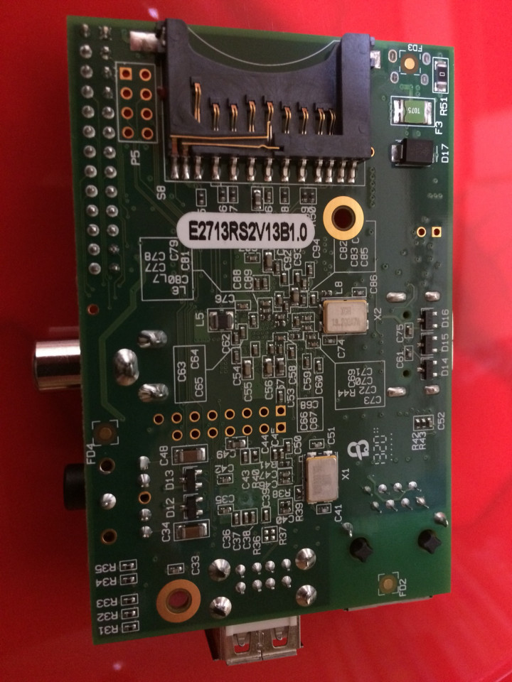

### ラズベリーパイって何？
> Raspberry Pi（ラズベリー パイ）は、ARMプロセッサを搭載したシングルボードコンピューターイギリスのラズベリーパイ財団（英語版）によって開発されている。
> 
> Wikipedia

シングルボードコンピューター

> シングルボードコンピューターは、むき出しの一枚（シングル）のプリント基板（ボード）の上に、必要なものに絞ったCPUと周辺部品、入出力インタフェースとコネクタを付けただけの極めて簡素なコンピューターある。
> 
> Wikipedia

調べていくと深みにはまりそうなので今日はここまでにします。
つまり、ラズベリーパイとは、基盤が1枚だけのコンピューターことらしいです。

### 開けてみましょう！

これです。
順番に見て行きましょう。

こちらの面には、HDMI端子が1つあります。

こちらは、LANぽーとと、USBポートが2つあります。

こちらは、音声端子と、ビデオ端子があります。

こちらには、電源用のマイクロUSB端子があります。実は、ラズベリーパイには、電源オンオフの概念がなく、このUSBケーブルを挿したり抜いたりする事で、オンオフ切り替えができるようです。

最期に、裏には、SDカードスロットがあります。

次回はからは、ラズベリーパイを実際に動かして見たいと思います。