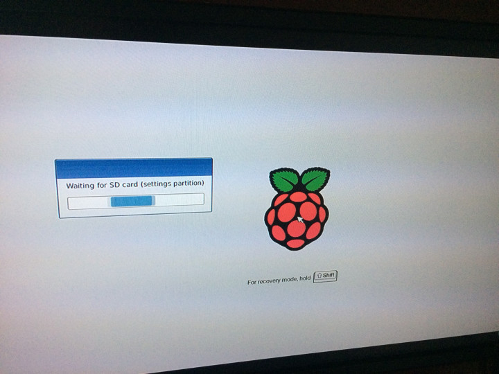
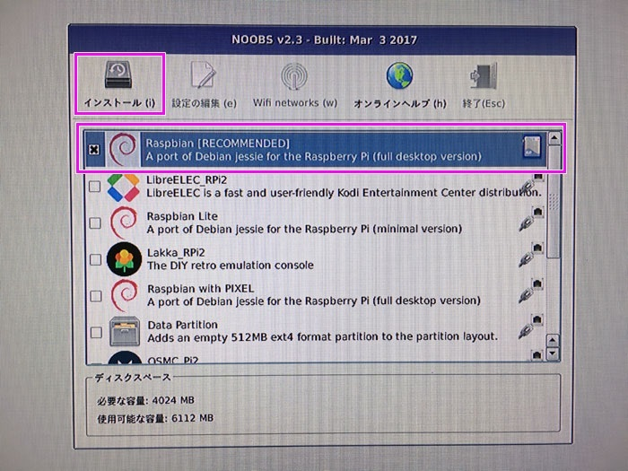
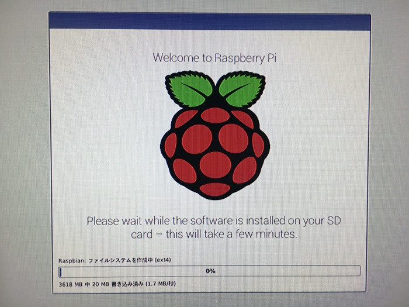
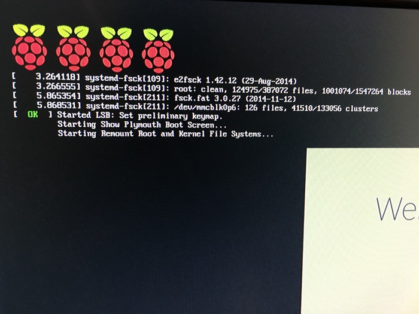

まずは、こちらをダウンロードします。

https://downloads.raspberrypi.org/NOOBS_lite_latest

次にこれを解凍します。

SDカードをパソコンに差し込み、そのSDカードの中身を空っぽにします。

先ほど解凍して出てきた、ファイルをSDカードにコピーします。

次に、ラズベリーパイに、先ほどのSDカードと、マウスと、キーボード、HDMI、LANケーブル、電源を接続しておきます。

起動すると、虹色の画面が表示されます。しばらく待つと、何やらエラーが表示されていますが、エンターを押すと、次のような画面になります。

何やら、SDカードのパーティーションを構成してるみたいです。

少し待ちます。

すると、このようなインストーラーが表示されます。

明るめの紫で囲まれているところを順番にクリックして行きます。

OSのダウンロードとインストールが開始されます。

完了まで、30分ほどかかりました。

ここで、しばらく待つと、写真が表示されます。それで、完了です。

1皿目のラズベリーパイ、美味しく焼きあがりました。

次回からは、ラズベリーパイを実際に使って見たいと思います。