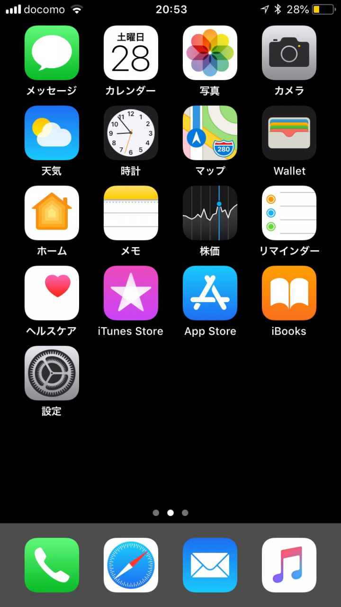

ホーム画面から拡大鏡を起動して、

そこからホーム画面に戻って

検索
キーワードを入力
パソコン・スマホ・ガジェット2018.04.28 20:57
iPhoneの拡大鏡に関するバクを発見しました。

ある日気づきました。

ホーム画面から拡大鏡を起動して、

そこからホーム画面に戻って

Appスイッチャーを起動すると

この状態で固まるバクを発見しました。なお、バージョンはiOS 11.3.1です。記事にできるほどでもないですが、暇な人はやってみてください。