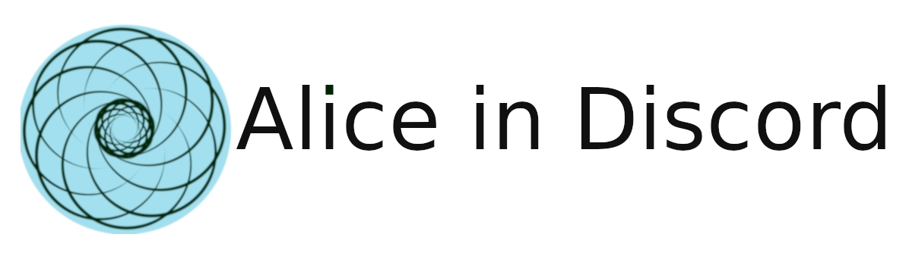

### はじめに
ブログ記事ではお初にお目にかかります、[たい](https://twitter.com/WSOFT7)と申します。WebSailingやAliceScriptなどを開発している高校2年生の`自称プログラマー`で同人サークル「WSOFT」の団長もしています。

高校のクラスDiscord鯖でBotを開発し、**完成しないままクラス替えを迎えた**ので記事に残そうと思います。

### Alice in Discordとは？
私が高校に入学してまだ日の立たないうちに、私のクラスではクラスLINEならぬクラスDiscordサーバーができました

技術を持てばそれを誇示したくなるのが技術者の性。ついでに`自称プログラマ`の友達を増やしたかった私は、次の条件を満たすDiscordのBotを作り、鯖主に導入してもらうことを計画しました。

- 「おみくじ」や「時報」などの簡単に遊べる機能を実装する
- 誰でも簡単にBotのアイデアを形にして、すぐサーバーに導入できるようにする


この一連のプロジェクトはAliceProjectと名づけられ、matsuzenがキャラクターデザインを担当しました。


### 修羅の道
**誰でも簡単にBotのアイデアを形にして、すぐにサーバーに導入できるようにする**ということは、本来必要であった手順を代行するか、自動的に実行できるようにしなければならないことを意味します。さらに、（意図的でなくても）クラスメイトの誰かが問題のあるBotを導入してしまうとAliceProject全体の信頼を失ってしまうことになることも大きな問題です。

そこで、一人一人の考えたBotのプログラムを、ちょうど多重人格のようにひとつのBotから複数同時に実行し、それぞれのプログラムに何かあってもほかに影響しないように設計しました。

Alice in Discord は下の図のような構造をとることで、当初掲げた目標を達成しようとしました。

<div class="mermaid">
graph LR
  ユーザー-->AliceBot
  AliceBot-->Hyper-Alice
  Hyper-Alice-->Bot1
  Hyper-Alice-->Bot2
  Hyper-Alice-->Bot3
</div>

また、プログラムは簡単に記述でき、かつ、必要な機能は一通り備えている必要があります。そこで、人格のAlice in Discord内での振る舞い（つまり、Botの動作そのものを意味します）を定義するために`AliceScript`を開発しました。AliceScriptでプログラミングした人格は、その立ち振る舞いと、それに必要なデータや人格の基本設定などをひとつにまとめて、人格ファイル（*.identity)となり、Hyper-Aliceで実行できるようになります。

<div class="mermaid">
graph TD;
    Botの振る舞いを指定するプログラム.alice -->人格ファイル.identity;
    人格の名前や必要な権限などの定義-->人格ファイル.identity;
    その他の画像や音楽などのデータ-->人格ファイル.identity;
</div>
### Hyper-Aliceとは？
Hyper-Aliceは、一般的なコンピューターOSに似ていて、Alice in Discordで展開されるさまざまなプログラム（ここでは人格と呼ぶことにします）の面倒の一切を負うプログラムです。Hyper-Aliceには次のような機能があります。

- **人格を起動する**  人格はちょうどアプリケーションのように簡単に起動でき、確実に終了できます。
- **人格を終了する**
- **人格を破壊する**　通常の処理で終了しようとしても終了しない人格は、Hyper-Aliceによって強制終了されます。
- **人格を交代させる**　人格によってリクエストがあった場合に、その人格に処理を交代します。しかし、いつでも交代できるわけではなく、Hyper-Aliceがその必要性を判断したうえで交代させます。それに従わない人格は**破壊**されます。

これらのさまざまな機能を複雑に実装することで、Alice in Discordは安定して動作する設計となりました。
                                                  
### クラスメイトからみた「Alice in Discord」
プログラミングをしないクラスメイトからみると、Alice in Discordは単におもしろBotとして機能します。

たとえば、すでに誰かの手によってAlice in Discordに`おみくじ.identity`がプログラミングされているとすると、音楽Botの要領でクラスメイトはコマンドを実行するとその人格を召喚できます。

```text title="Discord"
/start おみくじ
```

クラスメイトから見て、Hyper-Aliceは**完全に透過的に機能**します。そのため、サーバー内で「おみくじ」と発言するだけで今日の運勢が確認できます。

おみくじを終了したくなったら、次のように発言して終了します。

```text title="Discord"
/exit おみくじ
```

誰でも人格を終了することができるようになっていると、混乱を生じさせてしまう可能性があります。そこで、あらかじめexitを動作させないようにプログラミングしておき、鯖主に`/kill おみくじ`と発言してもらうこともできます。

### プログラマから見た「Alice in Discord」
いざ使ってもらうことができれば、これに自分の意見を反映させたいと思う人が出るのは自然なことです。Alice in Discordでは、クラスメイトがDiscord内から簡単にプログラミングができるようになっています。

たとえば、次の例では召喚されたら「Hello,World!」を表示して終了する人格をプログラミングします。

```cs title="Discord"
/push hello
print("Hello,World!");
```

プログラミング出来たら、それをすぐに試せます。

```text title="Discord"
/start hello
Alice in Discord> Hello,World!
```

### 対話的なBotの開発
クラスメイトの発言を受け取って返信することもできます。

Alice in Discordは各人格に、`me`クラスのインスタンスを提供します。これによって、あたかも自分がそのBotそのものであるかのようにふるまえます。

たとえば、誰かが「にゃ～ん」と発言したら「にゃにゃ～ん」と返信する人格は次のようにプログラムできます。
```cs title="Discord"
/push nya
 me.Recived += delegate(e)
  {
    if(e.Content=="にゃ～ん")
      {
         e.Reply("にゃにゃ～ん");
      }
  }
delay(-1);
```

### まとめ：「AliceProject」の実現の意義
もともと、「ALice in Discord」は、AliceScriptを基に私が開発した純国産の自作プログラムです。これは、習得が簡単かつ高度なプログラムを設計できるプログラミング言語である「C#言語」で造られています。また、「Alice in Discord」内での共通言語である「AliceScript」も、WSOFTScriptをベースに構文をC#に似せて造られています。
そして、AliceScriptは、オープンソース化されています。Alice in Discordもオープンソース化を計画しています。

今回、クラス鯖の解散に間に合わなかったものの私は、今あるDiscordBotやWSOFTScriptの仕組みを改造して、Discordを使って誰でもプログラミングができるようにしました。そして、この「Alice in Discord」や「AliceScript」は、基本的な.NETの知識に基づく自作プログラムです。ブラックボックスはまったく使っていません。複雑な文法や難しいアルゴリズム、数学の知識などはほとんど使用していません。

このような簡単な自作プログラムだけで、これまで存在しなかった「Discordから誰でもプログラミングができる」という体験をクラスメイトに提供するとともに、周りの友人や先輩にプログラムの可能性と、「学校配付のiPadからでも、みんなが使っているSNSからでもプログラミングができる」ということを知ってもらうことにこのプロジェクトの最大の価値があると考えます。
誰でも、このようなシステムやプログラムを書けば（または、すでにあるプロジェクトをビルドすれば）、同じものが手元で確実に造れるのだ、再現できるのだという実感を得られることに、大きな意味があるのです。

近年話題にあがるAIやSociety3.0等を支えるプログラムやシステムは、その多くが膨大なプログラムの組み合わせでできていて、もはやその全体像を誰も把握仕切れません。そして、そのレイヤーは大抵高く、ブラウザから利用できるものや「**AIを活用した～**」、「**SDGsに配慮した～**」等トレンドによって生み出されたものが大半です。あるいは、派手なゲームなどの類です。これと比較して、私の開発した、プログラミングの基盤である「AliceScript」や「Alice in Discord」はとても低いレイヤで、地味に動作します。構成要素は少なく、理解そのものは簡単です。そして、他のさまざまなプログラムやアプリケーションが、この私のプログラムで造られる基盤の上で作成されうる可能性を持っています。

「AliceScript」のようなフレームワークは縁の下の力持ちであり、それ自体が主役ではありません。他のクラスメイトが設計したプログラムはどんなものであっても一度受け入れ、そのコードが安全に動作することを保証し、セキュリティに違反したプログラムを検出して破壊するセキュリティ機構である「Hyper-Alice」もまたそのような類です。これは、多くの場合OSやCPUがすでに行っていて、開発者ですらその目に止まることはありません。しかし、これらは自作できるということを私は証明しました。

誰でも、自らの手でフレームワークを創ることが可能なのです。そもそも、コンピューターやCPU、OS等の価値は、そこにあるのではないでしょうか。自力で試行錯誤して造った自作プログラム、自作システム、自作ネットワークが意図したとおりに動いた時、これほどの楽しみは他にないと考えています。AliceProjectは完遂しなかったとはいえ、このプロジェクトを知り、携わってくれたクラスメイトがこの楽しみを実感するきっかけになれば幸いです。

何でもやれば自分たちで作れるということを実感してもらうために、「Alice in Discord」があって、「AliceScript」があって、「AliceProject」があります。
「ありすたん」はそのために生まれてきました。


