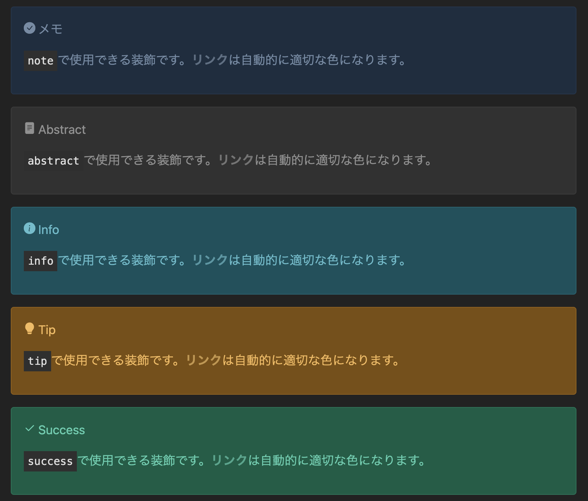

## 事前レンダリング
従来、Mermaid図形やアラート要素などはユーザー側のJavaScriptでレンダリングされていました。このため、ユーザー側でJavaScriptが実行されている間、画面にはちらつきが発生しており、これがユーザーエクスペリエンスを低下させていました。

新しいWSOFTDocsでは、それらの要素を事前に生成してから配信するため、ちらつきが最小限に抑えられます。

## アコーディオン
それほど重要ではないが、参考のために表示している情報には従前より折りたたみ要素を使用してきました。たとえば、次のようなものです。

  
折りたたみ要素

  このdetailsはアコーディオンになりません。

このような折りたたみ要素は、クリック可能な領域が狭く、WSOFTDocsのエクスペリエンストも調和しませんでした。そこで、これからの折りたたみ要素は以下のようなデザインに生まれ変わります。
ぜひクリックして展開してみてください。

??? アコーディオン
    これはアコーディオンです。
    従来の折りたたみ要素を代替します。

## アラート
Bootstrap 5.3との統合により、ダークモード時のアラートの視認性が向上しました。以下に、ダークモード時のこれまでのアラートとこれからのアラートを表示します。

### 今後について
新しいエクスペリエンスについて、ぜひ[GitHubのIssues](https://github.com/WSOFT-Project/docs/issues)までご意見をお寄せください。

最期までご覧いただき、ありがとうございました。これからもWSOFTDocsの改善を続けていきます。