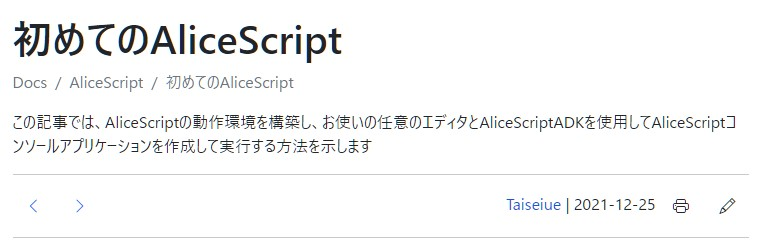
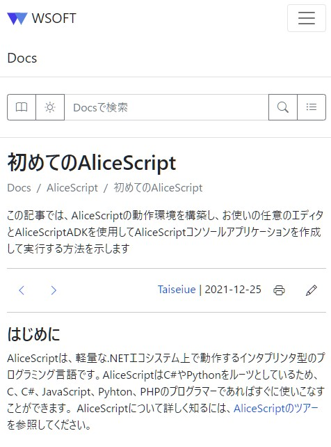
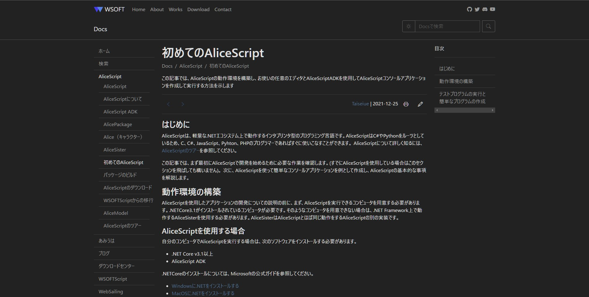
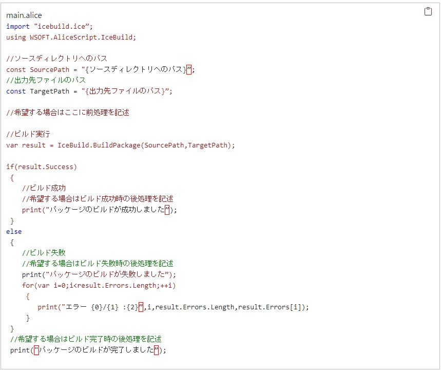

### WSOFTDocsを開発した理由
2017年にあみうはとして、ホームページの運営を開始して以来、私は長い間効率的かつ美しくコンテンツを投稿できるシステムを求め続けてきました。WSOFTでは長らくの間、メンバーやクラスメイトにインタビューを行い、そこで得られた意見を検討してきました。その結果、最新のエクスペリエンスを備えたWebサイトを新たに作成する必要にあることがわかりました。

WSOFTの新たなドキュメントシステムであるWSOFTDocsは、こうした取り組みから生まれました。
### 主な機能
WSOFTDocsへようこそ。まず、次に示すドキュメントページの例から始めましょう。このサイトの新しい機能をいくつか紹介します。


### 読みやすさ
コンテンツを読みやすくするために、Webサイトのコンテンツの幅を一定にしました。[先行の調査](https://webstyleguide.com/wsg3/7-page-design/6-page-width-line-length.html)から、長い文章を左から右に目で追うことは難しいため、コンテンツ幅を一定にすると理解度や読む速度が上がることがわかっています。
この効果を実際に体験していただくために、以下に「初めてのAliceScript」という記事を、WSOFTDocsのものとAliceScriptWikiのものを順番に示します。


### タイトルとツールバー
どれだけ素晴らしい記事であっても、新聞を読む気にさせるかどうかを決めるのは見出しです。WSOFTDocsの各記事ではタイトルに加えて、簡単ではありますが記事の説明文を追加しました。また、記事の筆者や情報の鮮度をお知らせする日付印、印刷ボタンやナビゲーションボタンも実装しました。


### レスポンシブデザイン
旧バージョンのWSOFTのサイトで寄せられたモバイルデバイスでのエクスペリエンス改善についてのご意見を反映するために、レスポンシブデザインを導入しました。ナビゲーションボタンや目次ボタンをクリックすると、デスクトップ表示と同じオプションが展開/折りたたまれて表示されます。



### ダークモード
ブルーライトが目を疲労させるかどうかはともかくとして、黒や灰色を基調としたデザインには男心をくすぐるものがあります。WSOFTDocsでは、ダークモードとライトモードをみなさんの好みに応じて変更できます。



### シンタックスハイライト
コードの例を参照するとき、そのコードがどんなものであるかを簡単に理解するための重要な要素に、シンタックスハイライトがあります。また、それぞれのコードブロックの右上にはコピーボタンを用意しました。これで、そのコードが実際にどのような働きをするのかをコピペで確認できます。



### コミュニティへの投稿
WSOFTDocsのすべてのドキュメントはオープンソース化されており、コミュニティのみなさんが自由に編集できるように設計されています。各記事にはペンのマークの編集ボタンがあり、GitHubのマークダウン形式のソースファイルへと移動して、コンテンツの修正や改善を求めるPullRequestを簡単に送信することができます。詳細については、[共同作成ガイド](/contribute)を参照してください。

また、WSOFTDocsを運営するために開発されたWebサイトプロジェクトである、[Lantana](https://lantana.wsoft.ws/)も[オープンソース](https://github.com/WSOFT-Project/lantana)のプロジェクトです。

### わかりやすいURL
AliceScriptWikiとWSOFTダウンロードセンターを利用する際に直面する日ごろの悩みの種のひとつに、記事のURLがわかりづらく読みづらいことが挙げられます。同じ記事について、新しいURLの例を次に示します。

```url title="以前のURL"
https://alice.wsoft.ws/index.php?title=%E5%88%9D%E3%82%81%E3%81%A6%E3%81%AEAliceScript
```

```url title="新しいURL"
https://docs.wsoft.ws/alice/begining-alice/
```

### サイトのパフォーマンス
サイトが表示されるまでの速度といった基本要素はとても重要です。WSOFTDocsのページロード時間はAliceScriptWikiと比べ最大で300%向上しており、また地域別の配信についてもCloudFlareのネットワークを使用することで大幅に改善しました。さらに、クラウド上で100%動作するアーキテクチャも構築しました。

### 今後について
WSOFTDocsの記事をぜひご覧になり、[GitHub](https://github.com/WSOFT-Project/docs/issues)までフィードバックをお寄せください。今後の記事では、各種コンテンツの追加計画や、コンテンツのローカライズの計画などについて説明する予定です。

最期までご覧いただき、ありがとうございました。これからもWSOFTDocsに、新たな記事を追加してまいります。