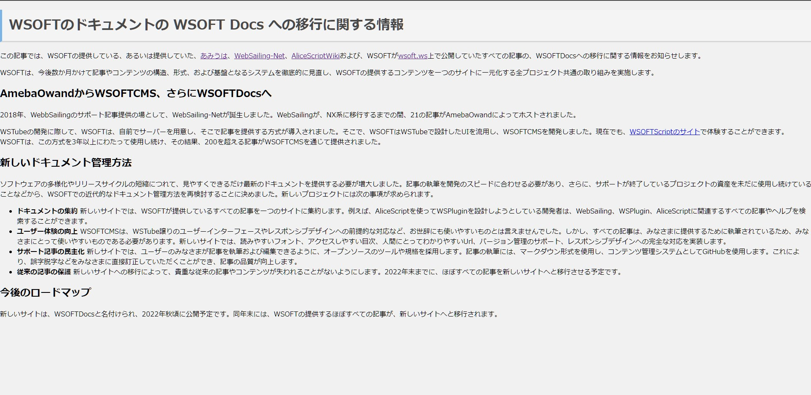

この記事では、配信するコンテンツの構造、形式、および基盤となるインフラを徹底的に見直し、WSOFTの配信するコンテンツを一元化する全プロジェクト共通の取り組みの最後の数ステップについて説明します。

### AmebaOwndからWSOFTCMS、さらにWSOFTDocsへ
2018年、WebbSailingのサポート記事提供の場として、WebSailing-Netが誕生しました。WebSailingが、NX系に移行するまでの間、21の記事がAmebaOwndによってホストされました。

WSTubeの開発に際して、WSOFTは、自前でサーバーを用意し、そこで記事を提供する方式を導入しました。WSOFTはWSTubeで設計したUIを流用し、HelpEngineを開発しました。現在では、これは[オープンソース](https://github.com/taiseiue/helpengine)化されています。WSOFTは、この方式を3年以上にわたって使用し続け、その結果、200を超える記事をHelpEngineを通じて提供しました。

### 新しいドキュメント管理方法
公開するソフトウェアの種類が増えたことやリリースサイクルが短くなっていることから、できるだけ最新の状態に保つ必要が出てきました。特に、ソフトウェアは記事の更新を開発のスピードに合わせる必要があります。このため、WSOFTのサイトに近代的なドキュメント管理方法を導入することに決めました。新しいプロジェクトには次の事項が求められました。

- **ドキュメントの集約** 新しいサイトでは、WSOFTが提供しているすべての記事をひとつのサイトに集約します。たとえば、AliceScriptを使ってWSPluginを設計しようとしている開発者は、WebSailing、WSPlugin、AliceScriptに関連するすべての記事を横断的に検索できます。
- **ユーザー体験の向上** 従来のサイトは、レスポンシブデザインに対応しておらず、アクセシビリティの観点からも、見やすいものではありませんでした。しかし、すべての記事は、読者に提供するために執筆されているため、読者にとって使いやすいものである必要があります。新しいサイトでは、読みやすいフォント、アクセスしやすい目次、人間にとってわかりやすいUrl、レスポンシブデザインを導入します。
- **サポート記事の民主化** 新しいサイトでは、誰でも記事を編集できるように、オープンソースのツールや規格を採用します。記事は、マークダウン形式を使用し、GitHubで管理します。これによって、誤字脱字などを読者が直接訂正することができ、記事の品質が向上します。
- **従来の記事の保護** 新しいサイトへの移行によって、貴重な従来の記事やコンテンツが失われることがないようにします。2022年末までに、ほぼすべての記事を新しいサイトへと移行させる予定です。

### 移行の進捗状況
新しいサイトはWSOFTDocsと名付け、2022年11月1日に公開しました。同年末には、WSOFTの提供するほぼすべての記事が、新しいサイトへと移行される予定です。進捗状況について詳しくは、以下をご覧ください。

#### あみうは
状況:完了

[あみうは](https://amiuha2103.amebaownd.com)の[WSOFTDocs](https://docs.wsoft.ws)への移行は、すでに完了しました。

そのブログでは以前、パソコンやガジェット、果ては恋愛話まで幅広い話題を扱った記事を公開していました。
最初は小学生間の小さな話のネタだったものは、あみうはのサイトの開設に伴って世界中のみなさんと共有することができるようになりました。

この移行では、30を超えるAmebaOwndで記述された記事を、Markdownに書き直すことが必要でした。すべての記事のWSOFTDocsへの移行が完了しました。
それらの記事は[あみうはDocs](https://docs.wsoft.ws/amiuha)で公開しています。

#### WSOFTScript
状況:完了

WSOFTScriptの更新情報などをお知らせしていた[WSOFTScriptのサイト](https://wsoft.ws/script)の[WSOFTDocs](https://docs.wsoft.ws/script)への移行はすでに完了しました。

#### WebSailingNet
状況:完了

WebSailingNetと一口に言っても、それに分類されるサイトは[WebSailing-Netのメインサイト](https://websailing.localinfo.jp)や[WebSailingDeveloper](https://developer-websailing.localinfo.jp)、[WSPluginライブラリ](https://plugin-websailing.localinfo.jp)、[WebSailingNXサポート](https://suport-websailing.localinfo.jp)や[WSEガイド](https://wseguide-websailing.localinfo.jp)などさまざまです。

それらすべてのサイトの記事のWSOFTDocsへの移行は完了しました。それらの記事は[WebSailingDocs](../products/websailing/index.md)で公開しています。

#### AliceScriptWiki
状況:完了

[AliceScriptWiki](https://alice.wsoft.ws/)では現在に至るまで、APIリファレンスを含め50を超える記事が公開されてきました。APIリファレンスでは、できる限り同じようなエクスペリエンスを提供する必要があるため、特別な設計が必要になります。

この移行では、200件を超えるMediaWikiで記述された記事を、Markdownに書き直し、エクスペリエンスを保つために追加のページを作成することが必要でした。従来AliceScriptWikiで公開していたすべての記事は[AliceScriptDocs](../products/alice/index.md)へ移行を完了しました。

また、当面の間AliceScriptWikiのサイトを残す方針が決まりました。現在のAliceScriptWikiのサイトは、読み取り専用となり、今後情報の更新はされません。

### ご意見をお寄せください

WSOFTはこの移行にかかる取り組みを継続し、WSOFTの製品ドキュメント全てについて、よりアクセスしやすく、見やすいものであるように改善を続けています。[GitHub](https://github.com/WSOFT-Project/docs/issues)でみなさんのご意見をお寄せください。
