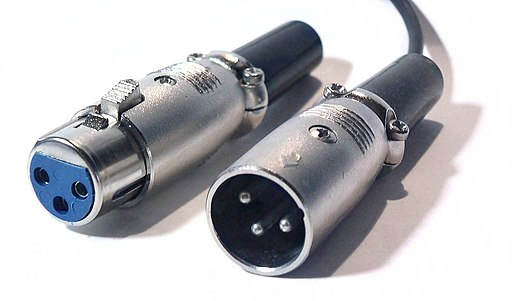
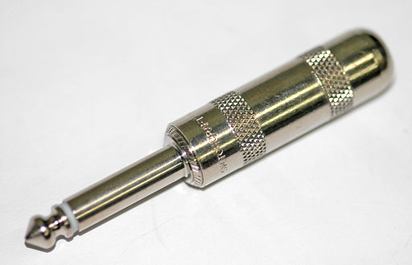
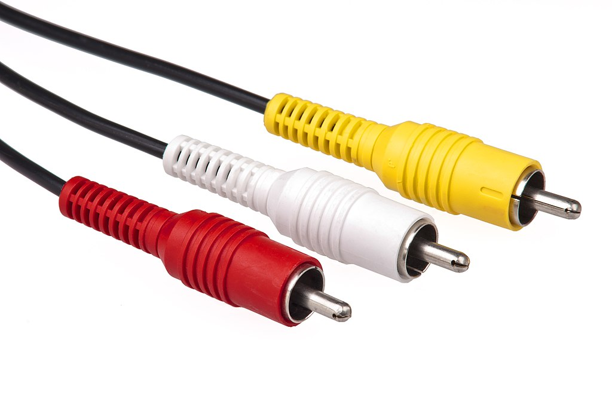
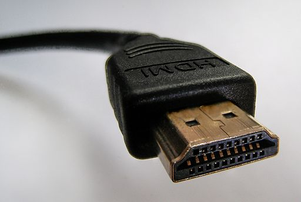
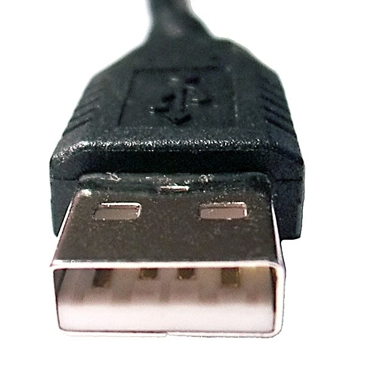
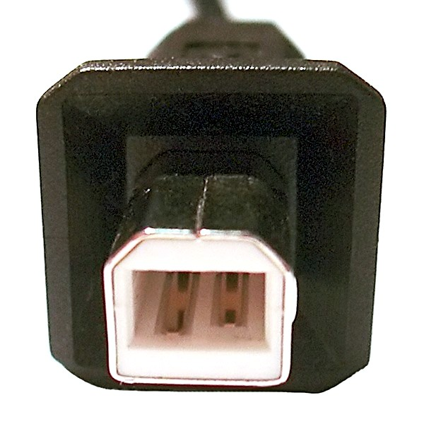

### 音声機器を接続するためのケーブル
#### XLRケーブル

Picture by Mxp – Xlr-connectors.jpg(2005) / <a href="https://creativecommons.org/licenses/by-sa/3.0/">CC BY 3.0</a>
 
上記の画像では左側がメス、右側がオス。

XLRケーブルは、マイクとミキサーまたはオーディオインターフェイスを接続する際や、ミキサーから比較的高価な機器に音声を送るためのケーブルです。
ピンは3つありますが、モノラル（＝左右どちらかの音のみ）で音声を送るので、モノラルでもよいマイク（マイクに左右はない）や、2本使って左と右をそれぞれ接続します。
ステレオ（＝左右同時）で送ることのできるXLRサラウンドケーブルもありますが、一般的に普及しているわけではありません。光が反射して収録の邪魔にならないように艶消し加工が施されているそうです。

**ロック機構が備わっていて、引っ張っても抜けない**ようになっています。このケーブルを抜き差しするときはロックを押さえながら行いましょう。音が出ていく側がオス、音が入る側がメスです。

!!!note "XLRケーブルが3ピンの理由"
    XLRケーブルは2本のピンにそれぞれ逆の電流を流すことでノイズ耐性を得ています。詳しく知るには「バランス接続」とか「平衡接続」とか調べてみよう。

!!!warning "接続すると壊れる組み合わせ" 
    オーディオインターフェイスやミキサーなどのファンタム電源をオンにし、このケーブルに48Vの電圧を加えたうえで**アンバランス**[^1]なマイクなどを接続すると、ショートし双方の機器が壊れることがあります。

[^1]: 一部の廉価なマイクやアンプなどは、XLR端子を搭載しながら不平衡回路になっている事があるようです。心配な場合は説明書を確認し、極端に安価なものは接続しないこと。

#### フォーンケーブル

Picture by Mataresephotos – TS_0.25inch_mono_plug.jpg(2011) / <a href="https://creativecommons.org/licenses/by-sa/3.0/">CC BY 3.0</a>
 
上記の画像は6.3mmで2極。

フォーンケーブルは、ミキサーまたはオーディオインターフェイス、スピーカーを接続する際や、マイクとそれらを接続する際に使用される、アンバランスなケーブルです。両方オスのケーブルが使用されることが多く、それらはシールドとか、ラインとも呼ばれます。ミキサーの「LINE」はこのためです。

ヘッドホンやオーディオインターフェイス、ミキサー、ヘッドホンなどで使用されている6.3mmタイプとスマホやタブレット、イヤホンなどで使用されている3.5mmタイプがあります。このため、スマホやタブレットのイヤホン端子とミキサーを接続するときは3.5mmと6.5mmの変換ケーブルが必要です。

プラグの端子部分に何本黒や白の線が入っているかで、ケーブルを見分けることができます。1本のみのものは2極、2本あれば3極です。3極のケーブルはステレオで音声を送ることができます。

ケーブルが対応していればステレオで送れるかというとそうでもありません。
多くのオーディオインターフェイスやミキサーは、メス部分が2極のため左右いずれかのモノラル入力しかできません。その代わり、LとR（左右）両方のジャックがあるので、Lと書いてある端子ともう一方のLジャックを、RとRを接続することでステレオ接続ができます。
モノラルで接続する場合はMONOと書いてあるジャックと接続します。

### 映像機器を接続するためのケーブル
#### RCAケーブル

Picture by Evan-Amos – Composite-cables.jpg(2010) / パブリックドメイン
 
コンポジット映像信号（黄色）とステレオ音声信号（赤白）

RCAケーブルは映像と音声を同時に送り、プロジェクターやモニターとコンピューターなどを接続したり、赤と白のケーブルのみを使ってオーディオ機器を接続することもあります。このとき赤色がR（右）、白色がL（左）の音声を送ります。

#### HDMIケーブル

Picture by connector-male 2 sharp PNr°0059.jpg(2007) / <a href="https://creativecommons.org/licenses/by-sa/3.0/">CC BY 3.0</a>
 
HDMI Type Aケーブル

HDMIケーブルは映像と音声を同時に送る、プロジェクターやモニターとコンピューターなどを接続するためのケーブルです。まれにHDMIケーブルを使ってオーディオ機器を接続することがあります。

### コンピューターやiPadを接続するためのケーブル
#### USBケーブル

Picture by André Karwath aka Aka USB Male Plug Type A.jpg,USB Male Plug Type B.jpg(2004) / <a href="https://creativecommons.org/licenses/by-sa/2.5">CC BY 2.5</a>
 
USB Type AとB端子

USBケーブルはコンピューターと周辺機器を接続するケーブルです。主にオーディオインターフェイスとコンピューター、iPadを接続する際に使用します。iPadを接続する際は別にLightning-USB3カメラアダプターを用意するか、Type-C接続のオーディオインターフェイスをLightning-USB-Cケーブルで接続することが必要です。

#### IEEE1394
IEEE1394ケーブルは旧式のコンピューターとオーディオインターフェイスを接続するケーブルです。FireWire、i.LINK、DV端子とも呼ばれます。