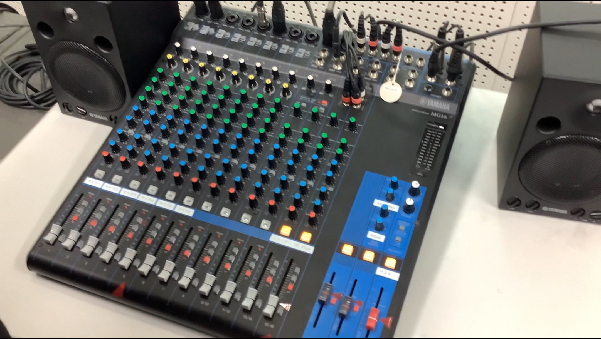

### 電源を入れる前に
つまみの説明は後でするとして、ミキサー（場合によっては調整卓）のフェーダー（上下に動かせるつまみ）をすべて一番下にします。簡単なことですが、とても大切なことです。
また、ミキサーに「PFL」と書かれたボタンやスイッチがあれば、それをOFFにしましょう。

### 電源を入れる
放送を始める前にもっとも大切な事柄は、電源を入れることですが、電源はどこにあるでしょう？放送卓とよばれるデスク型放送設備のある学校ならよいでしょうが、それより高価な（あるいは廉価な）機材を導入している学校ではスイッチはタップや**PAラック**にまとめられているかもしれません。PAラックはたとえば次のようなものです。

このようなラックの場合、最上部にスイッチがあって、それをONにすることで放送設備が一斉に起動するでしょう。

電源を入れることができたら、POWERなどのランプが点灯していることを確認しましょう。

### 放送前の準備
放送を始める前に、ミキサー（場合によっては調整卓）で、マイクやCDデッキなどのボリュームを確認し、調整します。

使用する機材のフェーダーを真ん中の位置（しるしがあればそこ）まで上げます。大抵の場合フェーダーの上に「CD」や、「マイク」と書いてあるはずです。

次にマスターのフェーダーを`0`と書いてある位置まで上げます。大抵の場合そのつまみだけ目立つようにしてあるはずです。機種によっては「STEREO」や「MASTER」と書いてあるかもしれません。今後、基本的にはこのフェーダーは触りません。

フェーダーを上げることができたら、実際にマイクで何か話してみたり、CDを再生してみたりして、音量が大きすぎないか調整しましょう。音量の調整はマスターではなくそれぞれのフェーダーで行うこと。ボリュームメーター（音量に合わせて動くアレ）があれば、それも参考になります。もしマイクがスピーカーの近くにあるなら、ハウリングしない位置を探るのも重要です。

!!!tip "音が出ないときは？"
    まず、フェーダーの上などのスイッチがOFFになっていないか確認しましょう。PFLスイッチをOFFにするのも忘れずに。
    ボリュームメーターがきちんと光っている場合は出力系の問題を疑うべきかもしれません。

### 放送開始
問題なくCDやマイクから音が出ることを確認したら、いよいよ放送開始です。

放送設備の使い方は学校によって大きく違うのでここでは説明しませんが、学校の放送ルールを守りましょう。初めからマイクを使うわけではない時は、マイクのフェーダーの位置を覚えた上で一番下まで戻します。

職員室に笑い声が放送されないことをもう一度確認して、放送を開始しましょう。

### 後片付け
放送が無事終わったら、すべてのフェーダーを一番下まで下げます。今回の放送で押したボタンやスイッチ、配線などは必ずもとの位置に戻しておきましょう。

最後に電源を切ったら、放送は完了です。