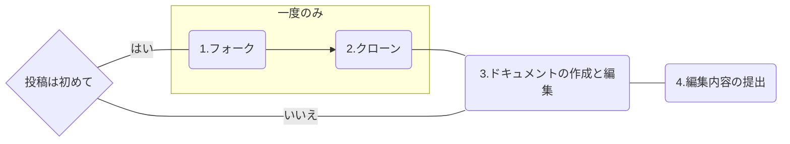

WSOFTDocsへの貢献にご興味をお持ちいただき、ありがとうございます。
WSOFTDocsの記事はすべてGitHub上で管理されており、誰でも編集、寄稿の提案を行えます。この記事では、VS CodeからGitHubを使用してWSOFTDocsに投稿する方法について説明します。VS Codeから投稿する方法は、以下のようなシナリオに向いています。

- 新しい記事を投稿する場合
- 画像のアップロードまたは変更をする場合

もし、誤植の修正など編集が小規模なものの場合は、Web上で行うのが便利です。Web上で編集する方法は、[ドキュメントの編集](./edit-document.md)で詳しく説明しています。

> [!TIP]
> この記事にしたがって作業を行うことで、GitHubのコミット、クローン、プルリクエストの機能を学習できます。

次に、全体の流れを説明します。



この記事では、はじめにあなたのコンピューターにWSOFTDocsのリポジトリをcloneする方法について説明します。この作業は一度のみ行うため、すでに行なっている場合は「3. ドキュメントの作成と編集」からご覧ください。

### 0. 前提環境
この記事のガイドに従って記事を投稿するには、以下のソフトウェアの導入およびアカウントの作成が必要です。

- [Visual Studio Code](https://code.visualstudio.com/)
- [Markdown All in One 拡張機能](https://marketplace.visualstudio.com/items?itemName=yzhang.markdown-all-in-one)
- [Git クライアント](https://www.git-scm.com/)
- [GitHubアカウント](https://github.com/)

以上の環境を準備してください。

はじめてGitをインストールして使う場合、ユーザー名とメールアドレスの設定が必要です。Gitの初期設定をすでに行なっている場合は、この手順をスキップできます。

ターミナル(Windowsの場合はコマンドプロンプト)を開いて、以下のコマンドを入力します。*Your Name*にはあなたの名前を、*email@example.com*にはあなたのメールアドレスを当てはめてください。

```sh title="シェル"
git config --global user.name "Your Name"

git config --global user.email "email@example.com"
```

設定したユーザー名とメールアドレスを確認するには、以下のコマンドを実行します。

```sh title="シェル"
# ユーザー名を確認する
git config --global user.name
# メールアドレスを確認する
git config --global user.email
```

設定が完了したら、次のセクションに進みます。

### 1. リポジトリのフォーク

WSOFTDocsへのコントリビュートを始める前に、自分のGitHubアカウントにdocsリポジトリをフォークする必要があります。

1. [docsのリポジトリ](https://github.com/WSOFT-Project/docs)を開いて、「**Fork**」をクリックします。
2. 「**Create a new fork**」ページに移動したら、「**Create fork**」ボタンをクリックして、フォークを完了します。

これでリポジトリをフォークできました。次のステップに進んでください。

### 2. リポジトリのクローン

フォークができたら、ローカルのコンピューターにdocsリポジトリをクローンする必要があります。

> [!WARNING] 注意
> **clone先ディレクトリをネットワークドライブやクラウドと同期したディレクトリに指定しない**でください。クラウドとの同期後に意図せずマージエラーが発生する可能性があります。
> 
> また、**Windows環境では、パス名を長くしすぎない**でください。Git for Windowsでは、規定では宛先パスが255文字を超えるディレクトリを扱うことができません。もし、長いパスを使用する必要がある場合は、**管理者権限**で以下のコマンドを実行します。
> `git config --global core.longpaths true`

1. VS Codeを起動します(すでに起動している場合は、「**ファイル**」>「**新しいウインドウ**」の順にクリックし新規ウインドウを開きます)
2. 「**ようこそ**」タブが表示されたら、**開始**の下にある「**Gitリポジトリのクローン**...」をクリックします
3. 画面中央上部に表示された「**GitHubから複製**」をクリックします(ここでGitHubへのログインを求められる可能性があります)
4. 「**リポジトリ名**」ボックスに`docs`と入力します。「あなたのユーザー名/docs」というリポジトリが表示されたら、それを選択します。
5. リポジトリのclone先ディレクトリを選択します。このディレクトリには十分な空き領域が必要です。
6. 右下に「リポジトリを複製しています」と表示されたら、完了するまで待ちます。
7. 「クローンしたリポジトリを開きますか？」と表示されたら、「**開く**」をクリックします。

これで準備は完了です。今後WSOFTDocsの記事を編集するときは作成先のディレクトリをVS Codeで開いてください。

### 3. ドキュメントの作成と編集
WSOFTDocsのリポジトリを開いたら、`docs`ディレクトリ以下に`*.md`で終わるファイルで構成された記事があります。

#### 新しい記事の作成

新しい記事を投稿するには、投稿したいディレクトリ内に新しいファイルを作成します。ファイル名は以下の規則に従ってつけてください。

- アルファベット小文字、数字とハイフンのみを使用する
- ハイフンは単語や数値を区切るスペースや句読点の代わりに使用する
- 動詞は原形を使用する(原則過去形や進行形は使用しない)
- 定冠詞(a、theなど)やand、inなどの短い語句を使用しない
- ファイル名は**必ず.md**で終える

ファイルを作成したら、はじめに記事のタイトルなどを決めます。
以下のコードをコードブロック右上のコピーボタンからコピーして、作成したファイルに貼り付けてください。

```md title="Markdown"
---
title : 記事のタイトル
summary : 記事の説明文
date : 2024-05-14
author : 著者の名前
---
```

貼り付けたら、それぞれの項目を記事に合わせて変更してください。`date`には日付を`2000-01-01`のように記述してください。特に、1桁の月、日付は先頭に0をつけてください。

メタデータについて詳しく知るには、[メタデータ](./metadata.md)をご覧ください。

#### 記事の書き方

ここまでで、記事を書く準備は完了です。記事はMarkdown(マークダウン)形式で書きます。以下に、簡単な例を示します。

```md title="Markdown"
### 見出し
#### 小さめの見出し
これは、Markdownで書いた簡単な記事のサンプルです。
アスタリスク2つで囲んだ場所は**太字**になります。
Markdownで段落を分ける(≒改行する)には一行空の行をはさみます。

他のサイトへのリンクを貼るには、[Google](https://google.com)のようにタイトルとUrlを書きます。

以下のように簡単に表をかけます。表を書くにはすぐ上の行を空行にします。

好き嫌い|Alice|Bob
---|---|---
りんご|好き|嫌い
ぶどう|好き|好き
みかん|嫌い|好き
```

これは以下のように表示されます。
手元で確認したい場合はVS Codeの右上端から3つ目、「**プレビューを横に表示**」アイコンをクリックして確認できます。

<h3>見出し</h3>
<h4>小さめの見出し</h4>

これは、Markdownで書いた簡単な記事のサンプルです。
アスタリスク2つで囲んだ場所は**太字**になります。
Markdownで段落を分ける(≒改行する)には一行空の行をはさみます。

他のサイトへのリンクを貼るには、[Google](https://google.com)のようにタイトルとUrlを書きます。

以下のように簡単に表をかけます。表を書くにはすぐ上の行を空行にします。

好き嫌い|Alice|Bob
---|---|---
りんご|好き|嫌い
ぶどう|好き|好き
みかん|嫌い|好き

Markdownの書き方については、[Markdownリファレンス](./markdown.md)をご覧ください。

#### 画像の貼り方
画像を貼るには、記事を書いているディレクトリにある**media**ディレクトリに貼りたい画像をコピーします。ディレクトリがない場合は作成してください。

次に、Markdownで画像を貼りたい位置に次のように記述します。

```md title="Markdown"

```

例えば、次の例ではこのディレクトリの**media**ディレクトリにあるAliceの画像を表示しています。

```md title="Markdown"

```


記事を編集し終えたら、必ず ++Ctrl+S++ または「**ファイル**」>「**保存**」で保存しましょう。

### 4. 編集内容の提出
一通り編集が終わったら、編集内容をpull requestとして提出します。

#### 4.1 編集内容のコミット
以下、5から先の項目は、初めて投稿するときのみ行います。

1. VS Code左端のメニューから「**ソース管理**」(<i class="bi bi-git"></i>に似たアイコン)を選択し、ソース管理ビューを開きます。
2. 記事の編集内容などを簡潔に*メッセージ*部分に書きます。
3. 「**コミット**」をクリックします。
4. 「コミット」が「変更の同期」に替わります。「**変更の同期**」をクリックします。
5. 「書き込みアクセスのないプロジェクトに変更を加えようとしています...」と表示されます。「**リポジトリのクローン**」をクリックします。
6. ブランチ名を決めて入力します。(これは好きなもので構いませんが、他の人と被らないようにしてください)

#### 4.2 pull requestの提出
編集内容のコミットを行ったら、コミットを元にpull requestを提出します。pull requestとは、自分の行った編集内容を全体に適用することです。つまり、この作業を行うことでインターネット上のWSOFT Docsのサイトに公開するように依頼します。

1. VS Code左端のメニューから「**GitHub pull request**」(<i class="bi bi-github"></i>アイコン)を選択し、pull requestビューを開きます。
2. 「PULL REQUESTS」領域にマウスを移動し、「**プルリクエストの作成**」(<i class="bi bi-arrow-clockwise"></i>アイコンの左隣)をクリックします。
3. *Title*部分に編集内容が表示されていない場合は、編集内容を簡潔に書きます。
4. 「**Create**」をクリックして、pull requestを提出します。

れでPull Requestの作成は完了です。WSOFTのメンバーが、Pull Requestをレビューし、承認されればそれをマージし、サイトに反映します。編集内容に関する質問などをお伺いすることがあるため、GitHubの通知を受け取れるようにしておいてください。

これで作業は完了です。お疲れ様でした。
WSOFTのメンバーが、提出していただいたpull requestを確認し、レビューの上、サイトに反映いたします。編集内容に関する質問などをお伺いすることがあるため、GitHubの通知を受け取れるようにしておいてください。公開までには、しばらくお時間をいただくことがあります。

WSOFTDocsへ投稿していただき、ありがとうございました。
