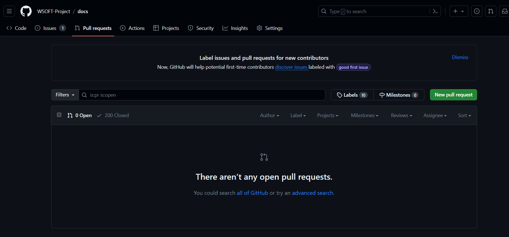
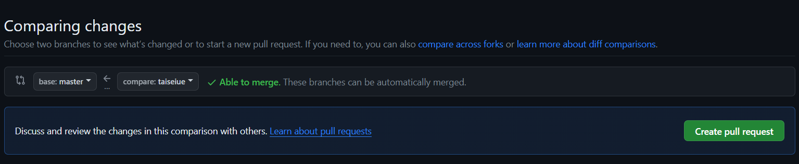
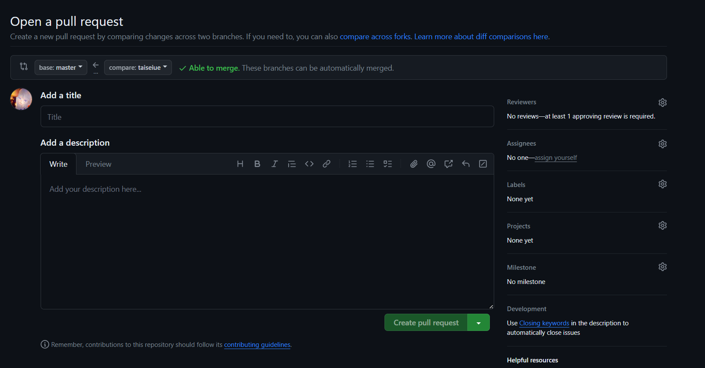

WSOFTDocsの記事では、ドキュメントの編集を使用することで、軽微な誤字脱字やその他の問題を簡単に報告および修正できます。

## 概要
さまざまな努力を重ねても、公開されているドキュメントには誤植や表現に関する小さな誤りが"必ず"入り込みます。
そのような誤りに気づかれた場合、リポジトリでIssueを作成して間違いを報告していただけますが、可能な場合は直接編集し、Pull Requestを作成して問題を修正するほうが早くて簡単です。

ドキュメントを編集するには、以下のいずれかの方法を使用できます。

1. ブラウザを使って編集する
2. Gitと好きなエディターを使ってローカルで編集する

簡単な修正を行う場合はブラウザを使って編集するほうが早くて簡単ですが、複数の記事を変更する場合や新たに画像をアップロードする場合、使い慣れたエディターで編集したい場合はローカルで編集することをオススメします。

## ブラウザを使って編集する方法
1. ドキュメントの編集を行うには、GitHubのアカウントが必要です。すでにアカウントをお持ちの場合は、GitHubにサインインしていることを確認してください。GitHubアカウントをお持ちでない場合は、[GitHubのサイト](https://github.com/join)から登録できます。
2. 編集するドキュメントのページを開きます。ドキュメントの編集が利用可能な場合、以下の画像のような「編集」ボタン(鉛筆アイコン)が表示されます。このボタンをクリックすると、GitHub上のソースファイルに移動します。
3. 鉛筆アイコンをクリックして記事を編集します。鉛筆アイコンが灰色に表示されている場合は、自分のGitHubアカウントでログインするか、新しいアカウントを作成する必要があります。
4. Webエディターでファイルを編集します。
5. 編集が完了したら、ページの下部までスクロールします。「変更の提案」領域に変更の簡単な概要（"誤字の修正"、"表現の改善"など）と、必要に応じて説明を入力します。タイトルはコミットメッセージの最初の行になります。入力できたら、「変更の提案」をクリックして変更をコミットします。
6. 変更の提案が済んだため、その変更をリポジトリに"Pull"するよう、そのリポジトリの所有者に依頼し、コミットする必要があります。これを完了するには、"PullRequest"と呼ばれる作業を実行します。「Propose changes」をクリックしてPullRequestを作成します。GitHubをはじめてお使いの場合、詳細については[Pull requestについて](https://docs.github.com/ja/pull-requests/collaborating-with-pull-requests/proposing-changes-to-your-work-with-pull-requests/about-pull-requests)を参照してください。
7. これで完了です。WSOFTのメンバーが、Pull Requestをレビューし、承認されればそれをマージし、サイトに反映します。編集内容に関する質問などをお伺いすることがあるため、GitHubの通知を受け取れるようにしておいてください。

## ローカルで編集する方法
### 編集の準備
以下の操作は、初回のみ必要です。

1. ローカルでドキュメントの編集を行うには、Gitがインストールされているコンピューターが必要です。すでにGitがインストールされている場合は、適切にユーザー名と電子メールアドレスが設定されていることを確認してください。Gitがインストールされていない場合は、[Gitのサイト](https://git-scm.com/downloads)またはパッケージマネージャーからインストールできます。
2. 作業ディレクトリにWSOFT Docsのリポジトリをクローンし、ブランチを作成します。このとき、ブランチ名には他と被らないように名前や目的などをいれてください。(たとえば、`taiseiue-edit`ブランチなど。)実際にクローンしてブランチを作成するには、以下のコマンドを実行します。`<ブランチ名>`は、適時変更してください。

```sh title="シェル"
git clone https://github.com/WSOFT-Project/docs.git
git branch -b <ブランチ名>
```

### 編集開始
以下の操作は、編集時に毎回行う必要があります。

1. 作業ディレクトリに移動して、`git pull`コマンドを実行します。
2. 任意のエディターで、作業ディレクトリ内のドキュメントを編集します。
3. 編集が完了したら、編集内容をアップロードします。作業ディレクトリで以下のコマンドを実行してください。`<コミットメッセージ>`には、作業内容の概要を入力してください。

```sh title="シェル"
git add .
git commit -m "<コミットメッセージ>"
git push
```

### Pull Requestの作成






1. [WSOFTDocsのPull Requestページ](https://github.com/WSOFT-Project/docs/pulls)にアクセスし、「**New pull request**」をクリックします。
2. Comparing changesに移動したら、**compare**を自分のブランチに、**base**を`master`に設定し、編集内容を確認して「**Create pull request**」をクリックします。
3. Open a pull requestに移動したら、編集内容のタイトルと説明を入力し、**Create pull request**をクリックします。
4. これでPull Requestの作成は完了です。WSOFTのメンバーが、Pull Requestをレビューし、承認されればそれをマージし、サイトに反映します。編集内容に関する質問などをお伺いすることがあるため、GitHubの通知を受け取れるようにしておいてください。