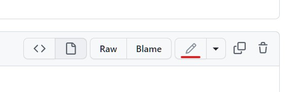
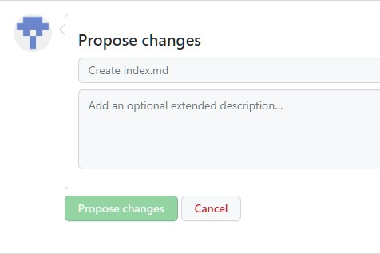

WSOFTDocs 共同作成ガイドへようこそ。

WSOFTのドキュメントは、すべてオープンソースでGitHub上でホストされていて、そこでPullRequest(PR)を使って記事の追加や更新を提案することができます。このような取り組みにより、エンジニアとみなさんの間にコミュニケーションが生まれます。

!!! note "重要"
    WSOFTDocsでは、[使用条件](/legal/docs-termsofuse)およびMITライセンスが採用されています。ご意見や質問がある場合は、info@wsoft.ws までご連絡ください。

!!! tip "変更不可能なコンテンツ"
    法的資料など一部のコンテンツは、たとえ変更内容が誤植の修正など軽微なものであったとしても、変更は許可されません。これらの記事の変更を含むpull requestは拒否されます。

### ドキュメントを編集する
様々な努力を重ねても、公開されたドキュメントには誤植や文法に関する小さな誤りが"必ず"入り込みます。これを受け入れることも大切なことなのですが、これを極力減らしていくことも大切なことです。Issueを作成して間違いを報告することもできますが、利用可能な場合は、PRを作成して問題を修正するオプションの方が早くて簡単です。

1. 一部のページでは、ブラウザ内で直接コンテンツを編集できます。利用可能な場合、以下に示すような「編集」ボタンが表示されます。このボタンをクリックすると、GitHub上のソースファイルに移動します。
2. 鉛筆アイコンをクリックして記事を編集します。鉛筆アイコンが灰色に表示されている場合は、自分のGitHubアカウントでログインするか、新しいアカウントを作成する必要があります。
3. Webエディタでファイルを編集します。
4. 編集が完了したら、ページの下部までスクロールします。「変更の提案」領域に変更のタイトルと、必要に応じて説明を入力します。タイトルはコミットメッセージの最初の行になります。「変更の提案」をクリックして変更をコミットします。
5. 変更の提案が済んだため、その変更をリポジトリに"Pull"するよう、そのリポジトリの所有者に依頼し、コミットする必要があります。これを完了するには、"PullRequest"と呼ばれる作業を実行します。「Propose changes」をクリックしてPullRequestを作成します。GitHubを初めてお使いの場合、詳細については[pull requestについて](https://docs.github.com/ja/pull-requests/collaborating-with-pull-requests/proposing-changes-to-your-work-with-pull-requests/about-pull-requests)を参照してください。
6. これで完了です。WSOFTのメンバーが、PRをレビューし、承認されたらそれをマージします。変更をお願いするフィードバックを受け取る可能性があります。

### オープン中のpull requestをレビューする
pull requestsタブを確認することで、新しい記事やその変更を公開前に確認できます。それらをレビューしてコメントを追加することで、コミュニティにフィードバックできます。

### 記事に関するIssueを作成する
WSOFTDocsは、現在進行中の継続的な作業ですから、まだまだ改善の余地があります。それらの改善点は、私一人ですべてを発見するのは困難です。
適切なIssueの投稿は、WSODFTDocsを改善するために役立ちます。提供していただく情報が詳細かつ具体的なほど、Issueは役立つものとなります。お探しだった情報を教えてください。ご使用になった検索語句をおしえてください。ガイドやドキュメントがわかりづらかった場合、どのようにするのが望ましいかお教えください。

### LantanaやMkDocsの開発に参加する
WSOFTDocsのユーザーエクスペリエンスの大部分は、[Lantana](https://lantana.wsoft.ws/)によって提供されています。Webページのユーザーエクスペリエンスについてご意見がある場合は、[Lantanaのリポジトリ](https://github.com/WSOFT-Project/lantana)へお願いします。
また、ドキュメントの生成システムは、[MkDocs](https://www.mkdocs.org)によって提供されています。MkDocsについても、[MkDocsのリポジトリ](https://github.com/mkdocs/mkdocs)へお願いします。

WSOFTDocsの改善にご協力いただき、ありがとうございます。
