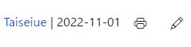
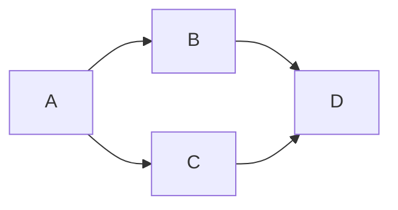

[Markdown](https://daringfireball.net/projects/markdown/)記法は、簡単で軽量なマークアップ言語です。WSOFTDocsでは、[Jinja](https://jinja.palletsprojects.com/)解析エンジンを介して解析されます。

### 普通のテキスト
そのまま記述可能です。
```markdown title="Markdown"
Lantanaは、シンプルで軽量なMKDocsのテーマです。
HTMLの知識がなくても簡単にサイトを作成できます。

改行するには、一行空行を挟みます。
```
結果

Lantanaは、シンプルで軽量なMKDocsのテーマです。
HTMLの知識がなくても簡単にサイトを作成できます。

改行するには、一行空行を挟みます。

### エスケープ
マークダウンで意味のある文字（たとえば、\*や\#など）をテキストとして表示するには、エスケープが必要です。
```markdown title="Markdown"
\*\#\!\`\\
```
!!! quote "結果"
    \*\#\!\`\\

### 明示的な空行
二行以上にわたって改行したい場合など、一部の場合ではHTMLの`<br/>`タグを使用します。
```html title="Markdown"
<br/>
```

### コメント
記事にコメントを記述する方法はHTMLと同じです。ビルド時に削除されます。
```html title="Markdown"
<!-- this is a comment. -->
```

### 見出し
Hタグを生成します。記事にタイトルが指定されていない場合、自動的に記事の一番最初の見出しがタイトルになります。

また、見出しは目次にも表示されます。
```markdown title="Markdown"
# これはH1タグになります
## これはH2タグになります
###### これはH6タグになります
```
結果
<h1>これはH1タグになります</h1>
<h2>これはH2タグになります</h2>
<h6>これはH6タグになります</h6>
<br/>

### テキストの装飾
文章をさまざまに装飾する方法をまとめて紹介します。
```markdown title="Markdown"
_ か * で囲むとHTMLのemタグになり、 *このように* 表示されます。

__ か ** で囲むとHTMLのstrongタグになり、**このように** 表示されます。

それらを組み合わせることもできます。*** で囲むと、***このように*** 表示されます。

~~ で囲むと打消し線になり、　~~このように~~ 表示されます。

^^ で囲むと下線がつき、^^このように^^ 表示されます。

== で囲むとハイライトがつき、==このように== 表示されます。

~ で囲むと下付き文字になり、使用すると~このように~表示されます。

^ で囲むと上付き文字になり、使用すると^このように^表示されます。

++ で囲むと++ctrl+alt+del++のようにキーボードのキーを表現できます。

また、`print("Hello,World!");`と記述することでコードをインライン表示できます。

```
_ か \* で囲むとHTMLのemタグになり、 *このように* 表示されます。

__ か \*\* で囲むとHTMLのstrongタグになり、**このように** 表示されます。

それらを組み合わせることもできます。\*\*\* で囲むと、***このように*** 表示されます。

\~\~ で囲むと打消し線になり、　~~このように~~ 表示されます。

\^\^ で囲むと下線がつき、^^このように^^ 表示されます。

\=\= で囲むとハイライトがつき、==このように== 表示されます。

\~ で囲むと下付き文字になり、使用すると~このように~表示されます。

\^ で囲むと上付き文字になり、使用すると^このように^表示されます。

\+\+ で囲むと++ctrl+alt+del++のようにキーボードのキーを表現できます。

また、`print("Hello,World!");`と記述することでコードをインライン表示できます。

テキストの装飾について詳しく知るには、[テキストの書式設定に関する指針](./text-formatting-guidelines.md)を参照してください。

### 脚注
<span class="badge bg-primary">対応バージョン:<=2.7.1</span>

`[^1]`のように文章の任意の場所に脚注へのリンクを設置すると、ページの末尾の説明へ移動します。
説明は文章中の任意の場所で`[^1]: <説明>`とすることで記述できます。

!!!warning "使用に注意"
    脚注機能は確かに便利ですが、ユーザーがそれを参照するたびにページ末尾に移動しなければならないことに注意してください。ひとつの記事に大量に脚注があったり、そこに重要なことが書いてある場合ユーザー体験を極端に低下させます。重要なことは直接文中に記述するように心がけてください。

```markdown title="例"
そのころわたくしは、モリーオ市の博物局に勤めて居りました。
十八等官 [^1]でしたから役所のなかでも、ずうっと下の方でしたし俸給[^2]もほんのわずかでしたが、受持ちが標本の採集や整理で生れ付き好きなことでしたから、わたくしは毎日ずいぶん愉快にはたらきました。

[^1]: ロシア帝国では、軍隊、政府、および宮廷における地位と階級を**[官等表](https://en.wikipedia.org/wiki/Table_of_Ranks)**と呼ばれるもので管理していました。
[^2]: 役所や会社に務める人の給料のことを指す言葉です。
```

結果

そのころわたくしは、モリーオ市の博物局に勤めて居りました。
十八等官[^1] でしたから役所のなかでも、ずうっと下の方でしたし俸給[^2]もほんのわずかでしたが、受持ちが標本の採集や整理で生れ付き好きなことでしたから、わたくしは毎日ずいぶん愉快にはたらきました。

[^1]: ロシア帝国では、軍隊、政府、および宮廷における地位と階級を[官等表](https://en.wikipedia.org/wiki/Table_of_Ranks)と呼ばれるもので管理していました。
[^2]: 役所や会社に務める人の給料のことを指す言葉です。

### コードブロック
```` ``` ```` で囲むことでコードとして認識され、初めを```` ```言語名 ```` とすることでシンタックスハイライトがつきます。`title="タイトル"`とすることでファイル名なども表現できます。また、`linenums="1"`とすると行番号を表示できます。
```markdown title="Markdown"
``` csharp title="Program.cs" linenums="1"
using System;

public class Program
 {
    public static void Main()
     {
            Console.WriteLine("Hello World!");
     }
 }
```

結果
``` csharp title="Program.cs" linenums="1"
using System;

public class Program
 {
    public static void Main()
     {
            Console.WriteLine("Hello World!");
     }
 }
```

!!! warning "注意"
    上記のサンプルでは末尾の```` ``` ````が欠落しています。（マークダウンの制約）コピペで使用する際はご注意ください。

WSOFTDocsでのコードブロックのお作法については、[コードの埋め込み方](./include-code.md)を参照してください。

### 数式
`\$\$`で囲むことでTeX記法を用いて数式を記述できます。
```markdown title="Markdown"
$$
\operatorname{ker} f=\{g\in G:f(g)=e_{H}\}{\mbox{.}}
$$
```
結果

$$
\operatorname{ker} f=\{g\in G:f(g)=e_{H}\}{\mbox{.}}
$$

`$`または`\(...\)`で囲むことで、数式を文中に埋め込むこともできます。
```markdown title="Markdown"
ディッフィー・ヘルマン鍵共有プロトコルでは、まず大きな素数 ${\displaystyle p}p$ と、
${\displaystyle p-1}p-1$ を割り切る大きな素数 ${\displaystyle q}q$ を用意します。
また、 ${\displaystyle g}g$ を
${\displaystyle ({\mathbb {Z} }/p{\mathbb {Z} })^{\ast }}{\displaystyle ({\mathbb {Z} }/p{\mathbb {Z} })^{\ast }}$ の元で、
位数が ${\displaystyle q}q$ である値とします。
この ${\displaystyle p,q,g}{\displaystyle p,q,g}$ の値は公開されているものとします。
```
結果

ディッフィー・ヘルマン鍵共有プロトコルでは、まず大きな素数 ${\displaystyle p}p$ と、 ${\displaystyle p-1}p-1$ を割り切る大きな素数 ${\displaystyle q}q$ を用意します。また、 ${\displaystyle g}g$ を ${\displaystyle ({\mathbb {Z} }/p{\mathbb {Z} })^{\ast }}{\displaystyle ({\mathbb {Z} }/p{\mathbb {Z} })^{\ast }}$ の元であり、位数が ${\displaystyle q}q$ である値とします。この ${\displaystyle p,q,g}{\displaystyle p,q,g}$ の値は公開されているものとします。

### 順序なしリスト
リストの上には空行が必要です。
```markdown title="Markdown"
* 文頭に"*"、"+"、"-"のいずれかを入れると順序なしリストになります
+ 記号のあとには**スペースが必要**です
- 同じリストでは同じ記号を使うことを推奨します。
```
結果

* 文頭に"`*`"、"`+`"、"`-`"のいずれかを入れると順序なしリストになります
+ 記号のあとには**スペースが必要**です
- 同じリストでは同じ記号を使うことを推奨します。

### 番号付きリスト
リストの上には空行が必要です。
```markdown title="Markdown"
1. 文頭に"数字."を入れると番号付きリストになります。
1. "数字."のあとには**スペースが必要**です
1. すべての数字を1にすると、自動的に番号が付きます。
```
結果

1. 文頭に"`数字.`"を入れると番号付きリストになります。
1. "`数字.`"のあとには**スペースが必要**です
1. すべての数字を1にすると、自動的に番号が付きます。

### タスクリスト
順序なしリストの記述の後ろに[]を入れるとチェックボックスが生成されます。
また、チェックが入った状態のボックスを生成する場合は[x]を入力します。
```markdown title="Markdown"
- [ ] タスク1
- [x] タスク2
```
結果

- [ ] タスク1
- [x] タスク2

### 水平線
```markdown title="Markdown"
---
```
結果
---

### URL
Urlやメールアドレスを書くだけで、自動的にリンクになります。
```markdown title="Markdown"
https://lantana.wsoft.ws

info@wsoft.ws
```
結果

https://lantana.wsoft.ws

info@wsoft.ws

### リンク
```markdown title="Markdown"
[リンク](about:blank)
```
結果

[リンク](about:blank)

WSOFTDocsでのリンクのお作法については、[リンクの使い方](./how-to-write-links.md)を参照してください。

### タイトル付きリンク
タイトルはリンクをホバーした時に表示されます。
```markdown title="Markdown"
[リンク](about:blank "タイトル")
```
結果

[リンク](about:blank "タイトル")

### リンクの使いまわし
```markdown title="Markdown"
[link]: about:blank
[ここ][link]と[ここ][link]は同じになります。
```
結果

[link]: about:blank
[ここ][link]と[ここ][link]は同じになります。

また、[link]という書き方もできます。

### ボタン
ボタンを使えば、ユーザーにとって注意を引きやすいリンクを作ることができます。ボタンはBootstrapによって提供されているため、クラスを指定するだけで使用できます。次に例を示します。

```markdown title="Markdown"
[ボタン](#){: .btn .btn-primary }
[ボタン](#){: .btn .btn-secondary }
[ボタン](#){: .btn .btn-success }
[ボタン](#){: .btn .btn-danger }
[ボタン](#){: .btn .btn-warning }
[ボタン](#){: .btn .btn-info }
[ボタン](#){: .btn .btn-light }
[ボタン](#){: .btn .btn-dark }
[ボタン](#){: .btn .btn-link }
```

結果

[ボタン](#){: .btn .btn-primary }
[ボタン](#){: .btn .btn-secondary }
[ボタン](#){: .btn .btn-success }
[ボタン](#){: .btn .btn-danger }
[ボタン](#){: .btn .btn-warning }
[ボタン](#){: .btn .btn-info }
[ボタン](#){: .btn .btn-light }
[ボタン](#){: .btn .btn-dark }
[ボタン](#){: .btn .btn-link }

### 画像
```markdown title="Markdown"

```

結果


### 表
Bootstrapの制約により、ヘッダーでは左右中央揃えが適用されません

```markdown title="Markdown"
| Left align | Right align | Center align |
|:-----------|------------:|:------------:|
| This       | This        | This         |
| column     | column      | column       |
| will       | will        | will         |
| be         | be          | be           |
| left       | right       | center       |
| aligned    | aligned     | aligned      |
```

結果

| Left align | Right align | Center align |
|:-----------|------------:|:------------:|
| This       | This        | This         |
| column     | column      | column       |
| will       | will        | will         |
| be         | be          | be           |
| left       | right       | center       |
| aligned    | aligned     | aligned      |

### 引用
```markdown title="Markdown"
> 文頭に>を置くことで引用になります。
> 複数行にまたがる場合、改行のたびにこの記号を置く必要があります。
> 
> 引用の中に別のMarkdownを使用することも可能です。
> 
> > これはネストされた引用です。
```
結果
> 文頭に>を置くことで引用になります。
> 複数行にまたがる場合、改行のたびにこの記号を置く必要があります。
> 
> 引用の中に別のMarkdownを使用することも可能です。
> 
> > これはネストされた引用です。

### 図形
Lantanaは規定でmermaid.jsをサポートします。mermaid.jsを使うと、複雑な図形を簡単に挿入できます。
```markdown title="Markdown"


結果


### アラート
目を引く形で説明したい場合、`!!! 種類 "タイトル"`で囲みます。

```markdown title="Markdown"
!!! note "メモ"
    `note`で使用できる装飾です。[リンク](#)は自動的に適切な色になります。
```
結果
!!! note "メモ"
    `note`で使用できる装飾です。[リンク](#)は自動的に適切な色になります。

!!! abstract
    `abstract`で使用できる装飾です。[リンク](#)は自動的に適切な色になります。

!!! info
    `info`で使用できる装飾です。[リンク](#)は自動的に適切な色になります。

!!! tip
    `tip`で使用できる装飾です。[リンク](#)は自動的に適切な色になります。

!!! success
    `success`で使用できる装飾です。[リンク](#)は自動的に適切な色になります。

!!! question
    `question`で使用できる装飾です。[リンク](#)は自動的に適切な色になります。

!!! warning
    `warning`で使用できる装飾です。[リンク](#)は自動的に適切な色になります。

!!! failure
    `failure`で使用できる装飾です。[リンク](#)は自動的に適切な色になります。

!!! danger
    `danger`で使用できる装飾です。[リンク](#)は自動的に適切な色になります。

!!! bug
    `bug`で使用できる装飾です。[リンク](#)は自動的に適切な色になります。

!!! example
    `example`で使用できる装飾です。[リンク](#)は自動的に適切な色になります。

!!! quote
    `quote`で使用できる装飾です。[リンク](#)は自動的に適切な色になります。

### 記事一覧
` = "<ディレクトリ名>" =`で囲むと、そのディレクトリの記事一覧を出力します。これはHTMLコード中でも使用できます。

```markdown title="例"
= "blog" =
```

!!!note "メモ"
    この機能がLantanaに実装されたことで従来WSOFTDocsに独自に実装されていた、`{{ print_thumbnails('') }}`関数は使用されなくなりました。これにより、ビルド時間が150%高速化しました。

### スニペットの埋め込み
`--8<--`で囲い、その中にファイル名を書き込むと、そのファイルを埋め込みます。
```markdown title="Markdown"
;--8<--
snippet.md
;--8<--
```
### HTMLの埋め込み
HTMLコードは、そのまま記述することで埋め込むことができます。
```html title="Markdown"
<h4>これはHTMLのH4タグです</h4>
```
結果
<h4>これはHTMLのH4タグです</h4>

### 属性の追加
`{: 属性名}`とするとマークダウンで生成される要素に特定の属性を追加できます。
```markdown title="Markdown"
### この要素にはqueryというIdがつきます {: #query }
```
結果

以下のようなHTMLが生成されます
```html
<h3 id="query">この要素にはqueryというIdがつきます</h3>
```