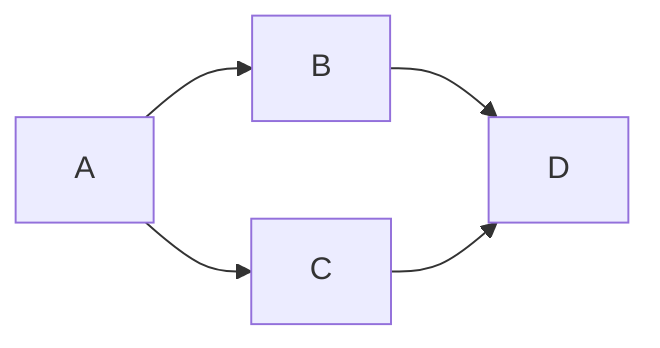

WSOFTDocsの記事は、すべて[Markdown](https://daringfireball.net/projects/markdown/)記法で記述します。
WSOFTDocsでは、記事のMarkdownは、[Pymdown](https://facelessuser.github.io/PyMdown/)を用いてビルドしています。また、WSOFTDocsでは、このサイト内で独自に表現できるMarkdown記法も導入しています。

どのエディターを使用してもMarkdownを記述できますが、[Markdown All in One 拡張機能](https://marketplace.visualstudio.com/items?itemName=yzhang.markdown-all-in-one)を導入した[VS Code](https://code.visualstudio.com/)で記述することをおすすすめします。

## テキスト
テキストの装飾について詳しく知るには、[テキストの書式設定に関する指針](./text-formatting-guidelines.md)を参照してください。

普通のテキストは、そのまま記述します。

```md title="Markdown"
Lantanaは、シンプルで軽量なMKDocsのテーマです。
HTMLの知識がなくても簡単にサイトを作成できます。

段落を分けるには、一行空行を挟みます。
```

**結果**

Lantanaは、シンプルで軽量なMKDocsのテーマです。
HTMLの知識がなくても簡単にサイトを作成できます。

段落を分けるには、一行空行を挟みます。

### 改行
文中で段落を分けずに改行する場合や、二行以上にわたって改行したい場合には、改行したい位置にHTMLの`<br/>`タグを使用します。

```html title="Markdown"
この文は段落を分けずに改行しています。<br/>
ここは上の文から改行されています。
```

**結果**

この文は段落を分けずに改行しています。<br/>
ここは上の文から改行されています。

### エスケープ
Markdown記法で意味のある文字（たとえば、\*や\#など）をテキストとして表示するには、エスケープが必要です。

```md title="Markdown"
\#これはヘッダーにはなりません

\*これは斜体にはなりません\*
```

**結果**

\#これはヘッダーにはなりません

\*これは斜体にはなりません\*


### コメント
記事にコメントを記述する方法はHTMLと同じです。コメントはビルド時に削除されます。

```html title="Markdown"
<!-- this is a comment. -->
```

> [!WARNING] 機密事項をコメントに残さない
> 記事中のコメントはビルド時に削除されますが、ソース上では残ります。
> 記事中のコメントはGitHubで閲覧できることにご注意ください。

### 太字・斜体
テキスト中で斜体にしたい場所を\*または\_で、太字にしたい場所を\*\*または\_\_で囲むことで、それぞれ斜体と太字を表現できます。斜体と太字は同時に使用できます。ただし、\_を使用するには左右に空白が必要です。

```md title="Markdown"
これは*斜体*になります。これも _同様_ です。

これは**太字**になります。これも __同様__ です。

これは***斜体および太字***になります。これも ___同様___ です。
```

**結果**

これは*斜体*になります。これも _同様_ です。

これは**太字**になります。これも __同様__ です。

これは***斜体および太字***になります。これも ___同様___ です。

### 下線・打ち消し線
テキスト中で下線を引きたい場所を\^\^で、打ち消し線を引きたい場所を\^\^を囲むことで、下線と打ち消し線を表現できます。

```md title="Markdown"
ここには^^下線^^が引かれます。

ここには~~打ち消し線~~が引かれます。
```

**結果**

ここには^^下線^^が引かれます。

ここには~~打ち消し線~~が引かれます。

### 上付き文字・下付き文字
テキスト中で上付き文字にしたい場所を\^で、下付き文字にしたい場所を^~で囲むことで、上下付き文字を表現できます。

```md title="Markdown"
これは^上付き文字^になります。

これは~下付き文字~になります。
```

**結果**

これは^上付き文字^になります。

これは~下付き文字~になります。

### ハイライト
テキスト中でハイライトをつけたい場所に==をつけることで、背景色を強調色にできます。

```md title="Markdown"
この場所に ==ハイライト== がつきます。
```

**結果**

この場所に ==ハイライト== がつきます。

> [!NOTE] ハイライトの制約
> ハイライトをつける際、==の周りには空白や読点など、単語として分割できる要素が必要です。

### キーボードショートカット
キーの組み合わせを表現するには、小文字のキー名を\+\+で囲みます。キー同士は+で繋げます。

```md title="Markdown"
Windowsでセキュリティオプションを表示するには++ctrl+alt+del++を押します。
```

**結果**

Windowsでセキュリティオプションを表示するには++ctrl+alt+del++を押します。

### インラインコード
テキスト中にコードを含めるには、\`で囲みます。

```md title="Markdown"
AliceScriptでテキストを表示するには、`print`関数を使います。
```

**結果**

AliceScriptでテキストを表示するには、`print`関数を使います。

## 見出し
Hタグを生成します。記事にタイトルが指定されていない場合、自動的に記事の一番最初の見出しがタイトルになります。記事中の見出しには、H2～H4見出しを使用してください。

見出しは目次にも表示されます。

```md title="Markdown"
## これはH2タグになります
#### これはH4タグになります
```

**結果**

<h2>これはH2タグになります</h2>
<h4>これはH4タグになります</h4>
<br/>

### 脚注
<span class="badge bg-primary">対応バージョン:>=2.7.1</span>

`[^1]`のように文章の任意の場所に脚注へのリンクを設置すると、ページの末尾の説明へ移動します。
説明は文章中の任意の場所で`[^1]: <説明>`とすることで記述できます。

> [!NOTE] 考慮事項
> 脚注機能は確かに便利ですが、ユーザーがそれを参照するたびにページ末尾に移動しなければならないことに注意してください。ひとつの記事に大量に脚注があったり、そこに重要なことが書いてある場合ユーザー体験を極端に低下させます。重要なことは直接文中に記述するように心がけてください。

```markdown title="例"
そのころわたくしは、モリーオ市の博物局に勤めて居りました。
十八等官 [^1]でしたから役所のなかでも、ずうっと下の方でしたし俸給[^2]もほんのわずかでしたが、受持ちが標本の採集や整理で生れ付き好きなことでしたから、わたくしは毎日ずいぶん愉快にはたらきました。

[^1]: ロシア帝国では、軍隊、政府、および宮廷における地位と階級を**[官等表](https://en.wikipedia.org/wiki/Table_of_Ranks)**と呼ばれるもので管理していました。
[^2]: 役所や会社に務める人の給料のことを指す言葉です。
```

**結果**

そのころわたくしは、モリーオ市の博物局に勤めて居りました。
十八等官[^1] でしたから役所のなかでも、ずうっと下の方でしたし俸給[^2]もほんのわずかでしたが、受持ちが標本の採集や整理で生れ付き好きなことでしたから、わたくしは毎日ずいぶん愉快にはたらきました。

[^1]: ロシア帝国では、軍隊、政府、および宮廷における地位と階級を[官等表](https://en.wikipedia.org/wiki/Table_of_Ranks)と呼ばれるもので管理していました。
[^2]: 役所や会社に務める人の給料のことを指す言葉です。

### コードブロック
```` ``` ```` で囲むことでコードとして認識され、言語インジケーター(```` ```言語名 ````)をつけることで、シンタックスハイライトがつきます。また、`title="タイトル"`とすることでファイル名などのタイトルを表示できます。

```markdown title="Markdown"
``` csharp title="Program.cs"
using System;

public class Program
 {
    public static void Main()
     {
            Console.WriteLine("Hello World!");
     }
 }
 ```
```

結果
``` csharp title="Program.cs"
using System;

public class Program
 {
    public static void Main()
     {
            Console.WriteLine("Hello World!");
     }
 }
```

WSOFTDocsでのコードブロックのお作法については、[コードの埋め込み方](./include-code.md)を参照してください。

### 数式
`\$\$`で囲むことでTeX記法を用いて数式を記述できます。
```markdown title="Markdown"
$$
\operatorname{ker} f=\{g\in G:f(g)=e_{H}\}{\mbox{.}}
$$
```
結果

$$
\operatorname{ker} f=\{g\in G:f(g)=e_{H}\}{\mbox{.}}
$$

`$`または`\(...\)`で囲むことで、数式を文中に埋め込むこともできます。
```markdown title="Markdown"
ディッフィー・ヘルマン鍵共有プロトコルでは、まず大きな素数 ${\displaystyle p}p$ と、
${\displaystyle p-1}p-1$ を割り切る大きな素数 ${\displaystyle q}q$ を用意します。
また、 ${\displaystyle g}g$ を
${\displaystyle ({\mathbb {Z} }/p{\mathbb {Z} })^{\ast }}{\displaystyle ({\mathbb {Z} }/p{\mathbb {Z} })^{\ast }}$ の元で、
位数が ${\displaystyle q}q$ である値とします。
この ${\displaystyle p,q,g}{\displaystyle p,q,g}$ の値は公開されているものとします。
```
結果

ディッフィー・ヘルマン鍵共有プロトコルでは、まず大きな素数 ${\displaystyle p}p$ と、 ${\displaystyle p-1}p-1$ を割り切る大きな素数 ${\displaystyle q}q$ を用意します。また、 ${\displaystyle g}g$ を ${\displaystyle ({\mathbb {Z} }/p{\mathbb {Z} })^{\ast }}{\displaystyle ({\mathbb {Z} }/p{\mathbb {Z} })^{\ast }}$ の元であり、位数が ${\displaystyle q}q$ である値とします。この ${\displaystyle p,q,g}{\displaystyle p,q,g}$ の値は公開されているものとします。

### 順序なしリスト
リストの上には空行が必要です。
```markdown title="Markdown"
* 文頭に"*"、"+"、"-"のいずれかを入れると順序なしリストになります
+ 記号のあとには**スペースが必要**です
- 同じリストでは同じ記号を使うことを推奨します。
```
結果

* 文頭に"`*`"、"`+`"、"`-`"のいずれかを入れると順序なしリストになります
+ 記号のあとには**スペースが必要**です
- 同じリストでは同じ記号を使うことを推奨します。

### 番号付きリスト
リストの上には空行が必要です。

```markdown title="Markdown"
1. 文頭に"数字."を入れると番号付きリストになります。
1. "数字."のあとには**スペースが必要**です
1. すべての数字を1にすると、自動的に番号が付きます。
```
結果

1. 文頭に"`数字.`"を入れると番号付きリストになります。
1. "`数字.`"のあとには**スペースが必要**です
1. すべての数字を1にすると、自動的に番号が付きます。

### タスクリスト
順序なしリストの記述の後ろに[]を入れるとチェックボックスが生成されます。
また、チェックが入った状態のボックスを生成する場合は[x]を入力します。
```markdown title="Markdown"
- [ ] タスク1
- [x] タスク2
```
結果

- [ ] タスク1
- [x] タスク2

### 水平線
```markdown title="Markdown"
---
```
結果
---

### URL
Urlやメールアドレスを書くだけで、自動的にリンクになります。
```markdown title="Markdown"
https://lantana.wsoft.ws

info@wsoft.ws
```
結果

https://lantana.wsoft.ws

info@wsoft.ws

### リンク
```markdown title="Markdown"
[リンク](about:blank)
```
結果

[リンク](about:blank)

WSOFTDocsでのリンクのお作法については、[リンクの使い方](./how-to-write-links.md)を参照してください。

### ページ内リンク
記事内の特定のヘッダーにジャンプするリンクを作成できます。

```md title="Markdown"
[順序なしリスト](#順序なしリスト)
```

**出力**

[順序なしリスト](#順序なしリスト)

### タイトル付きリンク
タイトルはリンクをホバーした時に表示されます。
```markdown title="Markdown"
[リンク](about:blank "タイトル")
```
結果

[リンク](about:blank "タイトル")

### リンクの使いまわし
```markdown title="Markdown"
[link]: about:blank
[ここ][link]と[ここ][link]は同じになります。
```
結果

[link]: about:blank
[ここ][link]と[ここ][link]は同じになります。

また、[link]という書き方もできます。

### セレクター
ユーザーの状況に応じて複数のどちらかのサイトにリンクしたい場合、セレクターを使用できます。
セレクターを使用するには、引用の先頭に`[!SELECTOR] タイトル`をつけ、引用中にリンクを列挙します。

```markdown title="Markdown"
> [!SELECTOR] 対象バージョンを選択
> [Alice2.3以前](../products/alice/api/alice/function.md)
> [Alice3.0以降](../products/alice/general/function.md)
```

> [!SELECTOR] 対象バージョンを選択
> [Alice2.3以前](../products/alice/api/alice/function.md)
> [Alice3.0以降](../products/alice/general/function.md)

### ボタン
ボタンを使えば、ユーザーにとって注意を引きやすいリンクを作ることができます。ボタンはBootstrapによって提供されているため、クラスを指定するだけで使用できます。次に例を示します。

```markdown title="Markdown"
[ボタン](#){: .btn .btn-primary }
[ボタン](#){: .btn .btn-secondary }
[ボタン](#){: .btn .btn-success }
[ボタン](#){: .btn .btn-danger }
[ボタン](#){: .btn .btn-warning }
[ボタン](#){: .btn .btn-info }
[ボタン](#){: .btn .btn-light }
[ボタン](#){: .btn .btn-dark }
[ボタン](#){: .btn .btn-link }
```

結果

[ボタン](#){: .btn .btn-primary }
[ボタン](#){: .btn .btn-secondary }
[ボタン](#){: .btn .btn-success }
[ボタン](#){: .btn .btn-danger }
[ボタン](#){: .btn .btn-warning }
[ボタン](#){: .btn .btn-info }
[ボタン](#){: .btn .btn-light }
[ボタン](#){: .btn .btn-dark }
[ボタン](#){: .btn .btn-link }

### 画像
```markdown title="Markdown"

```

結果


### 表
次のように記述することで簡単に表を使用できます。
ちなみに、名前のあとの空白はMarkdownの読みやすさのためで出力結果には影響しません。

```md title="Markdown"
名前     | 年齢
-------  | ----
山田 太郎 | 16
鈴木 花子 | 24
```

結果

名前     | 年齢
-------  | ----
山田 太郎 | 16
鈴木 花子 | 24

両端に`|`を使用することで、読みやすくできます。

```md title="Markdown"
|名前     | 年齢|
|-------  | ----|
|山田 太郎 | 16  |
|鈴木 花子 | 24  |
```

結果

|名前     | 年齢|
|-------  | ----|
|山田 太郎 | 16  |
|鈴木 花子 | 24  |

ヘッダーの区切りにコロンを追加すると、左右中央揃えを使用できます。
ヘッダーでは左右中央揃えが適用されません。

```markdown title="Markdown"
| Left align | Right align | Center align |
|:-----------|------------:|:------------:|
| This       | This        | This         |
| column     | column      | column       |
| will       | will        | will         |
| be         | be          | be           |
| left       | right       | center       |
| aligned    | aligned     | aligned      |
```

結果

| Left align | Right align | Center align |
|:-----------|------------:|:------------:|
| This       | This        | This         |
| column     | column      | column       |
| will       | will        | will         |
| be         | be          | be           |
| left       | right       | center       |
| aligned    | aligned     | aligned      |

### 引用
```markdown title="Markdown"
> 文頭に>を置くことで引用になります。
> 複数行にまたがる場合、改行のたびにこの記号を置く必要があります。
> 
> 引用の中に別のMarkdownを使用することも可能です。
> 
> > これはネストされた引用です。
```
結果
> 文頭に>を置くことで引用になります。
> 複数行にまたがる場合、改行のたびにこの記号を置く必要があります。
> 
> 引用の中に別のMarkdownを使用することも可能です。
> 
> > これはネストされた引用です。

### 図形
Lantanaは規定でmermaid.jsをサポートします。mermaid.jsを使うと、複雑な図形を簡単に挿入できます。
```markdown title="Markdown"


結果


### アラート
アラートを使用すると、記事の重要な部分を色とアイコンを使用して目立たせることができます。

アラートは、記事の中で3つまでにしてください。

適用したい引用符の任意の行に`[!種類]`を追加します。

```markdown title="Markdown"
> [!NOTE] メモ
> 流し読みしているユーザーにも読んでもらいたい情報を記述します。
```

**結果**

> [!NOTE] メモ
> 流し読みしているユーザーにも読んでもらいたい情報を記述します。

#### アラートのバリエーション
用途に応じて、アラートには様々な色やアイコンを使用できます。
次に例を示します。

NOTE
> [!NOTE]
> `NOTE`で使用できる装飾です。[リンク](#)は自動的に適切な色になります。
> 
> このアラートはGitHubのアラート記法と互換性があります。

TIP
> [!TIP]
> `TIP`で使用できる装飾です。[リンク](#)は自動的に適切な色になります。
> 
> このアラートはGitHubのアラート記法と互換性があります。

IMPORTANT
> [!IMPORTANT]
> `TIP`で使用できる装飾です。[リンク](#)は自動的に適切な色になります。
> 
> このアラートはGitHubのアラート記法と互換性があります。

CAUTION
> [!CAUTION]
> `CAUTION`で使用できる装飾です。[リンク](#)は自動的に適切な色になります。
> 
> このアラートはGitHubのアラート記法と互換性があります。

WARNING
> [!WARNING]
> `WARNING`で使用できる装飾です。[リンク](#)は自動的に適切な色になります。
> 
> このアラートはGitHubのアラート記法と互換性があります。

ABSTRACT
> [!ABSTRACT]
> `ABSTRACT`で使用できる装飾です。[リンク](#)は自動的に適切な色になります。

INFO
> [!INFO]
> `INFO`で使用できる装飾です。[リンク](#)は自動的に適切な色になります。

SUCCESS
> [!SUCCESS]
> `SUCCESS`で使用できる装飾です。[リンク](#)は自動的に適切な色になります。

QUESTION
> [!QUESTION]
> `QUESTION`で使用できる装飾です。[リンク](#)は自動的に適切な色になります。

FAILURE
> [!FAILURE]
> `FAILURE`で使用できる装飾です。[リンク](#)は自動的に適切な色になります。

DANGER
> [!DANGER]
> `DANGER`で使用できる装飾です。[リンク](#)は自動的に適切な色になります。

BUG
> [!BUG]
> `BUG`で使用できる装飾です。[リンク](#)は自動的に適切な色になります。

EXAMPLE
> [!EXAMPLE]
> `EXAMPLE`で使用できる装飾です。[リンク](#)は自動的に適切な色になります。

QUOTE
> [!QUOTE]
> `QUOTE`で使用できる装飾です。[リンク](#)は自動的に適切な色になります。

#### アラートの隣り合わせ
アラートを連続して配置するには、アラートの間に任意の要素を書きます。
次の例をご覧ください。

```md title="Markdown"
> [!NOTE]
> これはメモです。

<!-- -->
> [!WARNING]
> これは注意事項です
```

**結果**

> [!NOTE]
> これはメモです。

<!-- -->
> [!WARNING]
> これは注意事項です

<!-- -->
> [!NOTE]
> Alerts2拡張機能の導入により、従来の`!!! タイトル`で始まるアラートは非推奨になりました。

### 折り畳み
折り畳みを使用するには、`??? タイトル`で囲みます。

```md title="Markdown"
??? "ポラーノの広場"
    あのイーハトーヴォのすきとおった風、夏でも底に冷たさをもつ青いそら、うつくしい森で飾られたモリーオ市、郊外のぎらぎらひかる草の波。
    またそのなかでいっしょになったたくさんのひとたち、ファゼーロとロザーロ、羊飼のミーロや、顔の赤いこどもたち、地主のテーモ、山猫博士のボーガント・デストゥパーゴなど、いまこの暗い巨きな石の建物のなかで考えていると、みんなむかし風のなつかしい青い幻燈のように思われます。では、わたくしはいつかの小さなみだしをつけながら、しずかにあの年のイーハトーヴォの五月から十月までを書きつけましょう。
```

**結果**

??? "ポラーノの広場"
    あのイーハトーヴォのすきとおった風、夏でも底に冷たさをもつ青いそら、うつくしい森で飾られたモリーオ市、郊外のぎらぎらひかる草の波。
    またそのなかでいっしょになったたくさんのひとたち、ファゼーロとロザーロ、羊飼のミーロや、顔の赤いこどもたち、地主のテーモ、山猫博士のボーガント・デストゥパーゴなど、いまこの暗い巨きな石の建物のなかで考えていると、みんなむかし風のなつかしい青い幻燈のように思われます。では、わたくしはいつかの小さなみだしをつけながら、しずかにあの年のイーハトーヴォの五月から十月までを書きつけましょう。

また、最初から開いておくには、`???+ タイトル`で囲みます。

```md title="Markdown"
???+ "AliceScriptのツアー"
    AliceScript(「アリススクリプト」と読みます)は、.NET上で動作する軽量なスクリプト言語です。AliceScriptはJavaScriptと同等の書きやすさをもち、かつC#などの読みやすさや安全性も備えています。AliceScriptはC言語やC#、Java、JavaScript、PHPを使用したことのあるプログラマーならすぐに使いこなすことができます。
```

**結果**

???+ "AliceScriptのツアー"
    AliceScript(「アリススクリプト」と読みます)は、.NET上で動作する軽量なスクリプト言語です。AliceScriptはJavaScriptと同等の書きやすさをもち、かつC#などの読みやすさや安全性も備えています。AliceScriptはC言語やC#、Java、JavaScript、PHPを使用したことのあるプログラマーならすぐに使いこなすことができます。


### 記事一覧
` = "<ディレクトリ名>" =`で囲むと、そのディレクトリの記事一覧を出力します。これはHTMLコード中でも使用できます。

```markdown title="例"
= "blog" =
```

> [!NOTE] メモ
> この機能がLantanaに実装されたことで従来WSOFTDocsに独自に実装されていた、`{{ print_thumbnails('') }}`関数は使用されなくなりました。これにより、ビルド時間が150%高速化しました。

### スニペットの埋め込み
`--8<--`で囲い、その中にファイル名を書き込むと、そのファイルを埋め込みます。

```markdown title="Markdown"
;--8<--
snippet.md
;--8<--
```

### HTMLの埋め込み
HTMLコードは、そのまま記述することで埋め込むことができます。

```html title="Markdown"
<h4>これはHTMLのH4タグです</h4>
```

**結果**

<h4>これはHTMLのH4タグです</h4>

### 属性の追加
`{: 属性名}`とするとマークダウンで生成される要素に特定の属性を追加できます。
```markdown title="Markdown"
### この要素にはqueryというIdがつきます {: #query }
```

**結果**

以下のようなHTMLが生成されます
```html title="HTML"
<h3 id="query">この要素にはqueryというIdがつきます</h3>
```