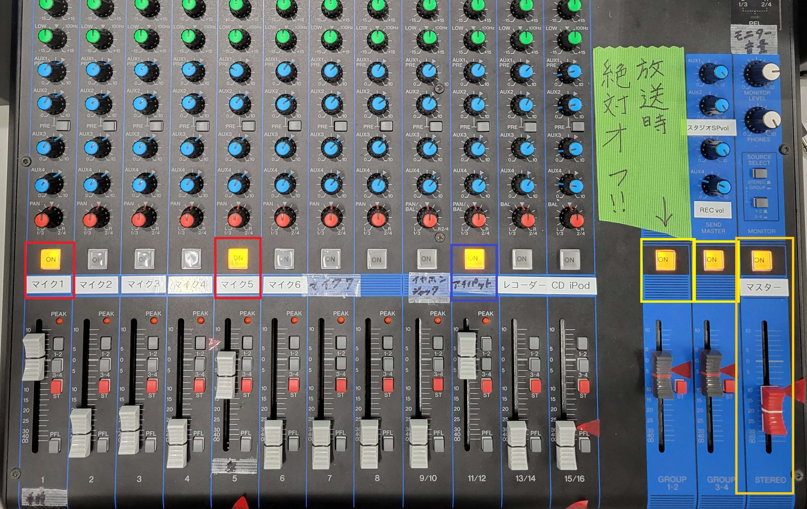

## 準備

収録を始める前に、スタジオのマイクやその他の配線抜けがないかを確認すること。

1. PAラックの電源を入れる
2. iPadをPAラックから出ているケーブルに差し込む。(Lightning端子っていうらしい)
3. 「マスター」、「GROUP1-2」と使用するマイク(2人収録ならマイク1とマイク5)の上にあるランプが点灯していることを確認する。(してなければ、「ON」を押して点灯させる)
4. マイクから音が入ることを確認する
5. iPadのアプリで録音できることを確認する

!!!note "GROUPの意味"
    スタジオのミキサーには2種類の配線がつながっていて、「GROUP1-2」が収録用、「GROUP3-4」が放送用に分かれています。これで、スイッチを押すだけで収録モードと放送モードを切り替えられて便利。あと、これを分けることで切り忘れによる放送事故を防げます。

!!!note "マイクの場所"
    調整室から見てマイク1～4が手前に、5と6が奥に設置されています。
    マイク7は調整室にあって、調整室から天の声を(録音する目的で)送るために使います。
    後で説明する「トークバックマイク」とは異なることに注意。

- 依頼時間までには担当者はじめ収録メンバーは全員スタジオに集まっておくこと。待たせると失礼です。

## 事前説明
ゲストが来たら、顧問の先生に印刷してもらっていた原稿を渡します。
仮に事前に原稿を渡していたとしても、もしかすると忘れてしまっていることもあるので、必ず渡すこと。
また、改めて**どんな話をして**、**どんなリアクションをもらいたいか**を説明するのも大事です。

収録する前の合図を決めておくこと。

## 収録本番
収録中は換気扇を切って、スタジオ側と調整室側のドアはすべて閉めます。

調整室側の「トークバックマイク」を使ってスタジオの人と合図をとります。
「トークバックマイク」は収録に入ってしまう可能性もあるので、必ず収録中は切っておくこと。
たとえば、「3...2...(OFF)」のような合図の取り方がオススメかも。

音量調整はそれぞれのマイクのつまみを使います。
どうしても音量が小さい場合は一番上のつまみ(GAIN)を操作すること。

人の声には一番上の**HPF**と書いてあるボタンを押すのがオススメ。
これをするとハイパスフィルターがかかり、人からでる不要な低音をカットできます。

**PHANTOM +48V**と書いてあるボタンは必ずオフにすること。
オンにするときはファンタム電源が必要なコンデンサーマイクなどをつないだときだけです。
下手にオンにしてマイクが(ミキサーが)壊れたなんてことがないように。

また、声の大小に差がある(語彙力)人の場合はコンプレッサーをかけるとよい。
上から2番目の黄色のつまみを右に回すことでコンプレッサーをかけられます。
このとき、あまりかけすぎる音割れしたり、まったく声が聞こえないなんてことになるので注意。

イコライザー(EQと書いてある4つのつまみ)は声がこもったりしやすいので人には原則使わないでください。

合図を始める段階で録音ボタンは押しておくこと。
もし、ラグがあってすぐに録音開始がされなくてもこれで耐えられます。

- なるべく録音は止めない。撮りすぎても後から編集できますが、撮れてない部分は取り返しがつきません。
- インタビュー中は相手の目を見て、うなずきながら聞くのがよい。機械的に原稿通り進めるのではなく、相手が答えてくれたことにツッコんで、これ！という言葉がもらえるまで話を続ける。
- 聞いたことはすべて頭に置きながらインタビューすること。自分の中でつながりを考えないと、編集するときにまとまらず悩むことになります。「そういえば、さっきこうおっしゃっていましたけど...」など、つながる部分を考えながら聞けば話もふくらむかも。
- 収録後は、出演依頼書の**収録**欄に収録日を記入して、原稿とともに保管する。余裕があればその日の収録について、ミスやよかったところなどを記入する。

## 後片付け
スタジオの機材は収録が終わったら必ず原状復帰。
こうしないと思わぬトラブルのもとになります。

また操作したつまみも必ずもとに戻しておくこと。
丸型つまみの元の位置がよく分からなくなったときはたいてい12時の位置に戻すか0にしておくとうまくいきます。

## 関連項目
- [出演依頼](./request.md)
- [原稿の書き方](./script.md)
- [ミキサー説明書](https://jp.yamaha.com/files/download/other_assets/4/1506954/mg16x_ja_om_a0.pdf)