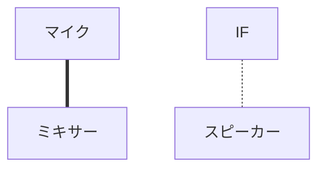
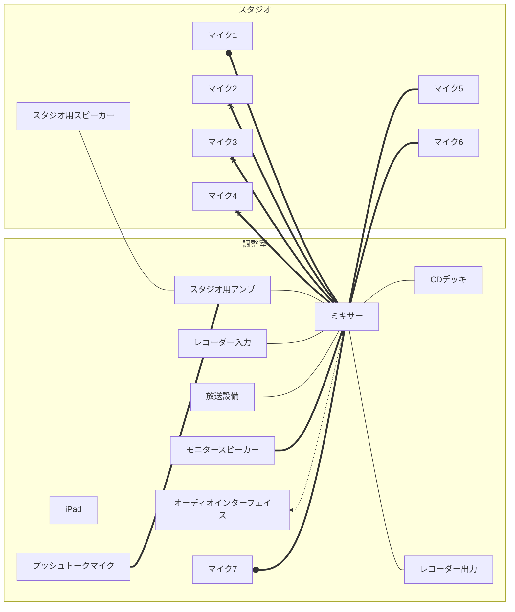
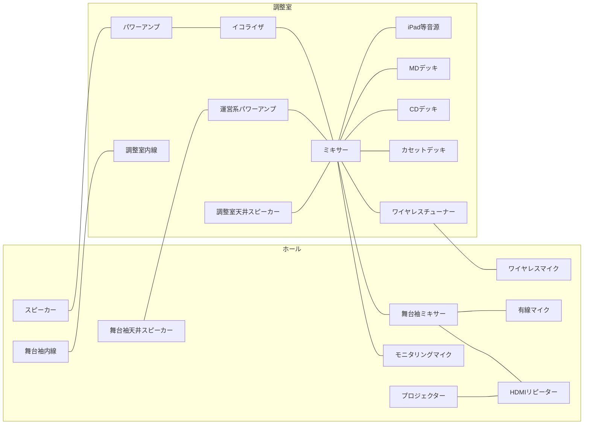
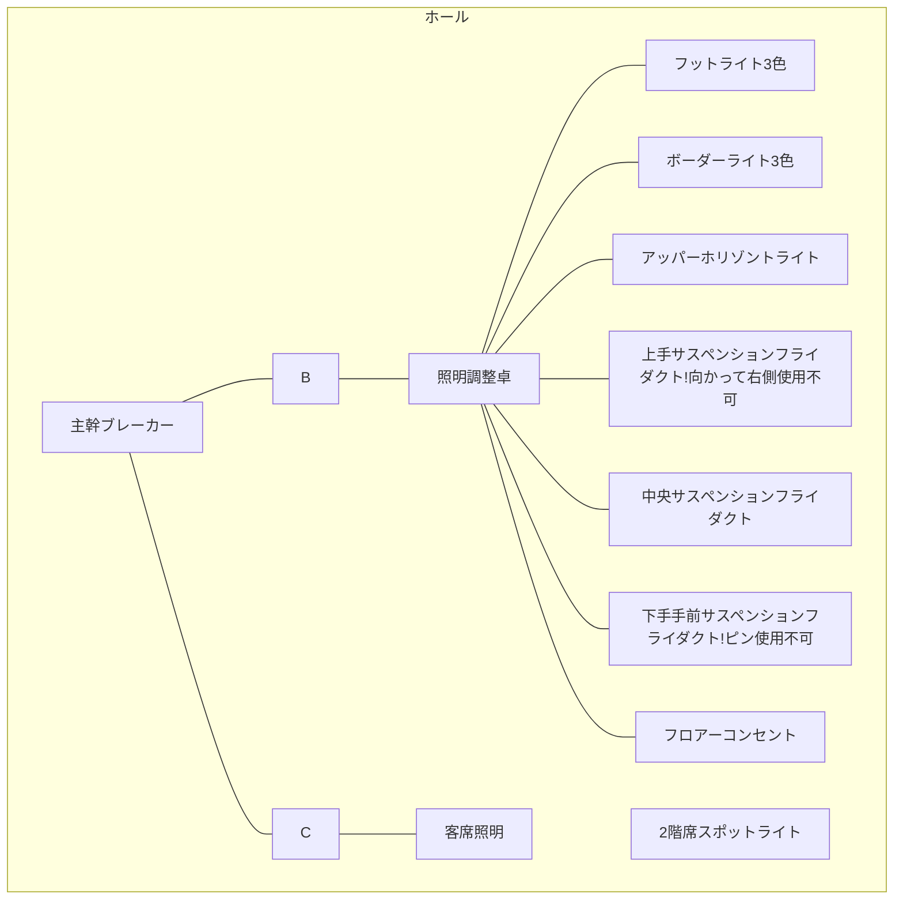
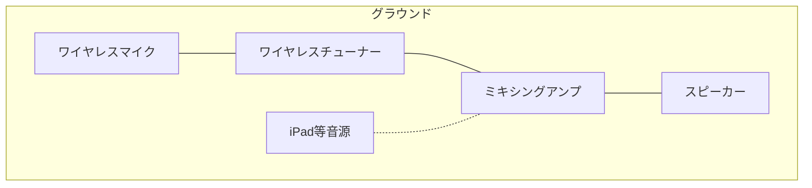
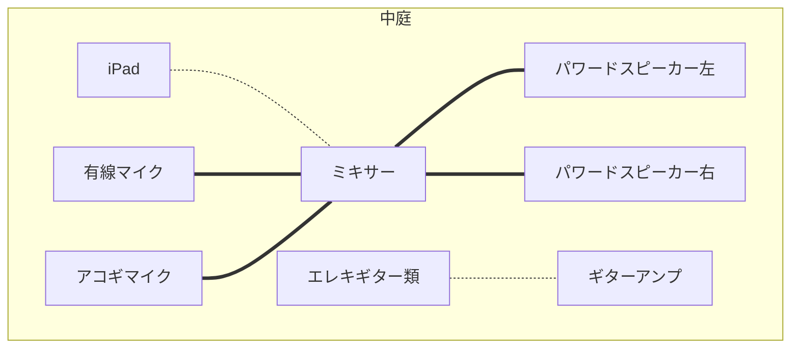

**2024年2月末時点**

## 配線図の見方

XLR接続(マイク用接続)の線は**太線**、シールド接続の線は**破線**で示しています。
また、先端が●の端子は現在使用中、×の端子は未使用です。

**例**

```mermaid
graph TB
    マイク===ミキサー
    IF-.-スピーカー
```

## スタジオ

```mermaid
graph RL
    subgraph 調整室
        CDデッキ---ミキサー
        レコーダー出力---ミキサー
        ミキサー---スタジオ用アンプ
        ミキサー---レコーダー入力
        ミキサー---放送設備
        ミキサー===モニタースピーカー
        ミキサー<-.->オーディオインターフェイス
        オーディオインターフェイス---iPad
        ミキサー==oマイク7
        スタジオ用アンプ===プッシュトークマイク
    end
    subgraph スタジオ
        ミキサー==oマイク1
        ミキサー==xマイク2
        ミキサー==xマイク3
        ミキサー==xマイク4
        マイク5===ミキサー
        マイク6===ミキサー
        スタジオ用アンプ---スタジオ用スピーカー
    end
```

## ホール
### 音響系

```mermaid
graph RL
    subgraph 調整室
        ワイヤレスチューナー---ミキサー
        カセットデッキ---ミキサー
        CDデッキ---ミキサー
        MDデッキ---ミキサー
        ミキサー---イコライザ
        イコライザ---パワーアンプ
        iPad等音源---ミキサー
        ミキサー---運営系パワーアンプ
        ミキサー---調整室天井スピーカー
        調整室内線
    end
    subgraph ホール
        パワーアンプ---スピーカー
        モニタリングマイク---ミキサー
        舞台袖ミキサー---ミキサー
        ワイヤレスマイク---ワイヤレスチューナー
        調整室内線---舞台袖内線
        HDMIリピーター---舞台袖ミキサー
        HDMIリピーター---プロジェクター
        有線マイク---舞台袖ミキサー
        運営系パワーアンプ---舞台袖天井スピーカー
    end
```

### 調光系

```mermaid
graph TB
    subgraph ホール
        主幹ブレーカー---C
        主幹ブレーカー---B
        B---照明調整卓
        C---客席照明
        2階席スポットライト
        照明調整卓---フットライト3色
        照明調整卓---ボーダーライト3色
        照明調整卓---アッパーホリゾントライト
        照明調整卓---上手サスペンションフライダクト!向かって右側使用不可
        照明調整卓---中央サスペンションフライダクト
        照明調整卓---下手手前サスペンションフライダクト!ピン使用不可
        照明調整卓---フロアーコンセント
    end
```

## グラウンド

```mermaid
graph TB
subgraph グラウンド
    ワイヤレスマイク---ワイヤレスチューナー
    ワイヤレスチューナー---ミキシングアンプ
    iPad等音源-.-ミキシングアンプ
    ミキシングアンプ---スピーカー
    end
```

## 中庭(カラオケ大会時)

```mermaid
graph TB
subgraph 中庭
    iPad-.-ミキサー
    有線マイク===ミキサー
    ミキサー===パワードスピーカー左
    ミキサー===パワードスピーカー右
    エレキギター類-.-ギターアンプ
    アコギマイク===ミキサー
    end
```