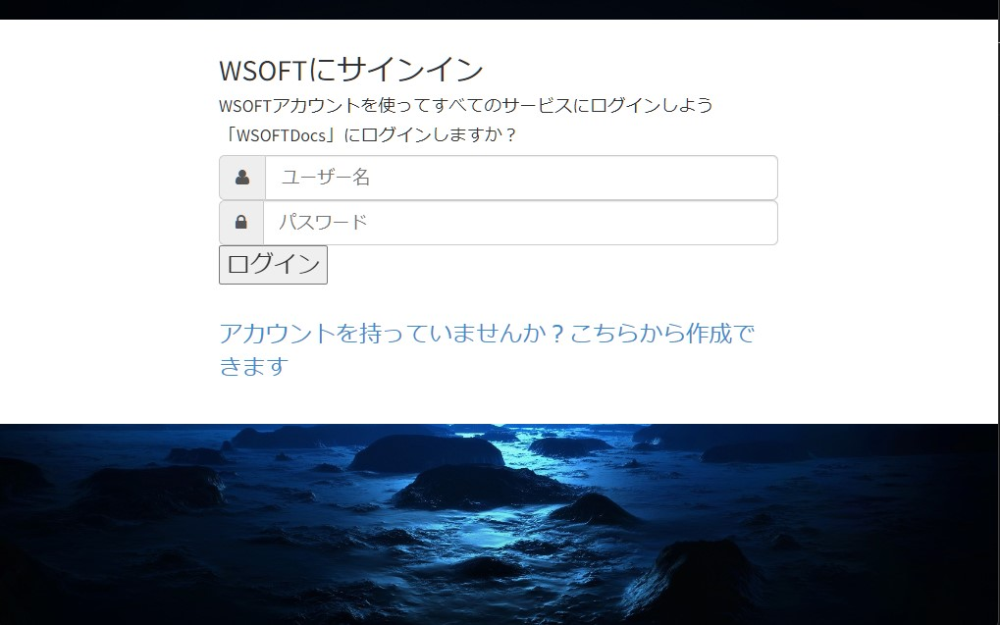

WSOFTアカウントへWebからログインするには、`AL`(AnyWhereLogin)システムを使用します。これは次のUrlを使って使用できます。

```url title="Url"
http://websailing-net.ddo.jp/al?alname=プロダクト名&alurl=リダイレクト先
```



ユーザー名とパスワードを使用してログインします。

アカウントにログインできたら、アカウントを使用するサービスへ自動的に遷移します。