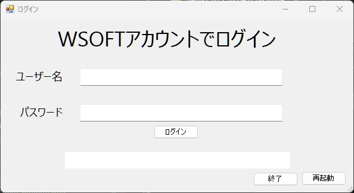
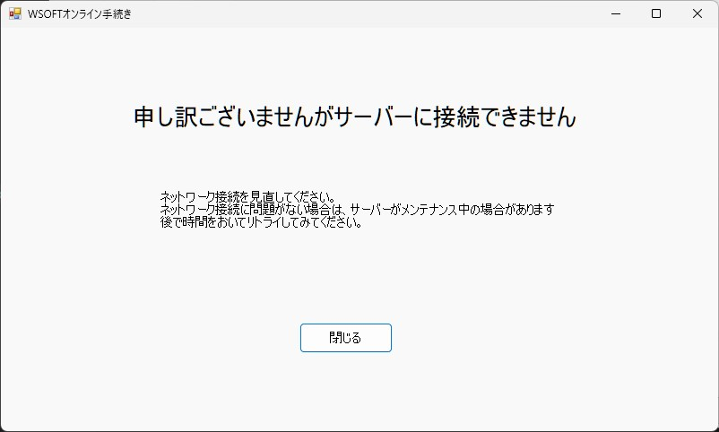

WSOFTアカウントへWindowsアプリからログインするには、WSOFTオンライン手続きシステムを使用します。
このシステムは、起動時に表示されるか、ログインボタンをクリックしたときに開始され、ログインウィンドウが表示されます。

このようなウィンドウにユーザー名とパスワードを入力し、ログインします。

また、WSOFTオンライン手続きシステムに接続するときは次のウィンドウが表示されることもあります。

!!!warning "サービス終了"
    WSOFTオンライン手続きは2020年10月16日にサービスを終了しました。終了後は以下のような表示に切り替わります。
    

オンライン手続きアプリの詳細については[WSOFTオンライン手続きの概要](./online-process.md)を確認してください。