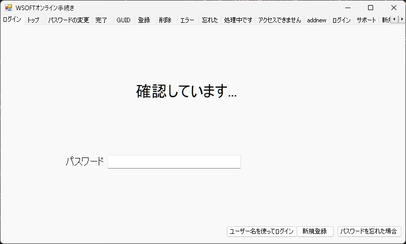
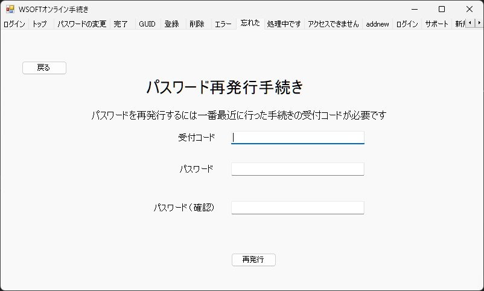
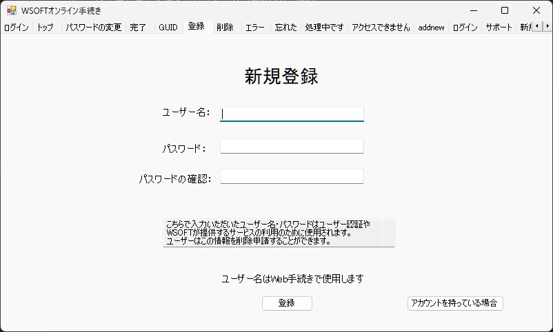
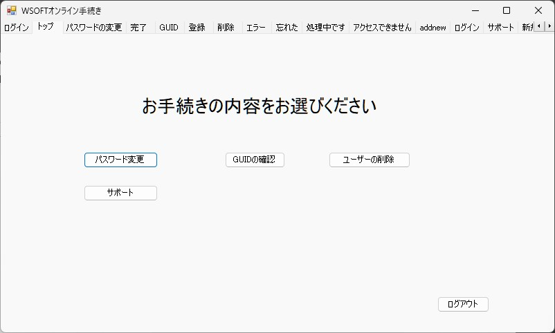
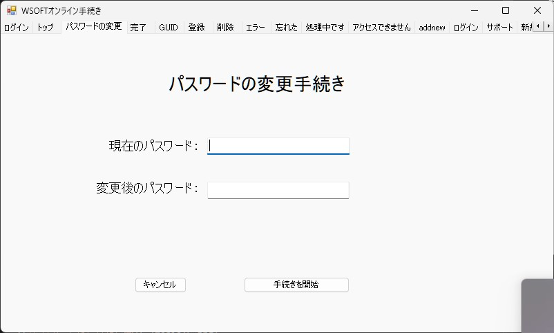
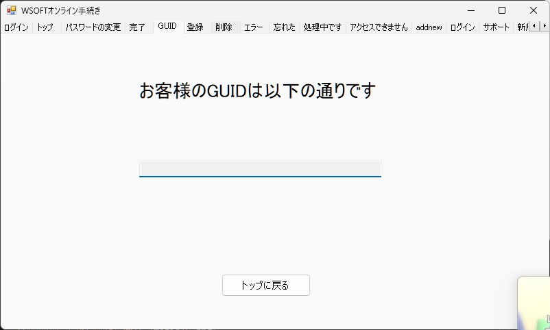
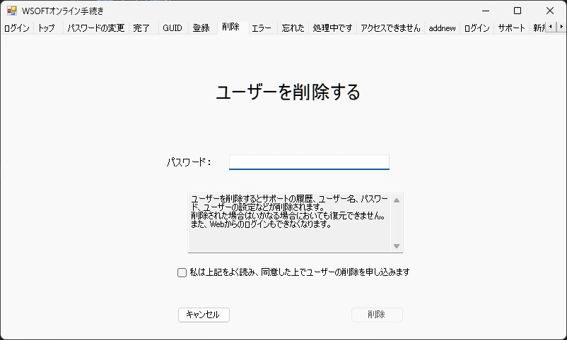
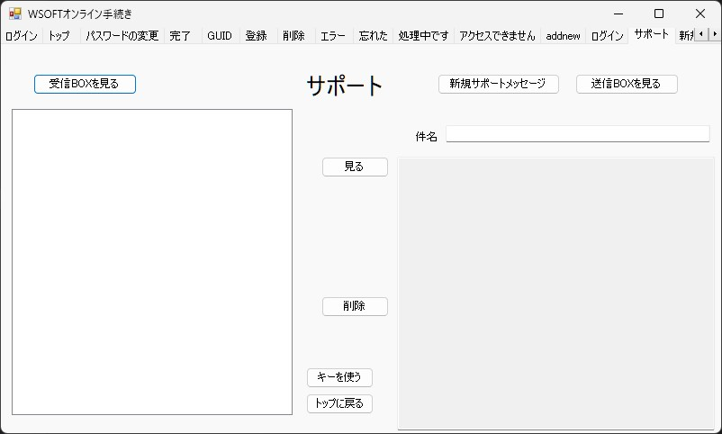
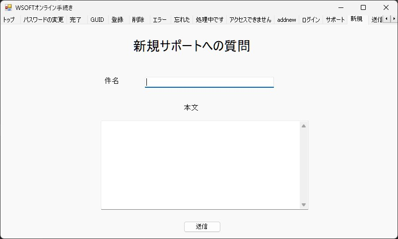
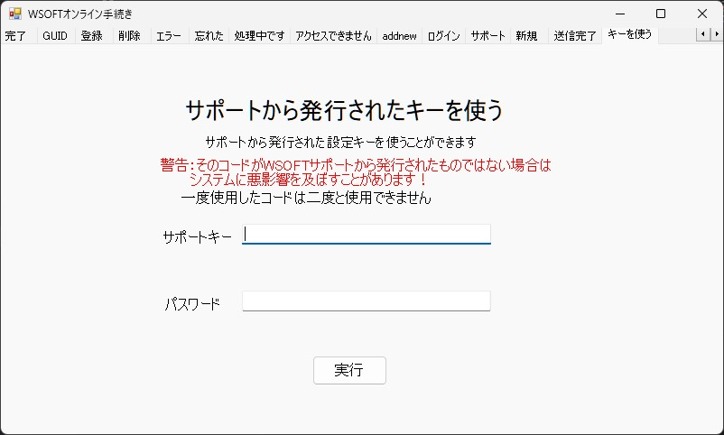

WSOFTオンライン手続きを使用すると、WSOFTアカウントのサービス受け、それを変更できます。この機能は、WSOFTオンライン手続きアプリで使用できるだけでなく、WebSailing3からも使用できます。

### ログイン
WSOFTアカウントにログインするには、ふたつの方法があります。

#### WebSailingのGUIDを使ってログインする
WebSailingに利用登録していれば、WebSailingのGUIDを使用してログインできます。
つまり、パスワードを入力するだけでログインできます。

!!!warning "利用登録が必要"
    WebSailingの利用登録をしていない場合はこのログイン方法は使えません。ユーザー名を使ってログインしてください。

#### ユーザ名を使ってログインする
WebSailingを登録したアカウント以外のアカウントにログインしたい場合などに、ユーザー名とパスワードを使ってログインすることもできます。

#### パスワードを忘れた場合
WSOFTアカウントのパスワードを忘れてしまった場合、最後に行った手続きの受付コードを使ってパスワードをリセットできます。

#### 新規アカウントの作成
アカウントを作成できます。この時、同時に利用登録とGUIDの発行も行われます。

### トップ画面
ログインに成功すると、サービスメニューが表示されます。

### パスワードの変更
ログイン後であれば、パスワードを変更できます。このときにも受付コードが発行されます。

### 登録GUIDの確認
設定ファイルが壊れてしまった場合など再設定する必要があるときにGUIDを確認できます。

### アカウントの削除
アカウントの削除手続きを行うと、利用登録とアカウント情報のすべてを抹消できます。この手続きでは受付コードは発行されません。また、削除後の復元はできません。

### サポート
WSOFTアカウントを使用して、サポートとメッセージをやりとりできます。

#### メッセージの作成
件名と本文を指定して、サポートにメッセージを送信できます。サポートから返信が返ってくることもあります。

#### サポートからのコードを使う
サポートから発行されたコードを使用して、スクリプトを実行し問題を解決できることがあります。

!!!danger "サポートからのものであることを確認"
    サポート以外から発行されたコードを実行すると任意のコードを実行される可能性があります。

