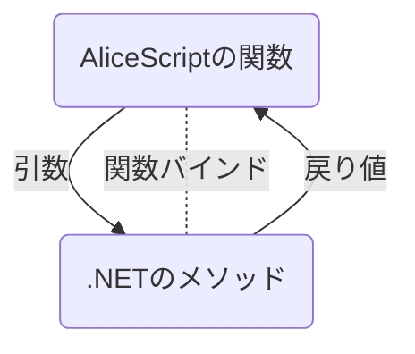
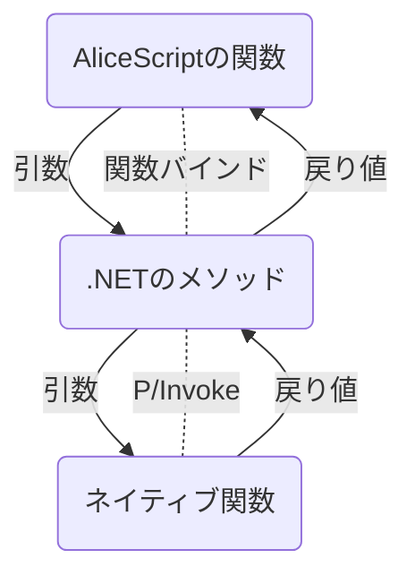

AliceScriptの型システムと.NETやネイティブの型システムは、厳密には一致しません。
このため、AliceScriptと他の言語との間で相互にやり取りを行う場合にはデータ型の変換を行う必要があります。マーシャリングはこの機能を指します。マーシャリングを使用する最も多くの理由は、他の言語で定義された関数に引数を渡し、その関数の戻り値を受け取るためです。

ほとんどの型は、AliceScriptと他の言語との間に共通するものがあります。
この場合は、単にこれを一対一で変換します。例えば、AliceScriptの[Bool型](../api/bool/index.md)は.NETのBoolean型と一対一で対応しています。
しかし、他言語の複数の型がAliceScriptのひとつの型に対応している場合など、一対一の関係で処理できない場合もあります。この場合は、必要に応じて型の範囲を拡大したり、縮小する必要がある場合は範囲チェックを行います。ある型で表されている値が変換先の型では表せない場合、例外が発生します。

マーシャリングは、普段開発者が意識する必要がないように設計されています。
しかし、他の言語との間で相互にデータをやり取りしていて、問題が発生している場合にマーシャリングの手法に関する知識が役に立つ可能性があります。
この記事では、AliceScriptの型と他の言語の型とを相互に変換する手法について説明します。

### 関数呼び出しの概念

AliceScriptの実装は、普段関数を次のように呼び出しています。

.NETやネイティブコードは、AliceScriptとは異なる型システムを持っているため、AliceScripとネイティブ関数の間で値のやり取りが必要になる場合は型変換が行われます。
SAIMのマーシャリングシステムは、変換先の型や変換元の型を考慮して、適切な処理を実行します。
ネイティブ関数の定義で`int`や`HWND`などの見慣れない型キーワードが使用されていますが、これはそのためです。

以下に、AliceScriptの型と、対応する型キーワード、対応するネイティブ型を示します。

|型キーワード|AliceScriptの型|.NETの型|ネイティブ型|
|--|--|--|--|
|`VOID`|該当なし|`System.Void`|Win32の`VOID`型|
|`BOOL`|`bool`|`System.Boolean`|Win32の`BOOL`型(実体は`INT`)|
|`LPSTR`、`LPWSTR`、`STRINGBUILDER`|`string`|`System.Text.StringBuilder`|`char*`または`char16_t*`(文字コードによる)|
|`LPTSTR`、`LPCSTR`、`LPCTSTR`、`LPCWSTR`、`STRING`|`string`|`System.String`|`const char*`または`const char16_t*`(文字コードによる)|

|型キーワード|AliceScriptの型|条件|小数|.NETの型|ネイティブ型|
|--|--|--|--|--|--|
|`INT8`、`SCHAR`、`SBYTE`|`number`|-128～127|無視|`System.SByte`|`int8_t`|
|`UCHAR`、`CHAR`、`BYTE`、`BOOLEAN`|`number`|0～255|無視|`System.Byte`|`uint8_t`|
|`INT16`、`SHORT`|`number`|-2,147,483,648～2,147,483,647|無視|`System.Int16`|`int16_t`|
|`UINT16`、`USHORT`、`WORD`|`number`|0～4,294,967,295|無視|`System.UInt16`|`uint16_t`|
|`INT32`、`INT`、`LONG32`|`number`|-2,147,483,648～2,147,483,647|無視|`System.Int32`|`int32_t`|
|`UINT32`、`UINT`、`ULONG32`、`DWORD`|`number`|0～4,294,967,295|無視|`System.UInt32`|`uint32_t`|
|`INT64`、`LONG`、`LONG64`、`LONGLONG`|`number`|-9,223,372,036,854,775,808～9,223,372,036,854,775,807|無視|`System.Int64`|`int64_t`|
|`UINT64`、`ULONG`、`ULONG64`、`ULONGLONG`|`number`|0～18,446,744,073,709,551,615|無視|`System.UInt64`|`uint64_t`|
|`FLOAT`、`SINGLE`|`number`|±1.5 x 10−45～±3.4 x 1038|有効|`System.Short`|Win32の`SINGLE`型|
|`DOUBLE`|`number`|条件なし|有効|`System.Double`|Win32の`DOUBLE`型|
|`HDC`、`HWND`、`HANDLE`、`IntPtr`|`number`|32ビットまたは64ビット以内|無視|`System.IntPtr`|`intptr_t`|
|`UIntPtr`|`number`|符号なし32ビットまたは64ビット以内|無視|`System.UIntPtr`|`uintptr_t`|