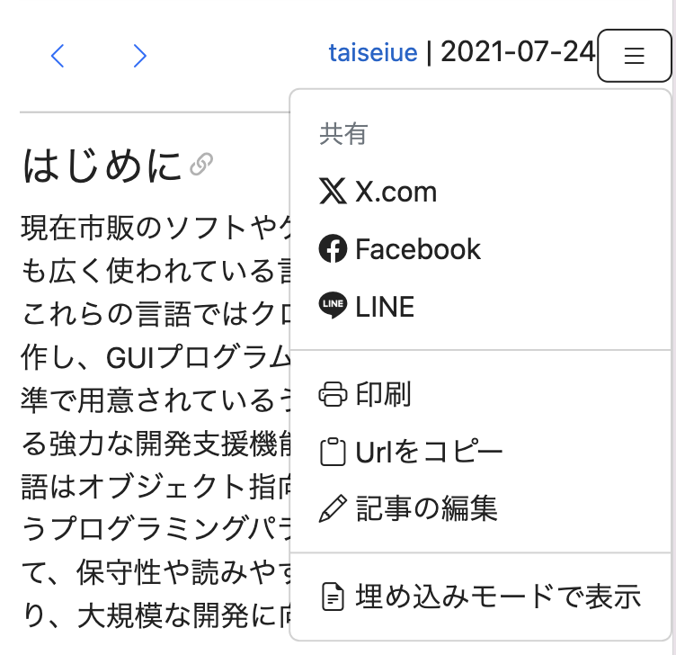

WSOFTDocsをご覧いただき、ありがとうございます。

## ページ内リンク
Docs内の記事の各見出しに、ページ内リンクができるようになりました。
次の例のように、ページ内でヘッダーへのリンクを書くことができるようになりました。

```md title="Markdown"
[ページ内リンク](#ページ内リンク)に、ページ内リンクについての説明があります。

ページ内リンクの使い方について知るには、[Markdownリファレンス#ページ内リンク](../../../contribute/markdown.md#ページ内リンク)をご覧ください。
```

**出力例**

[ページ内リンク](#ページ内リンク)に、ページ内リンクについての説明があります。

ページ内リンクの使い方について知るには、[Markdownリファレンス#ページ内リンク](../../../contribute/markdown.md#ページ内リンク)をご覧ください。

## コードのハイライト
記事内にインライン要素として表示されるコードに、シンタックスハイライトが使用できるようになりました。次の例のように、対応している場合はコード片にもシンタックスハイライトをつけられます。

```md title="Markdown"
Pythonでモジュールを読み込むには、`:::py3 import`文を使います。
例えば、`sys`モジュールを読み込むには、`:::py3 import sys`と書きます。
```

**出力例**

Pythonでモジュールを読み込むには、`:::py3 import`文を使います。
例えば、`sys`モジュールを読み込むには、`:::py3 import sys`と書きます。

コードのシンタックスハイライトについて詳しく知るには、[Markdownリファレンス#コードのハイライト](../../../contribute/markdown.md#コードのハイライト)をご覧ください。

## ナビゲーションバーの改善
従来、スマートフォンでは記事上部の印刷ボタンや編集ボタンは、幅が狭い場合でも1列に表示されていました。新しいWSOFTDocsでは、次の図に示すように表示幅が限られているデバイスではメニューボタンに機能が集約されるようになりました。



## 今後について
新しいエクスペリエンスについて、ぜひ[GitHubのIssues](https://github.com/WSOFT-Project/docs/issues)までご意見をお寄せください。

最期までご覧いただき、ありがとうございました。これからもWSOFTDocsの改善を続けていきます。