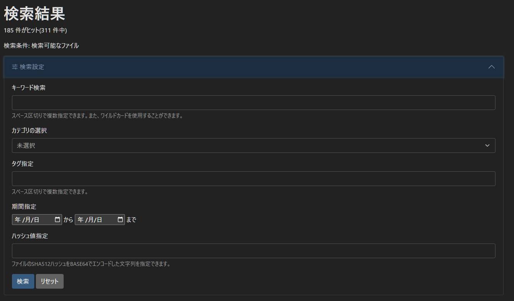

### はじめに
公開されているチェックサムを比較することで、ダウンロード中に通信障害が発生したり、ファイルが改ざんされたなどの事情によってファイルが壊れていないかを確認できます。
チェックサムを比較することで、そのファイルがWSOFTダウンロードセンターで公開されているものと同一であることが確認できます。

### 手元のファイルのハッシュ値を計算する
#### Windowsの場合
Windowsでダウンロードした手元のファイルのハッシュ値を計算するには、`certutil`コマンドを使用します。

```sh title="コマンドプロンプト"
certutil -hashfile <計算するファイルのパス> SHA512
```

コマンドが成功すると、以下のような出力が得られます。

```txt title="コマンドプロンプト"
SHA512 ハッシュ (対象 <計算するファイルのパス>):
<計算されたハッシュ値>
CertUtil: -hashfile コマンドは正常に完了しました。
```

ここで、計算されたハッシュ値をコピーしておきます。

#### Linuxの場合
Linuxでダウンロードした手元のファイルのハッシュ値を計算するには、`openssl`コマンドを使用します。

```sh title="シェル"
openssl sha512 <計算するファイルのパス>
```

コマンドが成功すると、以下のような出力が得られます。

```txt title="シェル"
SHA512(build.sh)= <計算されたハッシュ値>
```

ここで、計算されたハッシュ値をコピーしておきます。

### WSOFTダウンロードセンターで検索する
[WSOFTダウンロードセンター](https://download.wsoft.ws/Search)で、計算されたハッシュ値を検索します。



1. **検索設定**を開きます
2. **ハッシュ値指定**の項目に計算されたハッシュ値をペーストします
3. **検索**をクリックします

検索後、ひとつ以上の項目がヒットした場合、そのファイルはWSOFTダウンロードセンターで公開されていて、検索可能であることがわかります。