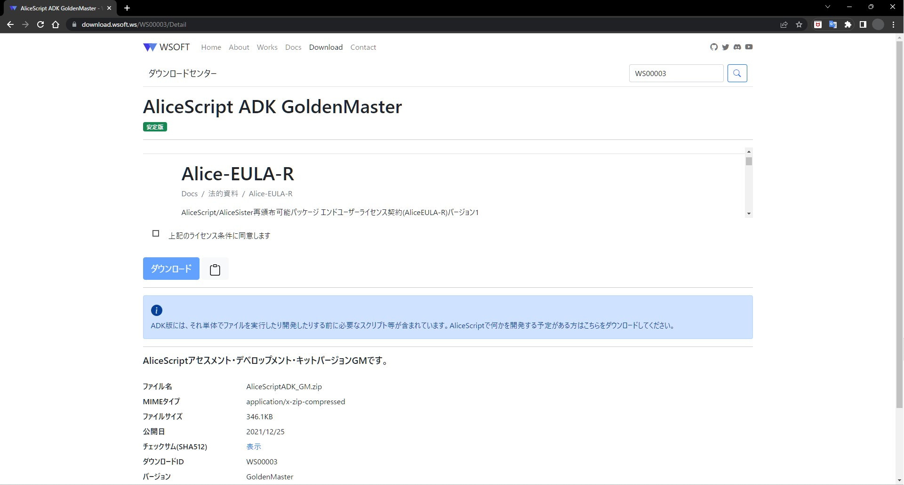

WSOFTダウンロードセンターでは、WSOFTが配信しているほとんどすべてのファイルが集まっています。ここではWSOFTとそれに関連する者が配付するファイルを配信しています。WSOFTダウンロードセンターは2022年3月25日に、従来のWSOFTShare、WSOFT共有を置き換える目的で開設しました。この記事では、WSOFTダウンロードセンターについて説明します。

WSOFTダウンロードセンターのトップ画面からは、ダウンロードがジャンル分けされている**カテゴリ**や、**ダウンロード**が並んでいます。後述する**ダウンロード番号**を持っていない場合はこの画面から必要なダウンロードを探すことができます。**検索**も使用できます。

**ダウンロード番号**を持っている場合は右上あるいは画面上部の検索ボックスに入力することでダウンロードに移動できます。

### 各ダウンロードの構成

WSOFTダウンロードセンターで配付されているすべてのファイルには**ダウンロード番号**が割り当てられています。ダウンロード番号は`WS`から始まる5桁の数字が入ります。このダウンロード番号はそれぞれの配布者から教えられるか、**検索**することで入手できます。一部のダウンロードは検索にも一覧にも表示されず、配布者からダウンロード番号を教えてもらうことでのみダウンロードできます。

また、ダウンロードによってはダウンロード番号だけでなく**フレンドリ名**からダウンロードすることもあります。フレンドリ名とは、*https://a.wsoft.ws/<任意の文字列>*で構成されるUrlのことです。任意の文字列にはダウンロードの分かりやすい名前などが入ります。

配信されているすべてのファイルはWSOFTによるSHA512の**チェックサム**が掲載されています。これによってダウンロードがWSOFTから配信されたものであることを確認できます。

一部のファイルをダウンロードするにはライセンス条項への同意が必要です。ファイルをダウンロードすることはライセンス条項への同意を意味します。