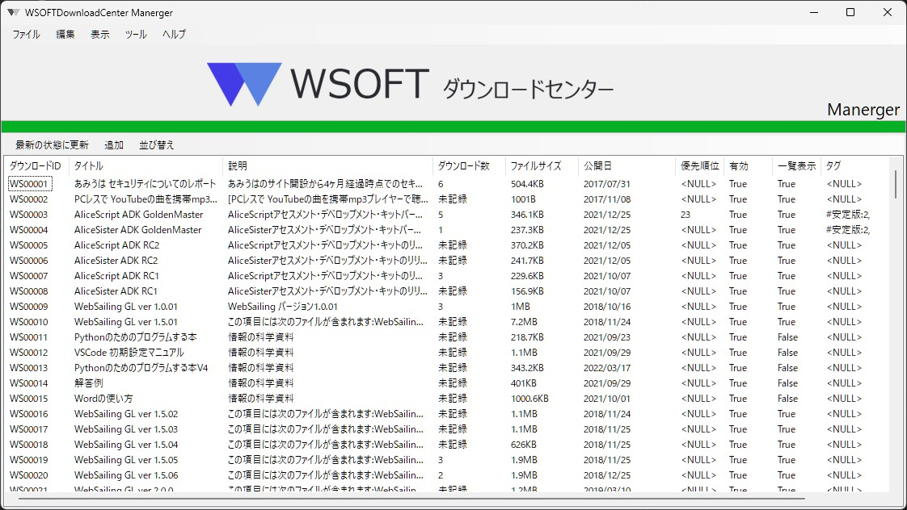
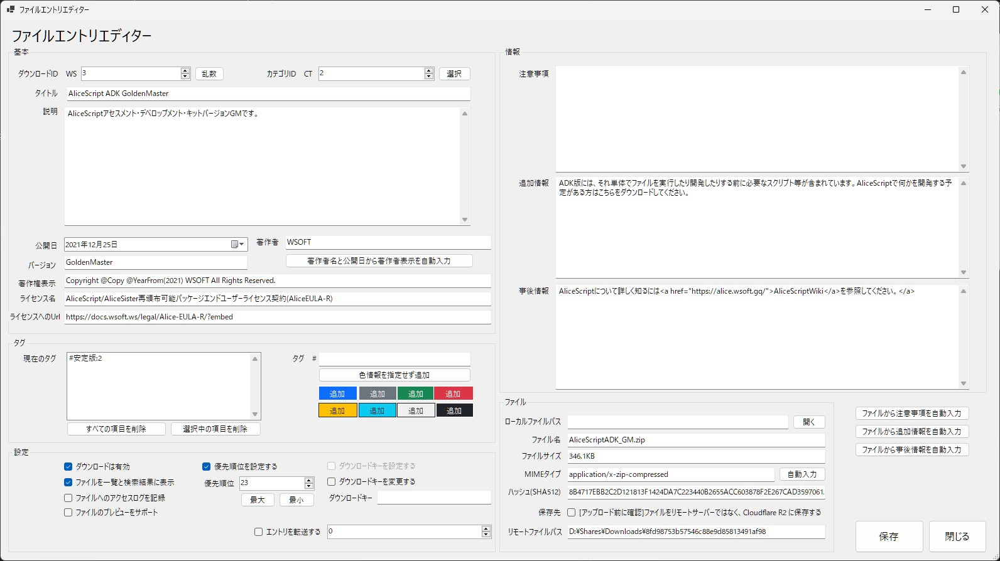

WSOFTダウンロードセンター管理端末（端末）は、WSOFTダウンロードセンターを管理するためのソフトウェアです。WSOFTダウンロードセンターマネージャーはWSNET内でのみ使用できます。

トップ画面では、WSOFTダウンロードセンターで配信されているファイルを一望できます。

ファイルエントリエディタでは、それぞれのダウンロードを操作できます。

*a.wsoft.ws*セントラルでは、ダウンロードを分かりやすくするための**フレンドリ名**からダウンロードすることもあります。フレンドリ名とは、*https://a.wsoft.ws/<任意の文字列>*で構成されるUrlのことです。任意の文字列にはダウンロードの分かりやすい名前などが入ります。これには、`/`や`?`、`&`などの文字を含むこともできます。Url末尾に`/`を含むことはできません。また、`&_gl`と`$_gl`パラメータはGoogleアナリティクスのものであるため、以降の文字列とともに自動的に無視されます。