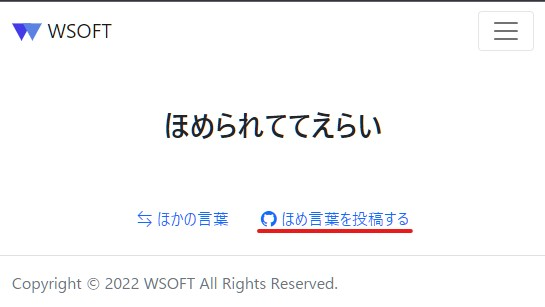
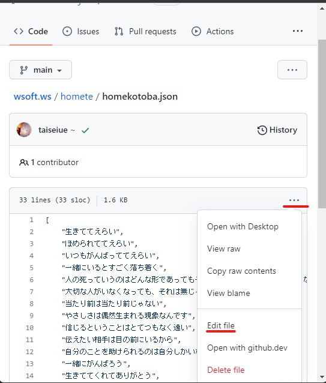
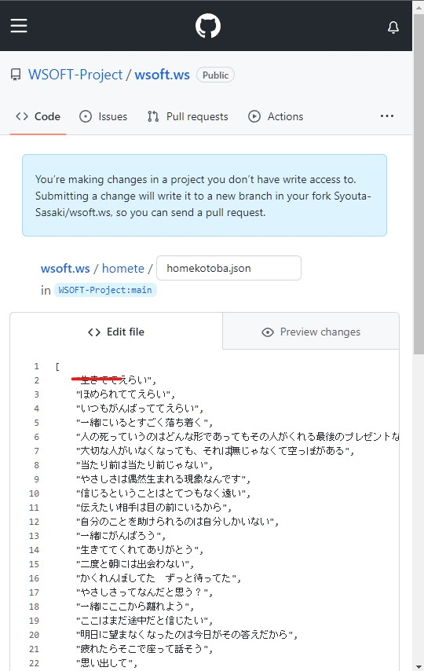
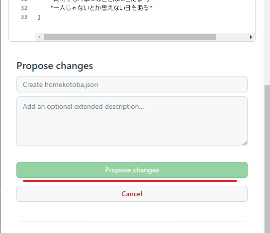
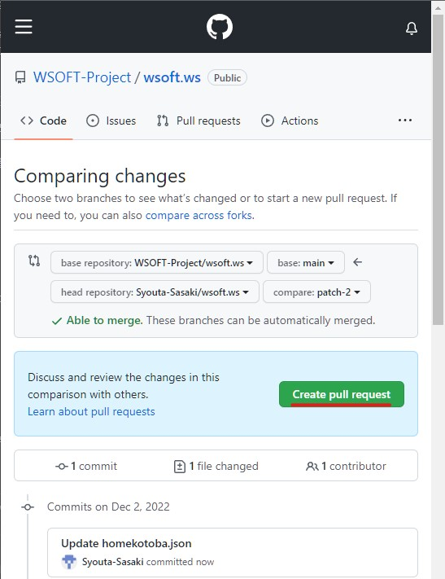
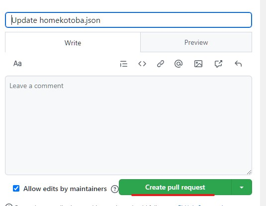

## ほめて.wsとは？
ほめて.wsは、仕事環境や人間関係など日ごろ頑張っているあなたを励ましたり、誰かを励ますことができるプラットフォームです。
ほめ言葉はGitHubで投稿でき、ほめられる人は匿名で使用できます。

<a href="https://wsoft.ws/homete" class="btn btn-primary btn-lg">ほめて.wsへ</a>

## ほめ言葉を投稿する
ほめ言葉を投稿しようとしていただきありがとうございます。

ほめて.wsは、すべてオープンソースでGitHubでホストされていて、pull requestを使ってほめ言葉の追加や更新を提案できます。

### 投稿する前に

- ほめて.wsに投稿するにはGitHubのアカウントが必要です。持っていない方は[ここ](https://github.com/signup)でアカウントを作成してください。
- あなたが投稿しようとしているほめ言葉は誰かを傷つけたりしませんか？下のコントリビューター行動規範に適していることを確認してください。

!!! warning "コントリビューター行動規範"
    次のような言葉を送信しないでください。たとえそのようなpull requestを送信されても、すべて却下されます。

    - 性的な意味を含む言葉や画像、相手の意思に反した性的関心や接近
    - あおり、侮辱的または軽蔑的なコメント、個人攻撃や政治攻撃
    - 公的または私的な嫌がらせ
    - 住所、メールアドレスなど、他者のプライベート情報の明示的な許可なき公開
    - 職場において合理的に不適切であると考えられる他の行為

### 編集ページを開く


ほめて.wsのページから「ほめ言葉を投稿する」をクリックします。



「・・・」から、「Edit file」をクリックします。

### ほめ言葉を入力する


思いついたほめ言葉を、入力エリアの一番上に入力します。

ほめ言葉は、「"」（ダブルコーテーション）で囲まれていて、最期に「,」（カンマ）が必要です。つまり、ほめ言葉は次のような形式で入力してください。

```js title="ほめ言葉"
"ほめ言葉",
```

### 投稿


一番下の「purpose changes」をクリックしてほめ言葉を投稿します。

### pull requestの送信




「Create Pull request」をクリックしてプルリクエストを送信します。これによって、あなたが投稿した内容が問題ないものかどうかチェックされた後、ほめて.wsに反映されます。

お疲れさまでした。あなたのpull requestは管理者が確認したあとで反映されます。反映には少し時間がかかるかもしれません。