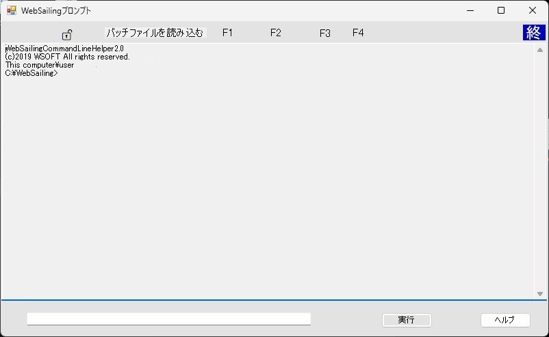
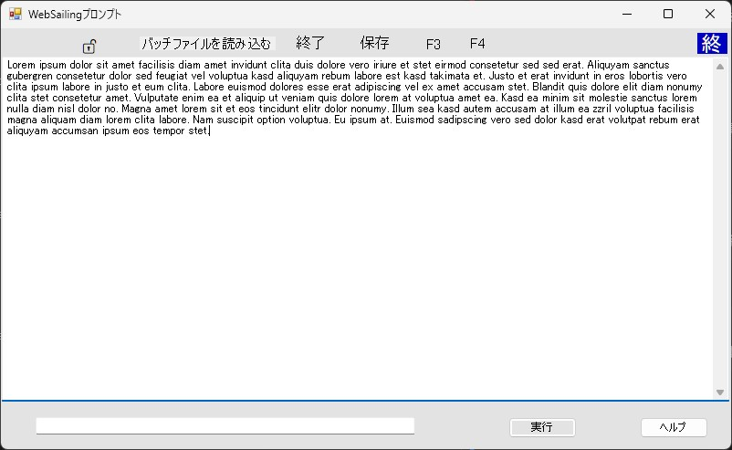

WebSailingGLには、WebSailingの機能を補助するためにWebSailingプロンプトが実装されています。ユーザーは、このプロンプトを使用して高度な設定変更を行うなどさまざまな機能を使用できます。

また、サポートは終了しているものの、WebSailingプロンプトは現在でもGLTerminalとして入手することが出来ます。これは、WebSailing3.0からWebSailingプロンプトの機能のみを独立させたものです。

---

<a href="https://download.wsoft.ws/WS00068" class="btn btn-primary btn-lg"><i class="bi bi-download"></i>&nbsp;ダウンロード</a>

---

### プロンプトの概要


WebSailingプロンプトは、下のテキストボックスにコマンドを入力し、**実行**をクリックすることでコマンドを実行できます。最上部の **鍵アイコン(🔒)** をクリックすると、プロンプトのロック状態が切り替わります。プロンプトをロックすると、コマンドを実行できなくなり、一切のテキストイベントがコマンドで処理されます。

**バッチファイルを読み込む**ラベルをクリックすることで、バッチファイルをスクリプト実行できます。これはテキストファイルの一番上から順番にコマンドを実行していく方式です。

**F1**...**F4**のボタンは、コマンドごとに用途が異なります。たとえば、**wspad**コマンドでは、保存や読込などの機能が割り当てられます。

**終**ボタンをクリックするとアプリケーションが終了します。

### コマンドの一覧
#### `@echo`コマンド
引数に`on`あるいは`off`を指定すると、ユーザーの入力が画面に表示されるかどうかの値を指定できます。

#### `balth`コマンド
コンピューター負荷をかけます。

#### `rund`コマンド
スクリプトファイルを読み込み、一行ずつ実行します。

#### `help`コマンド
コマンドの簡単な説明を表示します。

#### `cls`コマンド
画面をクリアします。

#### `cp`コマンド
引数に指定したファイルをもう一方に指定した場所へコピーします。

```txt title="コマンド"
cp <コピー元> <コピー先>
```

#### `net`コマンド
##### `dl`サブコマンド
ひとつ目の引数に指定したUrlのファイルをもう一方の引数に指定した場所に保存します。

```txt title="コマンド"
net dl <Url> <ダウンロード先>
```

##### `view`サブコマンド
ひとつ目の引数に指定したUrlの内容を表示します。

```txt title="コマンド"
net view <Url>
```

#### `echo`コマンド
引数に指定したテキストを表示します。

```txt title="コマンド"
echo <表示内容>
```

#### `wspack`コマンド
##### `mount`サブコマンド
ひとつ目の引数に指定したWebSailingイメージを指定したディレクトリに展開します。

```txt title="コマンド"
wspack mount <イメージへのパス> <展開先>
```

##### `cleate`サブコマンド
ひとつ目の引数に指定したディレクトリをもとにWebSailingイメージを作成します。

```txt title="コマンド"
wspack cleate <ソース> <ターゲット>
```

##### `add`サブコマンド
ひとつ目の引数に指定したイメージにふたつ目に指定したファイルを追加します。

```txt title="コマンド"
wspack add <イメージ> <追加するファイル>
```

##### `view`サブコマンド
指定したイメージに含まれているファイルの一覧を表示します。

```txt title="コマンド"
wspack view <イメージ>
```

#### `test`コマンド
`EnvInfo`オブジェクトのプロパティを列挙します。

```txt title="コマンド"
test
```

#### `exit`コマンド
アプリケーションを終了します。

```txt title="コマンド"
exit
```

#### `close`コマンド
プロンプトを終了します。

```txt title="コマンド"
close
```

#### `cd`コマンド
プロンプトのカレントディレクトリを変更します。

```txt title="コマンド"
cd <ディレクトリ>
```

#### `wsupdate`コマンド
##### `del`サブコマンド
WebSailingの更新キャッシュを削除します。

```txt title="コマンド"
wsupdate del
```

#### `wsupdate`コマンド
##### `new`サブコマンド
WebSailingの更新イメージをネットワークからダウンロードし、更新可能な状態にします。

```txt title="コマンド"
wsupdate new
```

##### `start`サブコマンド
次回起動時にWebSailingを更新するように構成します。

```txt title="コマンド"
wsupdate start
```

##### `update`サブコマンド
WebSailingの更新を**今**実行します。

```txt title="コマンド"
wsupdate update
```

#### `exec`コマンド
ファイルを実行します。

```txt title="コマンド"
exec <ファイル名>
```

#### `dir`コマンド
現在のディレクトリ内容を列挙します。

```txt title="コマンド"
dir
```

#### `api`コマンド
##### `get`サブコマンド
指定したパッケージをインストールします。

```txt title="コマンド"
api get <パッケージ名>
```

##### `update`サブコマンド
現在インストールされているパッケージをすべて最新の状態に更新します。

```txt title="コマンド"
api update
```

##### `izon`サブコマンド
現在インストールされているパッケージに必要な依存関係を列挙します。解決していない依存関係があれば警告します。

```txt title="コマンド"
api izon
```

#### `makecer`コマンド
APIをサイドロードするために必要な証明書を作成します。このコマンドは対話形式で実行されます。

```txt title="コマンド"
makecer <APIファイル名>
```

#### `addcer`コマンド
APIを実行するために必要な証明書を編集します。このコマンドは対話形式で実行されます。

```txt title="コマンド"
addcer <APIファイル名>
```

#### `delcer`コマンド
APIを実行するために必要な証明書を削除、APIが使用できないようにします。

```txt title="コマンド"
delcer <APIファイル名>
```

#### `wspad`コマンド


テキストエディタを起動します。このコマンドは対話形式で実行されます。

```txt title="コマンド"
wspad <ファイル名>
```

#### `mem`コマンド
`m1`から`m9`までの変数領域に値を書き込みます。変数は`$m1`のような形式で使用できます。

```txt title="コマンド"
mem m1 Hello,World!
echo $m1 // 出力例 : Hello,World!
```

### その他の情報
- WebSailingプロンプトは、起動時に`C:\WebSailing\APIData`にディレクトリを作成します。
- WebSailingプロンプトは、起動時に`C:\WebSailing\API`にディレクトリを作成します。
- WebSailingプロンプトは、起動時に`C:\WebSailing\APIData\start.wsb`に起動用スクリプトを作成します。