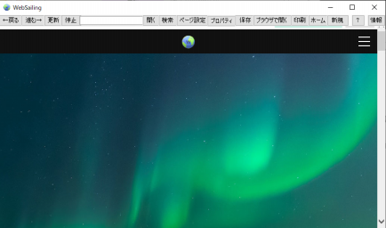
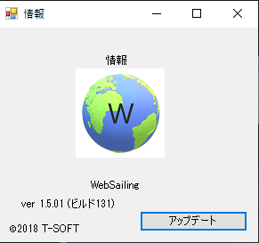

!!! warning "サポート終了"
    WebSailing GLシリーズのサポートはすでに終了しています。WSOFTはこのソフトウェアを実行して起こったいかなる事象についても責任を負いかねます。

ホームから情報をクリックして、「情報」ウィンドウを開きます。

「アップデート」をクリックします。

「アップデートの確認」をクリックしてアップデートを確認します。

アップデートが利用可能な場合は「アップデートが不要です」ボタンが「アップデートを実行」に変化します。このボタンをクリックすることで更新のダウンロードが開始されます。

更新のサイズによっては、「Lhaplas Self Extractor」が表示されることがあります。この場合、インストーラーを任意の場所に保存した後、そのファイルをダブルクリックして実行することで更新を続行できます。