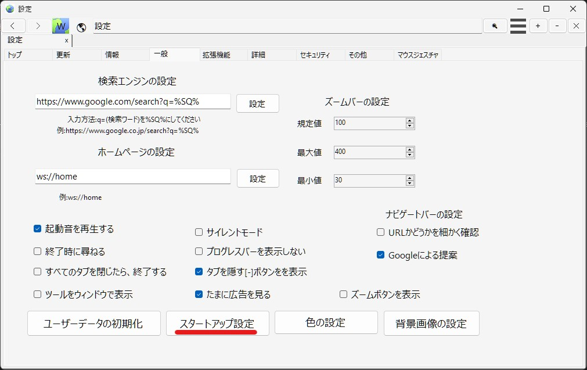

!!!warning "サービス終了"
    サービスおよびサポートが終了したソフトを使い続けるという事は、非常に大きな安全上の懸念を伴います。
    この記事の情報を試すときはユーザー自身の責任において実行し、できるだけ[WebSailingNX](../../index.md)に移行してください。

2020年10月16日のWSOFTのレガシサービス一斉終了に伴って、WebSailingの拡張機能の署名を検証するサービスも終了しました。この記事では、署名の検証なしで拡張機能を実行する方法を説明します。

1. 設定を開き、スタートアップ設定をクリックします。

2. **詳細**タブ内の、**プラグインの署名を強制しない**にチェックを入れ、**OK**をクリックし適用します。
3. WebSailingを再起動します。