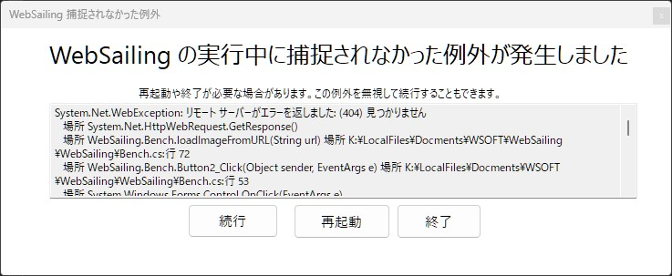

### 説明
**捕捉されなかった例外**とは、WebSailingか拡張機能で起こったエラーのうち、どのエラー検知機能にも感知されず、対処もされなかったエラーが起こったことを表します。

あなたがユーザーの場合、この例外を対処することはほぼ不可能です。最近インストールした拡張機能などをアンインストールすることで解決する可能性はあります。

多くの場合、**続行**をクリックしてももとの画面に戻ることはありません。**再起動**することを推奨します。

あなたが開発者の場合、上記の画像のように例外がスローされるまでのスタックトレースが表示される場合があります。この問題の解決につながるかもしれません。