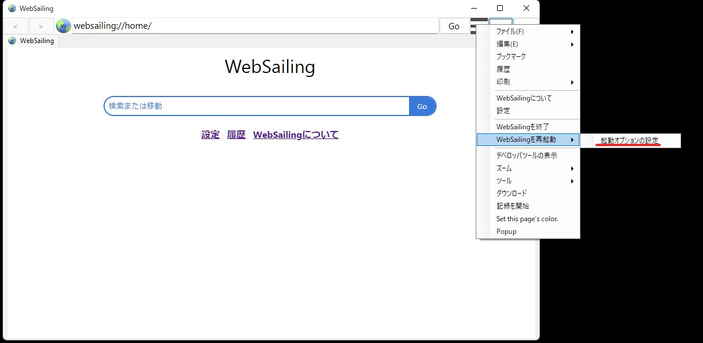
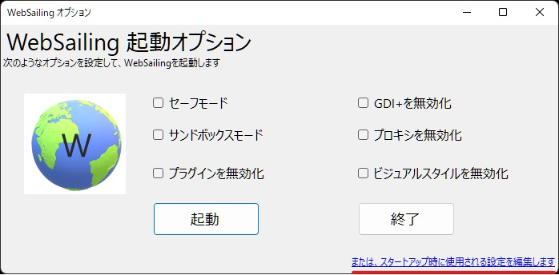

## 起動時の設定の概要
WebSailing101以降のすべてのバージョンでWebSailingの起動をカスタマイズするには、ConfigEditorを使用できます。app.wsconfは、WebSailingの実行ファイルと同じディレクトリに配置されていて、WSOFTConfig形式で保存されています。この設定ファイルには次の項目が保存されています。

* WebSailingのユーザーデータの保存先
* WebSailingの起動時の挙動（セーフモードなど）
* ログファイルの保存先

それぞれの設定へのパスと、設定内容は次の通りです。

|パス|値の種類|内容|
|:----|:----:|:----|
|/Application/Startup/UserData/Directory|文字列型|ユーザーごとの作業フォルダーとして使用されるディレクトリのパス
|/Application/Startup/UserData/EnabbleSandbox|ビット型|起動時にサンドボックス機能を有効にするか|
|/Application/Startup/UserData/EnableSafeMode|ビット型|起動時にセーフモードを有効にするか|
|/Application/Startup/UserData/EnableRecoveryMode|ビット型|回復モードを使用可能にするか|
|/Application/Startup/UserData/EnableCustomizedStartup|ビット型|カスタム起動を許可するか|
|/Application/Startup/UserData/EnableEmergensyMode|ビット型|エマージェンシーモードを使用可能にするか|
|/Application/Startup/UserData/Location|文字列型|ユーザー設定ファイルへのパス
|/Application/Log|文字列型|ログファイルのパス|

## 起動時の設定を編集する方法
起動時の設定ファイルは、WSOFTConfig形式に準拠しているため、対応するバージョンのWSOFTConfing編集環境であれば閲覧・編集が可能です。この記事では、WebSailingで、起動時の設定を編集する方法を説明します。編集方法は、実行中のWebSailingの設定を編集するか、起動していないWebSailingの設定を編集するかで操作が変わります。

!!! warning
    ConfigEditorを使用する場合は、注意が必要です。設定ファイルを誤って編集すると、ソフトウェアを再インストールする必要がある問題が発生したり、データが失われる可能性があります。非公式のソースによって提案される編集は避けてください。また、設定ファイルを編集する前にバックアップをとるとより安全です。
### 起動中のWebSailingの設定を編集する
!!! note title="メモ"
    起動オプションを使用するため、app.wsconf/Application/Startup/UserData/EnableCustomizedStartupがTrueであることが必要です。
1. 起動中のWebSailingの設定を編集するには、「メニュー」、「WebSailingを再起動」、「起動オプションの設定」へと進みます。

!!! warning title="注意事項"
    この時、誤って「WebSailingを再起動」をクリックしないように注意します。
1. WebSailing起動オプションが表示されたら、右下のリンク「または、スタートアップ時に使用される設定を編集します」をクリックします。

1. ConfigEditorが起動します。ここでは、app.wsconf/Config/Application以下の設定を編集できます。

編集が終了したら保存た後ウィンドウを閉じ、WebSailing起動オプションで必要なオプションを設定した後、「起動」をクリックします。

### 起動していないWebSailingの設定を編集する
1. 別のディレクトリにインストールされているWebSailingを起動して、[websailing://settings/tools/](websailing://settings/tools/)にアクセスします。

1. 設定エディターをクリックして、ConfigEditorを起動します。

1. 「ファイル」、「開く」をクリックして、対象のWebSailingのapp.wsconfファイルを選択します。

1. 設定を編集します。編集が終了したら「ファイル」、「保存」をクリックして設定ファイルを保存します。
