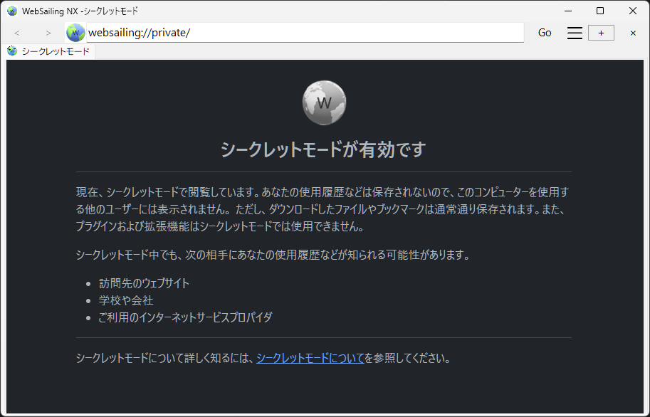

### シークレットモードの仕組み
新しいシークレットウィンドウを開くたびに、新しいWebSailingプロセスが起動します。複数のシークレットウインドウを開いた時、それらはすべて別のセッションとして扱われます。
また、シークレットウインドウ内で開いたタブは、すべて同じセッションとして扱われます。
シークレットウインドウを閉じると、そのウインドウのセッションを終了できます。

シークレットモードでは、閲覧履歴、Cookieやサイトデータはコンピューターに保存されません。つまり、何を閲覧してもWebSailingの履歴には表示されず、他のユーザーに知られることもありません。
ログインしない限り、ウェブサイトでは新しいユーザーとして認識され、誰がアクセスしているかはわかりません。

また、シークレットモードのウインドウではプラグインや拡張機能を読み込むことができないため、プラグインによってあなたの行動が追跡されることもありません。
WebSailingの設定についても、新しくインストールした時と同じ設定になります。必要に応じてシークレットモード中に設定を変更できますが、シークレットウインドウを閉じた時点でその設定は破棄されます。
これは、セーフモードの挙動と同じです。

### シークレットモードでできないこと
##### ウェブサイトに誰がアクセスしているか知られないようにする
シークレットモード中にウェブサイトにログインすると、サイトでユーザーの情報が認識され、その時点からウェブサイトはあなたの行動を追跡することができるようになります。

##### コンピューターに閲覧時の形跡をまったく残さないようにする
シークレットモードで閲覧したウェブサイトのキャッシュは、通常コンピューターの再起動時に削除されます。このため、再起動していない状態で、難しくはあるものの手間をかければ閲覧した形跡が見つかってしまうことがあります。

##### シークレットモードで閲覧したサイトに基づく広告が配信されないようにする
シークレットモードを終了すると、それらの広告は配信されないようになります。

##### 学校や会社、インターネットサービスプロパイダに閲覧履歴を知られないようにする
インターネットサービスプロパイダはもとより、学校や会社でもVPNやプロキシなどの技術により行動が監視されていることがあります。シークレットモードでそのような監視をすりぬけることはできません。