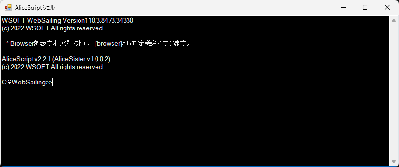
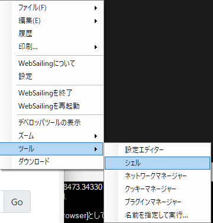

### AliceScriptシェルの概要
WebSailing2.0以降のバージョンのWebSailingは、その種類を問わずすべてWebSailingを高度に操作する方法が提供されていました。たとえば、WebSailingGLでは[**WebSailingプロンプト**（GLTerminal）](../gl/guide/command-reference.md)が、WebSailingNX（レガシー）では[**WebSailingNXターミナル**](../legacy/guide/command-reference.md)が、WebSailingNX 100以前のバージョンではWebSailingコマンドが実装されていました。

[WebSailing108](../changelog/1080.md)では、それを置き換える機能としてAliceScript準拠のAliceSisterが導入されました。この機能の導入によって、簡単なスクリプトや対話インターフェイスを使用してWebSailingで機能を実行できます。



AliceScriptシェルは**メインメニュー**の**ツール**の中にあります。

**Browser**オブジェクトを使用して、WSPluginと同じように直接ブラウザを操作できます。たとえば、WebSailingの設定ページを開くことができないようにするには、次のようなコードを実行します。

```cs title="AliceScriptシェル"
browser.Navigating = url => return url.StartsWith("websailing://settings");
```