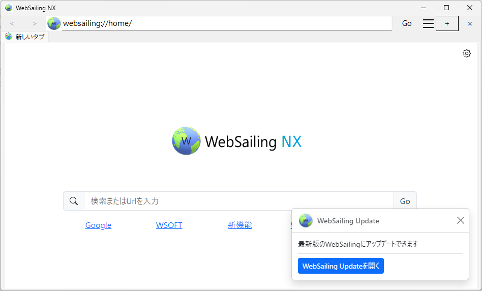
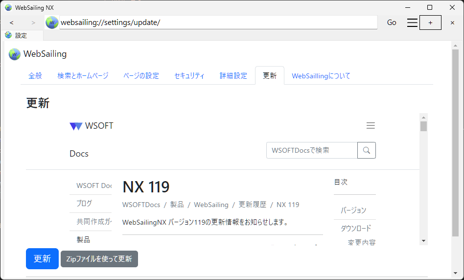
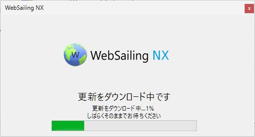
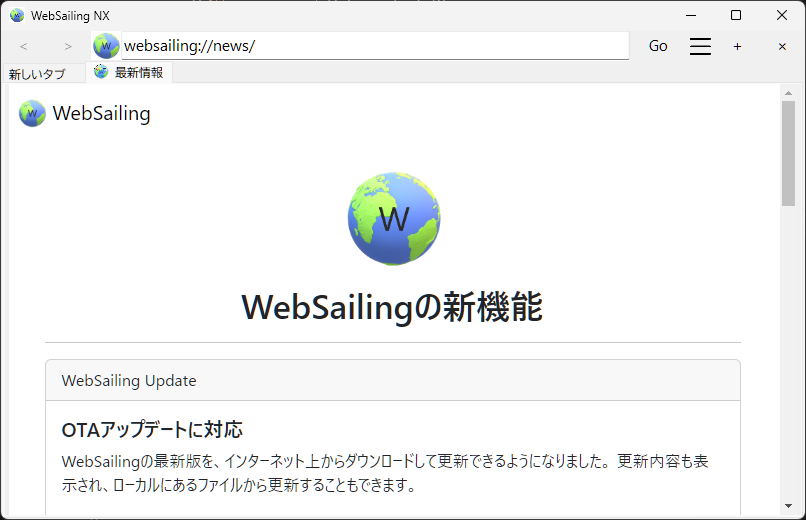

WebSailingを常に最新版に保つことは、セキュリティの向上と細心の機能・パフォーマンスを受けとるために不可欠です。WebSailing NX 118以前のバージョンのWebSailingでは、WebSailingをアップデートするために、毎回最新版のファイルをダウンロードし古いファイルを削除した後、新しいファイルを展開するなどアップデートに複雑な手順が必要でした。

WebSailing NX 119以降のWebSailingには、WebSailing Updateが搭載されています。WebSailing Updateを使用すると、簡単な操作でWebSailingを最新版にアップデートできます。

WebSailing NX 120以降のWebSailingでは、以下のように最新版のWebSailingが使用可能になった際にホーム画面でお知らせが表示されます。

## WebSailingを最新版にアップデートする
!!!tip "必要条件"
    更新したいWebSailingが、[バージョン118](./1180.md)([WS276](https://download.wsoft.ws/WS00276))以前の場合は、まず[バージョン119](./1190.md)([WS277](https://download.wsoft.ws/WS00277))に手動でアップデートする必要があります。

### 1. 更新を確認する

1. 「**WebSailingの設定**」を開きます。
2. 設定メニューから「**更新**」を選択します。

[WebSailingの設定を開く](websailing://settings/update/){: .btn .btn-primary }

### 2. 更新をダウンロードする

更新可能なWebSailingがある場合、更新ボタンが青色になっています。
WebSailingの更新をダウンロードするには、「**更新**」をクリックします。

更新は自動的にダウンロードされます。
ダウンロードが完了したら、次回起動時に更新が予約されます。

この後も、通常通りWebSailingを使用できます。

### 3. 更新をインストールする

更新をダウンロード後、WebSailingを起動した際に自動的にアップデートが開始します。

更新のインストール時には、以下の処理が自動的に行われます。

1. 現在のバージョンのバックアップの作成
2. 現在のバージョンの実行ファイルを`ファイル名.old`に名前変更
3. アップデートファイルの解凍・コピー
4. WebSailingの再起動(新しい実行ファイルの起動)
5. 古いバージョンの実行ファイルを削除
6. `websailing://news/`を開く

インストールが完了すれば、自動的にWebSailingが再起動し、WebSailingの新機能をお知らせします。これで更新は完了です。
