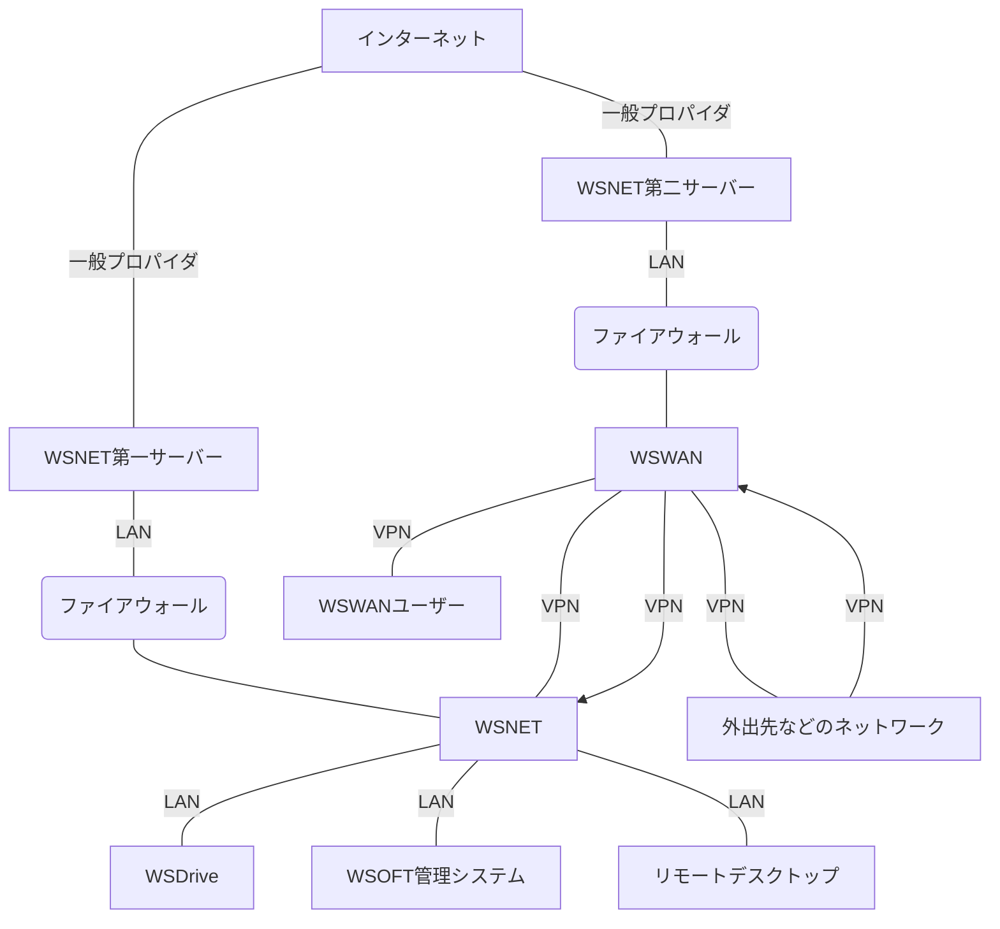

WSNET（統合WSOFT情報網）が登場する前、WSOFTはひとつのサーバーですべてのサービスを運用しており、外出先からWSOFTのサービスへアクセスするときは一般ユーザーと同じように使用するしかありませんでした。
外出先からWSOFTのサービスをメンテナンスあるいは開発することはほぼできず、ファイル共有などもWSOFTShare（現在のWSOFTダウンロードセンター）などの外部に対して開かれたシステムを使用するしかありませんでした。これは、セキュリティ上の懸念がつきまとうものでありました。そこで、WSOFTのメンバーがアクセスできるVPN網を構築しました。

## システム図

## WSNETの機能

### WSNET
**WSNET**はもっとも初めに構築されたVPN網です。これは、WSNETの各サーバーとWSNETクライアント（開発端末）を接続するために構築されました。特定のユーザーはWSWANからもアクセスできます。このネットワーク内でWSDriveやWSOFT管理システム、リモートデスクトップなどが提供されます。

### WSDrive
**WSDrive**はNASで、WSOFTのメンバーに一定の容量のストレージを提供します。メンバーはこれを自由に使用することができ、開発や趣味などに使用できます。また、これは**WSDriveWebDAV発行サービス**を使用して、直接インターネットからもアクセスできます(一月末に終了予定)。

### WSOFT管理システム
**WSOFT管理システム**は、WSOFTダウンロードセンターマネージャーやWSOFTミッションコントロールセンター、WSTube管理システム、*a.wsoft.ws*セントラルなどさまざまな管理ツールを提供します。この機能はWSNET内からのみアクセスできる場合が多く、WSWANから使用する場合はリモートデスクトップを使用することになります。

### リモートデスクトップ
**リモートデスクトップ**は、WSOFTのメンバーにWSOFT第一サーバーへのGUIアクセスを提供します。GUIを使用することができるので、簡単にサーバーのメンテナンスを行うことができます。また、メンバーのコンピューターWSNETに接続することで、メンバーのコンピューターリモートデスクトップ接続することもできます。