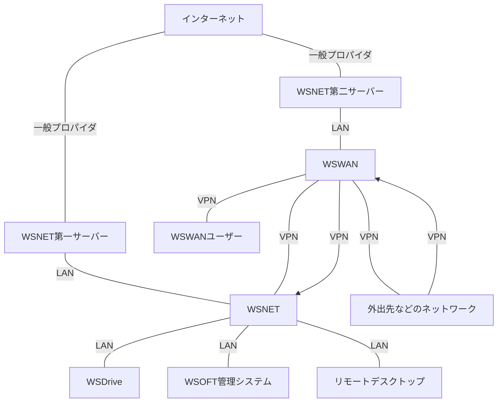

WSNET（統合WSOFTネットワーク）が登場する前、WSOFTは一つのサーバーですべてのサービスを運用しており、外出先からWSOFTのサービスへアクセスするときは一般ユーザーと同じように使用するしかありませんでした。
外出先からWSOFTのサービスをメンテナンスあるいは開発することはほぼできず、ファイル共有などもWSOFTShare（現在のWSOFTダウンロードセンター）などの外部に対して開かれたシステムを使用するしかありませんでした。これは、セキュリティ上の懸念がつきまとうものでありました。そこで、WSOFTのメンバーがアクセスできるVPN網が構築されるようになりました。

## システム図

## WSNETの機能
### WSWAN接続サービス
上記のシステム図で**WSWANユーザー**というものがありますが、これはWSWAN接続サービスのユーザーです。これは、公衆無線LANなどの**制限された**ネットワーク内からネットワークへのフルアクセスを提供するWSOFTのサービスです。