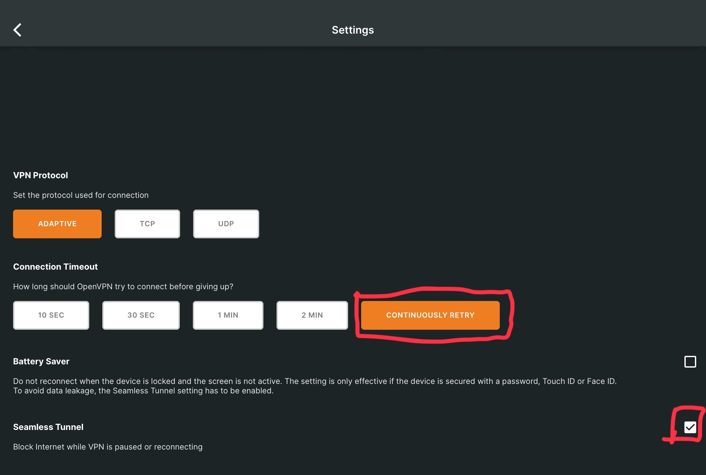

### 発生した事実
2023年6月5日10時ごろから16時43分まで、OpenVPNを使用したWSWANへの接続がしずらくなった。

#### 原因
WSOFT稲荷データセンターにてHDD1台が故障したことにより、VPNユーザーの認証ができなくなった。

#### 対応
HDDを簡易修復した後、16時40分に認証サービスを再起動したほか、同時接続受付台数を減らした。

#### 再発防止策
出来る限り早い段階で稲荷データセンターにあるサーバーを新しいものに置き換えます。

新しいサーバーは1万5千円程度と見積もっています。安定したVPNを提供し続けるためにも寄付いただければ幸いです。

### ユーザー側で対応していただけること
iPhone/iPad,AndroidでWSNETに接続している方は、OpenVPNの次の設定を見直すことで接続しやすくなることがあります。

- Connection Timeout(接続をあきらめる設定)
  
  **CONTINUOUSLY RETRY**(諦めずに再接続する)を選択することで、端末を使用中に突然切断される問題が低減されます。

- Battery Saver

  この項目の**チェックを外す**ことで、勝手にVPNから切断されることを防ぎます。

- Seamless Tunnel

  この項目にチェックを入れることで、接続試行中や再接続中にネットワークが切断されることを防ぎます。