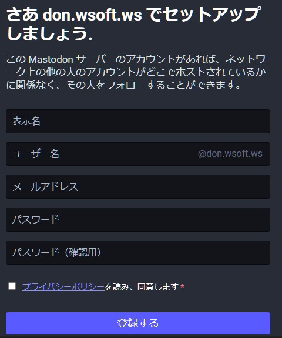
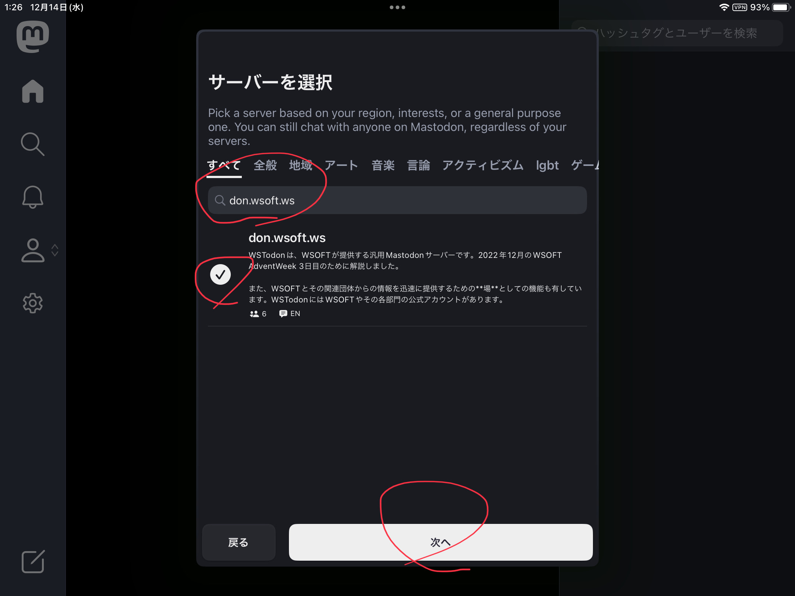
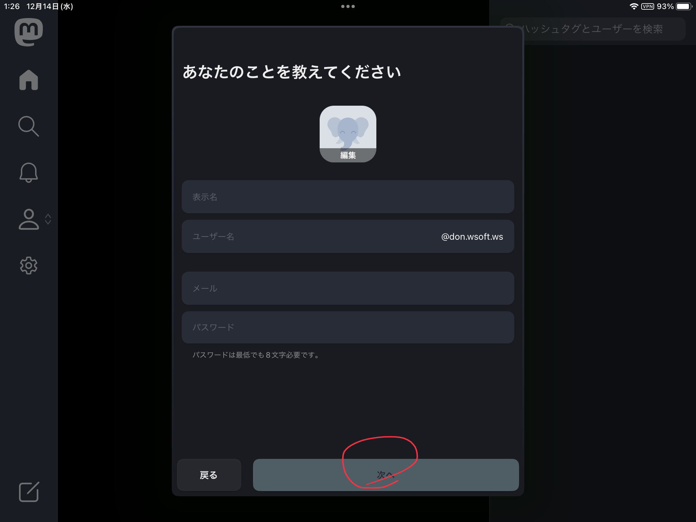
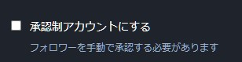

### 登録前後の質問

#### Q.AndroidやiPadのためのアプリはありますか？
**あります。**　iPhoneやiPadのために[Mastodon for iPhone and iPad](https://apps.apple.com/us/app/mastodon-for-iphone/id1571998974)アプリが、Androidのために[Mastodon](https://play.google.com/store/apps/details?id=org.joinmastodon.android&pli=1)アプリが公式から頒布されています。他にも、サードパーティーのアプリを使うこともできます。

#### Q.PCまたはブラウザからアカウントを作る方法を教えてください。
PCから、[WSTodon登録フォーム](https://don.wsoft.ws/auth/sign_up)にアクセスします。

!!!note "重要"
    続けるには、サーバーのルールをよく読み同意する必要があります。

フォームに必要事項を記入し、登録してください。その後、確認メールが届きます。
メールアドレスが私用できない場合は、Q.メールアドレスがなくても登録できますか？を参照してください。

#### Q.AndroidやiOSのMastodonアプリからアカウントを作る方法を教えてください。
まずは端末にMastodonアプリをインストールし、起動します。

起動したら、「Create Account」をタップします。

**サーバーを選択**欄に***don.wsoft.ws***と入力します。**don.wsoft.ws**が一覧に表示されたら、それをチェックし次へ進みます。

必要事項を入力し、残りの登録作業を終わらせます。

#### Q.メールアドレスがなくても登録できますか？
**はい。** 実験的にですが、メールアドレスのない方に***-don@wsoft.ws***のメールアドレスを付与しています。これに参加し、メールアドレスなしでの登録を希望される方は、[WSTodon用メールアドレス作成フォーム](https://forms.gle/A9roF4ceBqqZMoK57)でご連絡ください。

#### Q.登録にお金はかかりますか？
**いいえ。** 登録から運用まですべての費用はWSOFTが負担します。そのため、費用はかかりません。

### アカウントを作ってからの質問
#### Q.自分のアカウントを非公開アカウント（いわゆる鍵垢）にできますか？
**はい。** **ユーザー設定**  > **承認制アカウントにする**という設定項目があります。設定は[プロフィールの設定](https://don.wsoft.ws/settings/profile)から行なえます。

#### Q.サーバーごとにアカウントを作らないといけないのですか？違うサーバーの人とやり取りしたい時は相手と同じサーバーでないといけないのですか？
**いいえ。** 違うサーバーのユーザー同士でもリプライ、フォロー、お気に入りなどひととおりの機能は使用可能です
