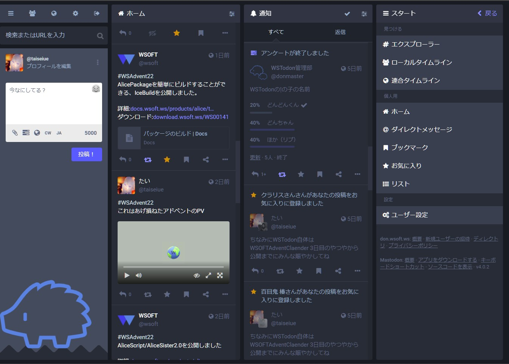

### WSTodonとは？

WSTodonは、WSOFTが提供する汎用Mastodonサーバーです。2022年12月のWSOFT AdventWeek 3日目のために解説しました。

また、WSOFTとその関連団体からの情報を迅速に提供するための**場**としての機能も有しています。WSTodonにはWSOFTやその各部門の公式アカウントがあります。

つまるところ、WSOFTが提供する新しいSNSです。既存のSNSと互換性があり、Web3の概念が取り入れられています。

<a href="https://don.wsoft.ws/" type="button" class="btn btn-primary btn-lg">WSTodonはこちら</a>
<a href="https://don.wsoft.ws/invite/gNhLEZaV" type="button" class="btn btn-success btn-lg">参加するにはこちら</a>

### よくある質問
よくある質問とその回答は、[よくある質問と回答](./faq.md)にまとまっています。

メールアドレスなしでの登録を希望される方は、[WSTodon用メールアドレス作成フォーム](https://forms.gle/A9roF4ceBqqZMoK57)でご連絡ください。