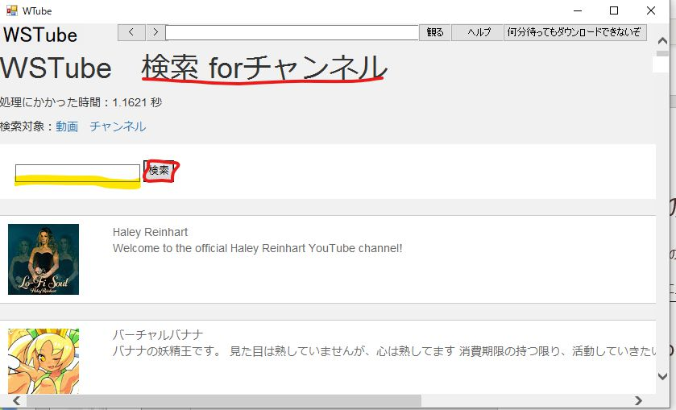
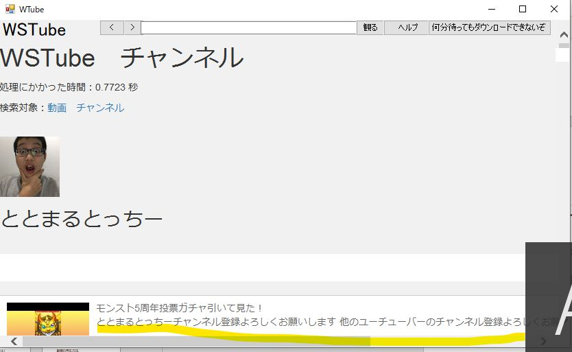

### はじめに
このソフトを作ろうと思ったきっかけは、学校でYouTubeを視聴することです。
あんなにもクリエイティブな活動をしている人たちを観ることが、なぜできないのか。
疑問に思った末に完成したのがこのソフトです。
このソフトは様々なサーバーやソフトウェア、ライブラリの力を得て制作、運用されています。

### 検索の使い方
!!! warning "検索回数の上限"
    YouTubeAPIの制約により、検索を使用できるのは一日当たり400回までです。検索可能回数は検索欄上部に表示されています。

1. WSTubeを起動する
2. 検索欄にキーワードを入力する

### 検索の使い方（forチャンネル)

1. 検索画面から検索対象: チャンネルをクリックする
2. 検索欄にキーワードを入力する
   
### 動画の再生方法
1. 再生したい動画をクリック
2. しばらく待つ

!!! note "再生可能になるまでの時間"
    WSTube NEXT以前の環境では、動画が再生可能になるまでおよそ1~2分程度の時間がかかっていました。これは、対象の動画を一度サーバーにダウンロードしていたからです。しばらくたっても動画が再生されない場合は「何分待ってもダウンロードできないぞ」ボタンをクリックして現在の状況を確認できます。

### チャンネルのみかた

1. 検索forチャンネルで目当てのチャンネルを探す
2. クリックする
3. チャンネルページへ移動する

### エラーメッセージが表示される場合
#### ダウンロードエラー(サーバー)が表示され、視聴できない
このタイプのエラーは、指定された動画が視聴できないタイプの動画であることを示します。
この場合、動画はミュージックビデオ、高画質ビデオ、比較的最近に公開された一部の動画、WMMで公開された動画、一部のAndroid端末から公開された動画などである場合が多く、技術的にはH264形式で公開されていない動画で起こるものです。

#### ダウンロードエラー（内部）が表示され、視聴できない
このタイプのエラーは、コンピュータかクライアントに問題があることを示します。
例えば、ネットワークに接続されていない、サーバーのメンテナンス中などが起こり得ます。
