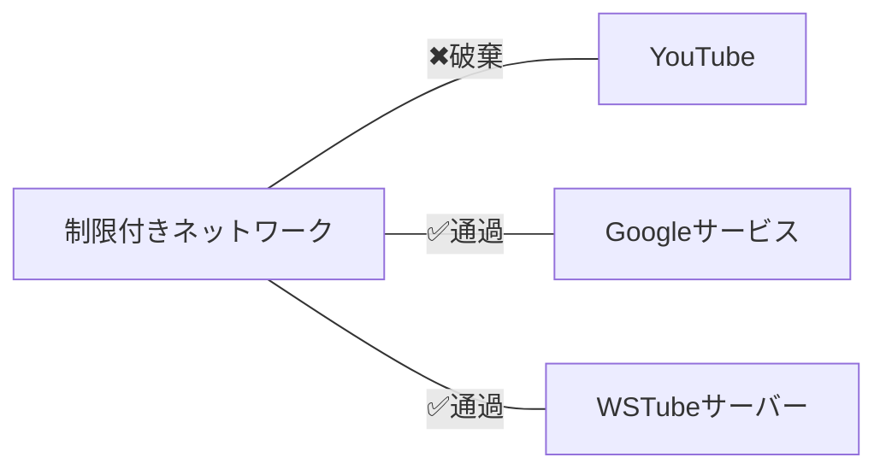

WSTubeは、私が中学生のころに開発し運用していた強力なYouTube視聴環境です。WSTubeは某校パソコン部における学術目的のための研究プロジェクトとして開発された製品です。

### 極めて強力な視聴可能性
#### ファイアウォールやプロキシを通過
WSTubeの重要な特徴のひとつとして、ファイアウォール、プロキシサーバーやNATなどの制限システムをうまくすり抜けることができる機能があります。たとえばプロキシサーバーは、大学などの公共の場でのネットワークに導入されています。

現代のコンピューターットワークでは、セキュリティ上の理由から内部ネットワークと外部ネットワークを分離するためのネットワークデバイスが導入されていることが一般的です。また、大学や小中高校などの教育機関のネットワークでは、外部からの侵入を防ぐとともに児童や生徒、学生が学習上望ましくないと判断されるサイトへのアクセスを遮断することが往々にしてあります。

YouTubeなどの動画サイトはこの規制の対象とされることがよくあります。規制の内容についてここで細かく触れることはしませんが、この規制は大学等が指定したDNSサーバーを使用させ、`youtube.com`などのサイトをDNS解決できないようにするとういう方法がとられます。この規制を回避するためにDNSサーバーを変更しようと試みても、内部から外部へのUDPパケットはそもそも遮断されていたり、TCPパケットも`80`ポートと`443`ポートへの通信のみ許可されていたりします。よって従来のようなIPsec、L2TPなどのVPN技術もここでは使用できません。SoftEtherやOpenVPNなど`443`ポートを使用するVPNを使用して制限を回避することもできますが、いずれの方法でもVPNクライアントソフトの導入が不可欠であり、それらはOSのネットワーク層になんらかのハックを仕掛けるため管理者権限のない一般ユーザーが使用することは困難です。

#### 動画をユーザーに提供するためにHTTP/Sプロトコルを使用
WSTubeは動画をユーザーに提供するためにHTTP/Sプロトコルを使用します。しかし、動画が提供されるのは`youtube.com`からではありません。任意のWSTubeサーバーが導入されたサーバーから動画を取得します。WSTubeサーバーはYouTubeからの動画の取得をユーザーに代わって行うことで、ユーザーはYouTubeにアクセスせずとも動画を視聴できるのです。

#### クロスプラットフォームサポート
WSTubeサーバーはHTTP/SベースのWebサーバーで動作するため、H264動画が再生可能なブラウザであればどの環境でもWSTubeを使用できます。この機能により、たとえ環境が3DSであれ、WiiUであれ、YouTubeの動画を視聴できるのです。

#### クライアントアプリ
Windowsではクライアントアプリである、WSTubeMODを開発しています。これを使用すれば、ユーザーはファイルをダブルクリックするだけでWSTubeにアクセスでき、動画のダウンロードや変換なども行えます。このプログラムは.NETFramework4.5で開発されており、現代の教育現場で普及しているWindows 8.1以降が搭載されているOSで前提条件を意識せずに導入できます。

### セキュリティと易管理性
#### 中間者攻撃の防止
あなたは、結局内部ネットワークにYouTube動画が流れてくるのだからいつかはそれが検出されるのではないかという疑問を持つかもしれません。実際、HTTP通信はネットワーク管理者からどのようなパケットが行きかっているかがすべて把握できます。しかし、WSTubeサーバーがHTTPS通信をサポートしていればその心配はありません。あなたとWSTubeサーバーとの間の通信内容は誰も見ることができないのです。（もちろん、中にはHTTPS通信を解除して検閲することのできるシステムもありますが、そのようなシステムが導入されている環境は非常に稀です。

#### アカウント
WSOFTが提供するWSTubeシステムは、WSOFTアカウントをログイン手段に採用していますが、さまざまなログイン手法をお好みで導入できるのもWSTubeの強みです。アカウントはすべてハッシュ化して保存され、履歴なども管理者とそのユーザーからのみアクセスできます。また、アカウントの使用を強制することによって、どのユーザーがWSTubeを使用できるかを把握できます。

#### ユーザーとロール
すべてのユーザーにはロールが付与されており、いずれのロールが付与されているかによって、「視聴可能」であるか、「管理者」であるいかあるいは「視聴不能」であるかを制御できます。

#### 有害な動画のフィルタリング
簡易動画フィルタリング機能により、検索画面で有害な動画を視聴する可能性が大きく下がります。また、クライアントアプリを導入すれば、直接IDを指定して動画を視聴しようとした際にもフィルタリングがかかります。

#### 動画待機行列を溢れさせる攻撃（Dos攻撃）の防止
各ユーザーに応じて同時に動画待機行列に並ばせることのできる動画の合計数を制限できます。これによって悪質な使用を制限できます。誰がどのくらい占有しているかについての統計は、ミッションコントロールセンターからかくにんできます。

#### ログ保存機能
管理者は、ユーザーがどのような検索キーワードを使用して、どのような動画にたどり着き視聴したかを確認できます。このログはユーザーごとに保存され、いつでも確認できるようになっています。

#### ミッションコントロールセンター
ミッションコントロールセンターでは、ユーザーがWSTube上でどのような行動をしているかを個別監視し、必要に応じて制限を課す機能を提供します。
管理者は複数人を指定でき、必要に応じてそれを変更できます。
