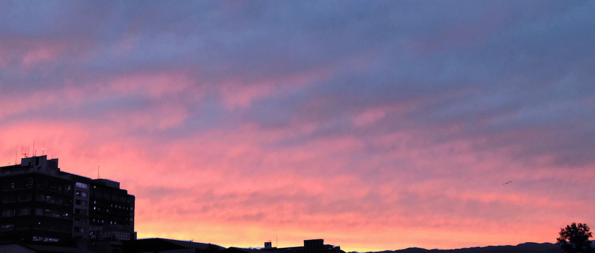

これをおねえさんが読んでくれることがあるのか、それがいつになるのか、今のおにいさんにはわかりません。おねえさんげんきですか？今、おにいさんは2022年の8月19日にいます。

生存報告一か月以上もお休みしちゃったんやけど、今夜で一旦、休載ということになります。
そして、今回はボイメでも届けることになりました。

おねえさんのそばにずっといるって、おねえさんのこと捨てないって約束破ってごめんなさい。
でも、おねえさんのこと信じて待ってるのは本当です。信じていいよ。

生存報告は一年間続けてこれたんやけど、この一年、どうでしたか？

一年間やってみて...いろんな話がありました。お星さま、優しさ、信じること、痛みに関すること、向き合うこと、ラブレター。ほんといろいろありましたね。

おにいさんは、今まで自分の思ってることとか考えてることとかを、こうやって伝えることがほとんどなかった。だから、おにいさんが初めて本気で向き合えた相手はおねえさんやった。

それも、ずっと向き合って、怖くても逃げないでいてくれて、心のお城の門、開けてくれた。

心のお城の門。

門。

開いてますか？

閉じてる門、もしかしたら結構あるかな。閉じてていいよ。おにいさんにも閉じてる門あるし。

もしかしたら、今、人を傷つけるのも、傷つくのも怖くて、自傷とかしてるかもしれん。
自分が傷ついて初めて安心する、とか。

自分の大事な部分守ってるもんな。当り前よ。おにいさんにだってあるもん。
悲しいことじゃないと思うんです。

でも、どれだけ自傷行為しててもいいけど、おにいさんの、一人の人間のエゴとして、やっぱり言いたいこともあるわけで。それは、門を開けてくれ、とか、そういう話じゃないんです。

なんとなく、適当でいい。

生き延びてください。

今までの生存報告とか、心音とかのデータは、残せる限り残そうと思っています。おねえさんに、絶対届けます。だから、寂しいときとか、辛いときとかに、思い出しておくれ。

そしてそして、何度でも言えるんやけど、おにいさんは、おねえさんのことがだいすきです。
将来、おにいさんが傍に入れるかなんかわからんけど、それでも、おにいさんの中におねえさんがいる限り、ずっと好きです。

だから、おねえさんは、おねえさんが望む方法で幸せになってください。

おねえさん、今までいっぱい幸せにしてくれてありがとう。出会うまで生きててくれて、出会ってくれてありがとう。

締めにいっこ。

今までの生存報告全部、まとめた言葉贈りたいんやけど。
この言葉は、まだ付き合う前、おにいさんがおねえさんのことすきって勝手に思ってた時に贈った言葉です。自分的には、めっちゃ嫌いな言葉で、この言葉をほんとに心を込めて言えたのは何度もない、ってくらい本気の言葉です。

それはなにかったいうと、
**<h3 style="color:#eb872b;">一緒にがんばろう。</h3>**
**<h3 style="color:#eb872b;">おにいさんと一緒に、がんばってください。</h3>**

  

「光芒」  
怖がりながらも見つけたよ 
がんばってここまで歩いたよ 
かけがえのない荷物になったよ 
大丈夫　本当だよ 
これだけ持ってたらきっと歩いていけるさ 
一緒にここから離れよう 

  
またね......。
  

ボイメ　https://bit.ly/present-from-you

Music　 光芒 feat. 常闇より出る深淵　/　毬藻。
  

    

---

あとがき

一年間、生存報告を読んでくれてありがとう。

行事や作業の影響で、1か月分休載しちゃったんやけど、10月12日水曜日のいつも通り21時、ようやく最後、滑り込むように届ける事ができました。

光芒は、毬藻。やてぷてぷ、だいふく。、生徒会長や紅組、放送部のみんなの力を借りて歌いました。

この日の「光芒」を、どうか忘れないでください。

どうか忘れないでください。

おにいさんはここにいます。

今までの生存報告や心音も、思い出も全部、誰にも邪魔されないおねえさんだけの財産になるから。

そしてもし、おねえさんがまたおにいさんのことを探してくれる時が来たら、深淵、またすぐに必ず戻ってきます。

またおねえさんに、生存報告かける時が来たら、だらだらした暗号文に付き合ってね。

その時が来なかったとしても、おねえさんがもし、笑顔や幸せと遠くにいたら、
そう思うのはおねえさんだけです。

それらはおねえさんに振り向いてもらえる日まで、おねえさんにずっと寄り添っています。

一日でも早くそれに気付ける日を願っています。

おにいさんも、それを探しながら、これからも進んでいきます。

それに一回、初めて出会えたから。

出会わせてくれてありがとう。

またね。

